::: {.hero .songs-hero}
::: {.hero-content}
<h1 class="hero-title">📜 Poeții Noștri</h1>
<p class="hero-subtitle">Marea poezie a lumii — pusă pe muzică și imagine. Alege o temă.</p>
<div class="mood-filter hero-mood-filter" id="moodFilter" role="tablist" aria-label="Filtru tematic"></div>
:::
:::

::: {.search-stats-bar}
<div class="stats-container"><div class="stat-item"><span class="stat-number" id="totalSongs">0</span><span class="stat-label">Poeme</span></div>
<div class="stat-item"><span class="stat-number" id="totalMoods">0</span><span class="stat-label">Teme</span></div>
<div class="stat-item"><span class="stat-number" id="visibleSongs">0</span><span class="stat-label">Afișate</span></div></div>
<div class="search-container"><div class="search-input-wrapper"><input type="search" id="songSearch" placeholder="🔍 Caută după poet, titlu sau temă..." aria-label="Caută poeme"></div></div>
:::

::: {.songs-grid}
<div class="song-card" data-mood="singuratate" role="article"><div class="song-image-container"><div class="play-overlay"><a href="a-e-baconsky-batran-si-singur.html" class="play-btn-link" aria-label="Ascultă Bătrân și singur"><button class="play-btn">▶️</button></a></div><div class="song-badges"><span class="badge featured-badge">singuratate</span></div></div><div class="song-content"><div class="song-header"><h3 class="song-title"><a href="a-e-baconsky-batran-si-singur.html">Bătrân și singur</a></h3><div class="song-meta"><span class="artist">A. E. Baconsky</span></div></div><div class="song-actions"><a href="a-e-baconsky-batran-si-singur.html" class="btn btn-primary">▶️ Ascultă</a></div></div></div>
<div class="song-card" data-mood="caldura" role="article"><div class="song-image-container">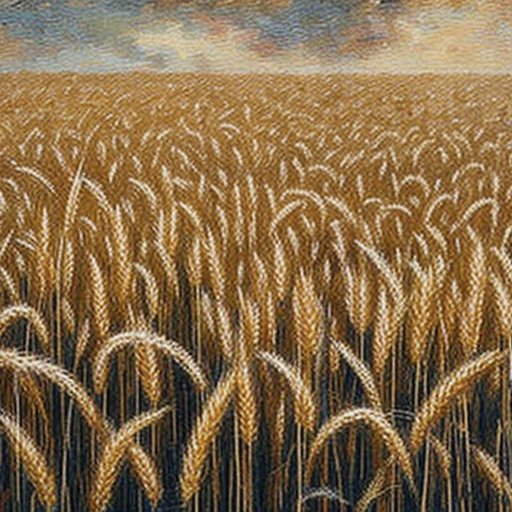<div class="play-overlay"><a href="a-e-baconsky-vara-tarzie.html" class="play-btn-link" aria-label="Ascultă Vara târzie"><button class="play-btn">▶️</button></a></div><div class="song-badges"><span class="badge featured-badge">caldura</span></div></div><div class="song-content"><div class="song-header"><h3 class="song-title"><a href="a-e-baconsky-vara-tarzie.html">Vara târzie</a></h3><div class="song-meta"><span class="artist">A. E. Baconsky</span></div></div><div class="song-actions"><a href="a-e-baconsky-vara-tarzie.html" class="btn btn-primary">▶️ Ascultă</a></div></div></div>
<div class="song-card" data-mood="drum" role="article"><div class="song-image-container">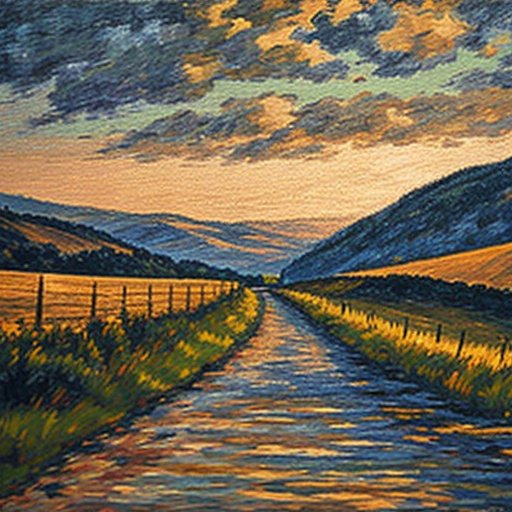<div class="play-overlay"><a href="adam-mickiewicz-ganduri-de-ziua-plecarii.html" class="play-btn-link" aria-label="Ascultă Gânduri de ziua plecării"><button class="play-btn">▶️</button></a></div><div class="song-badges"><span class="badge featured-badge">drum</span></div></div><div class="song-content"><div class="song-header"><h3 class="song-title"><a href="adam-mickiewicz-ganduri-de-ziua-plecarii.html">Gânduri de ziua plecării</a></h3><div class="song-meta"><span class="artist">Adam Mickiewicz</span></div></div><div class="song-actions"><a href="adam-mickiewicz-ganduri-de-ziua-plecarii.html" class="btn btn-primary">▶️ Ascultă</a></div></div></div>
<div class="song-card" data-mood="fericire" role="article"><div class="song-image-container">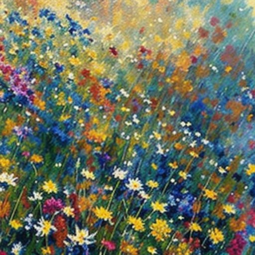<div class="play-overlay"><a href="adam-puslojic-bucurie.html" class="play-btn-link" aria-label="Ascultă Bucurie"><button class="play-btn">▶️</button></a></div><div class="song-badges"><span class="badge featured-badge">fericire</span></div></div><div class="song-content"><div class="song-header"><h3 class="song-title"><a href="adam-puslojic-bucurie.html">Bucurie</a></h3><div class="song-meta"><span class="artist">Adam Puslojić</span></div></div><div class="song-actions"><a href="adam-puslojic-bucurie.html" class="btn btn-primary">▶️ Ascultă</a></div></div></div>
<div class="song-card" data-mood="drum" role="article"><div class="song-image-container"><div class="play-overlay"><a href="adam-puslojic-mor-pe-drum.html" class="play-btn-link" aria-label="Ascultă Mor pe drum"><button class="play-btn">▶️</button></a></div><div class="song-badges"><span class="badge featured-badge">drum</span></div></div><div class="song-content"><div class="song-header"><h3 class="song-title"><a href="adam-puslojic-mor-pe-drum.html">Mor pe drum</a></h3><div class="song-meta"><span class="artist">Adam Puslojić</span></div></div><div class="song-actions"><a href="adam-puslojic-mor-pe-drum.html" class="btn btn-primary">▶️ Ascultă</a></div></div></div>
<div class="song-card" data-mood="frate" role="article"><div class="song-image-container"><div class="play-overlay"><a href="adam-puslojic-un-edict-nou-fratilor-mei-romani.html" class="play-btn-link" aria-label="Ascultă Un edict nou: fraţilor mei români"><button class="play-btn">▶️</button></a></div><div class="song-badges"><span class="badge featured-badge">frate</span></div></div><div class="song-content"><div class="song-header"><h3 class="song-title"><a href="adam-puslojic-un-edict-nou-fratilor-mei-romani.html">Un edict nou: fraţilor mei români</a></h3><div class="song-meta"><span class="artist">Adam Puslojić</span></div></div><div class="song-actions"><a href="adam-puslojic-un-edict-nou-fratilor-mei-romani.html" class="btn btn-primary">▶️ Ascultă</a></div></div></div>
<div class="song-card" data-mood="mama" role="article"><div class="song-image-container">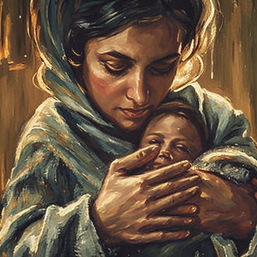<div class="play-overlay"><a href="adrian-paunescu-a-venit-aseara-mama.html" class="play-btn-link" aria-label="Ascultă A venit aseară mama"><button class="play-btn">▶️</button></a></div><div class="song-badges"><span class="badge featured-badge">mama</span></div></div><div class="song-content"><div class="song-header"><h3 class="song-title"><a href="adrian-paunescu-a-venit-aseara-mama.html">A venit aseară mama</a></h3><div class="song-meta"><span class="artist">Adrian Păunescu</span></div></div><div class="song-actions"><a href="adrian-paunescu-a-venit-aseara-mama.html" class="btn btn-primary">▶️ Ascultă</a></div></div></div>
<div class="song-card" data-mood="flori" role="article"><div class="song-image-container">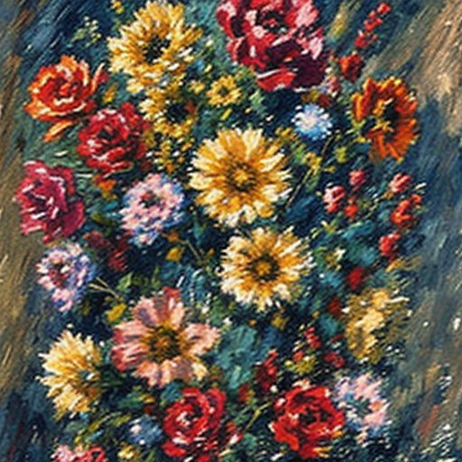<div class="play-overlay"><a href="adrian-paunescu-aceeasi-floare.html" class="play-btn-link" aria-label="Ascultă Aceeași floare"><button class="play-btn">▶️</button></a></div><div class="song-badges"><span class="badge featured-badge">flori</span></div></div><div class="song-content"><div class="song-header"><h3 class="song-title"><a href="adrian-paunescu-aceeasi-floare.html">Aceeași floare</a></h3><div class="song-meta"><span class="artist">Adrian Păunescu</span></div></div><div class="song-actions"><a href="adrian-paunescu-aceeasi-floare.html" class="btn btn-primary">▶️ Ascultă</a></div></div></div>
<div class="song-card" data-mood="tara" role="article"><div class="song-image-container"><div class="play-overlay"><a href="adrian-paunescu-adio-mama-patrie-adio.html" class="play-btn-link" aria-label="Ascultă Adio, mamă patrie, adio!"><button class="play-btn">▶️</button></a></div><div class="song-badges"><span class="badge featured-badge">tara</span></div></div><div class="song-content"><div class="song-header"><h3 class="song-title"><a href="adrian-paunescu-adio-mama-patrie-adio.html">Adio, mamă patrie, adio!</a></h3><div class="song-meta"><span class="artist">Adrian Păunescu</span></div></div><div class="song-actions"><a href="adrian-paunescu-adio-mama-patrie-adio.html" class="btn btn-primary">▶️ Ascultă</a></div></div></div>
<div class="song-card" data-mood="caldura" role="article"><div class="song-image-container"><div class="play-overlay"><a href="adrian-paunescu-adio-vara.html" class="play-btn-link" aria-label="Ascultă Adio, vară"><button class="play-btn">▶️</button></a></div><div class="song-badges"><span class="badge featured-badge">caldura</span></div></div><div class="song-content"><div class="song-header"><h3 class="song-title"><a href="adrian-paunescu-adio-vara.html">Adio, vară</a></h3><div class="song-meta"><span class="artist">Adrian Păunescu</span></div></div><div class="song-actions"><a href="adrian-paunescu-adio-vara.html" class="btn btn-primary">▶️ Ascultă</a></div></div></div>
<div class="song-card" data-mood="amintire" role="article"><div class="song-image-container">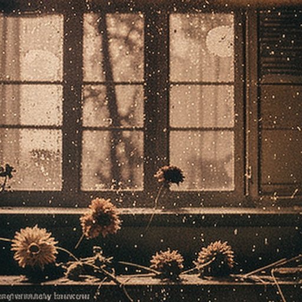<div class="play-overlay"><a href="adrian-paunescu-agresiva-amintire.html" class="play-btn-link" aria-label="Ascultă Agresiva amintire"><button class="play-btn">▶️</button></a></div><div class="song-badges"><span class="badge featured-badge">amintire</span></div></div><div class="song-content"><div class="song-header"><h3 class="song-title"><a href="adrian-paunescu-agresiva-amintire.html">Agresiva amintire</a></h3><div class="song-meta"><span class="artist">Adrian Păunescu</span></div></div><div class="song-actions"><a href="adrian-paunescu-agresiva-amintire.html" class="btn btn-primary">▶️ Ascultă</a></div></div></div>
<div class="song-card" data-mood="moarte" role="article"><div class="song-image-container">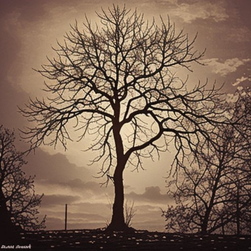<div class="play-overlay"><a href="adrian-paunescu-biet-nemuritor-la-zidul-mortii.html" class="play-btn-link" aria-label="Ascultă Biet nemuritor la zidul mortii"><button class="play-btn">▶️</button></a></div><div class="song-badges"><span class="badge featured-badge">moarte</span></div></div><div class="song-content"><div class="song-header"><h3 class="song-title"><a href="adrian-paunescu-biet-nemuritor-la-zidul-mortii.html">Biet nemuritor la zidul mortii</a></h3><div class="song-meta"><span class="artist">Adrian Păunescu</span></div></div><div class="song-actions"><a href="adrian-paunescu-biet-nemuritor-la-zidul-mortii.html" class="btn btn-primary">▶️ Ascultă</a></div></div></div>
<div class="song-card" data-mood="mama" role="article"><div class="song-image-container"><div class="play-overlay"><a href="adrian-paunescu-bocet-pentru-mama.html" class="play-btn-link" aria-label="Ascultă Bocet pentru mama"><button class="play-btn">▶️</button></a></div><div class="song-badges"><span class="badge featured-badge">mama</span></div></div><div class="song-content"><div class="song-header"><h3 class="song-title"><a href="adrian-paunescu-bocet-pentru-mama.html">Bocet pentru mama</a></h3><div class="song-meta"><span class="artist">Adrian Păunescu</span></div></div><div class="song-actions"><a href="adrian-paunescu-bocet-pentru-mama.html" class="btn btn-primary">▶️ Ascultă</a></div></div></div>
<div class="song-card" data-mood="moarte" role="article"><div class="song-image-container"><div class="play-overlay"><a href="adrian-paunescu-bocetul-lui-ion-cel-fara-mormant.html" class="play-btn-link" aria-label="Ascultă Bocetul lui Ion cel fără mormânt"><button class="play-btn">▶️</button></a></div><div class="song-badges"><span class="badge featured-badge">moarte</span></div></div><div class="song-content"><div class="song-header"><h3 class="song-title"><a href="adrian-paunescu-bocetul-lui-ion-cel-fara-mormant.html">Bocetul lui Ion cel fără mormânt</a></h3><div class="song-meta"><span class="artist">Adrian Păunescu</span></div></div><div class="song-actions"><a href="adrian-paunescu-bocetul-lui-ion-cel-fara-mormant.html" class="btn btn-primary">▶️ Ascultă</a></div></div></div>
<div class="song-card" data-mood="toamna" role="article"><div class="song-image-container"><div class="play-overlay"><a href="adrian-paunescu-ca-o-reverenta-frunza.html" class="play-btn-link" aria-label="Ascultă Ca o reverenţă, frunza"><button class="play-btn">▶️</button></a></div><div class="song-badges"><span class="badge featured-badge">toamna</span></div></div><div class="song-content"><div class="song-header"><h3 class="song-title"><a href="adrian-paunescu-ca-o-reverenta-frunza.html">Ca o reverenţă, frunza</a></h3><div class="song-meta"><span class="artist">Adrian Păunescu</span></div></div><div class="song-actions"><a href="adrian-paunescu-ca-o-reverenta-frunza.html" class="btn btn-primary">▶️ Ascultă</a></div></div></div>
<div class="song-card" data-mood="cuvant" role="article"><div class="song-image-container"><div class="play-overlay"><a href="adrian-paunescu-cartea-cartilor-de-poezie-prefata.html" class="play-btn-link" aria-label="Ascultă Cartea cărţilor de poezie (prefață)"><button class="play-btn">▶️</button></a></div><div class="song-badges"><span class="badge featured-badge">cuvant</span></div></div><div class="song-content"><div class="song-header"><h3 class="song-title"><a href="adrian-paunescu-cartea-cartilor-de-poezie-prefata.html">Cartea cărţilor de poezie (prefață)</a></h3><div class="song-meta"><span class="artist">Adrian Păunescu</span></div></div><div class="song-actions"><a href="adrian-paunescu-cartea-cartilor-de-poezie-prefata.html" class="btn btn-primary">▶️ Ascultă</a></div></div></div>
<div class="song-card" data-mood="casa" role="article"><div class="song-image-container">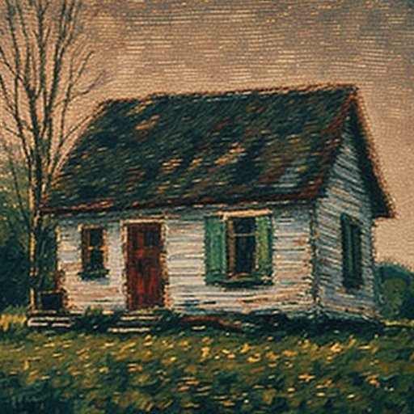<div class="play-overlay"><a href="adrian-paunescu-casa-de-lemn.html" class="play-btn-link" aria-label="Ascultă Casa de lemn"><button class="play-btn">▶️</button></a></div><div class="song-badges"><span class="badge featured-badge">casa</span></div></div><div class="song-content"><div class="song-header"><h3 class="song-title"><a href="adrian-paunescu-casa-de-lemn.html">Casa de lemn</a></h3><div class="song-meta"><span class="artist">Adrian Păunescu</span></div></div><div class="song-actions"><a href="adrian-paunescu-casa-de-lemn.html" class="btn btn-primary">▶️ Ascultă</a></div></div></div>
<div class="song-card" data-mood="caldura" role="article"><div class="song-image-container"><div class="play-overlay"><a href="adrian-paunescu-ce-toamna-mi-e-in-plin-delir-de-vara.html" class="play-btn-link" aria-label="Ascultă Ce toamnă mi-e, în plin delir de vară"><button class="play-btn">▶️</button></a></div><div class="song-badges"><span class="badge featured-badge">caldura</span></div></div><div class="song-content"><div class="song-header"><h3 class="song-title"><a href="adrian-paunescu-ce-toamna-mi-e-in-plin-delir-de-vara.html">Ce toamnă mi-e, în plin delir de vară</a></h3><div class="song-meta"><span class="artist">Adrian Păunescu</span></div></div><div class="song-actions"><a href="adrian-paunescu-ce-toamna-mi-e-in-plin-delir-de-vara.html" class="btn btn-primary">▶️ Ascultă</a></div></div></div>
<div class="song-card" data-mood="amintire" role="article"><div class="song-image-container"><div class="play-overlay"><a href="adrian-paunescu-cerere-de-uitare.html" class="play-btn-link" aria-label="Ascultă Cerere de uitare"><button class="play-btn">▶️</button></a></div><div class="song-badges"><span class="badge featured-badge">amintire</span></div></div><div class="song-content"><div class="song-header"><h3 class="song-title"><a href="adrian-paunescu-cerere-de-uitare.html">Cerere de uitare</a></h3><div class="song-meta"><span class="artist">Adrian Păunescu</span></div></div><div class="song-actions"><a href="adrian-paunescu-cerere-de-uitare.html" class="btn btn-primary">▶️ Ascultă</a></div></div></div>
<div class="song-card" data-mood="durere" role="article"><div class="song-image-container">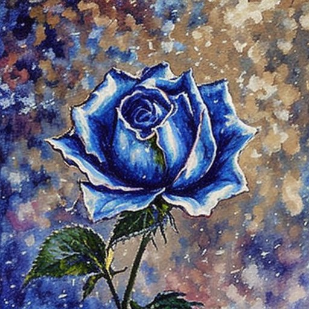<div class="play-overlay"><a href="adrian-paunescu-cersesc-suferinta.html" class="play-btn-link" aria-label="Ascultă Cerșesc suferința"><button class="play-btn">▶️</button></a></div><div class="song-badges"><span class="badge featured-badge">durere</span></div></div><div class="song-content"><div class="song-header"><h3 class="song-title"><a href="adrian-paunescu-cersesc-suferinta.html">Cerșesc suferința</a></h3><div class="song-meta"><span class="artist">Adrian Păunescu</span></div></div><div class="song-actions"><a href="adrian-paunescu-cersesc-suferinta.html" class="btn btn-primary">▶️ Ascultă</a></div></div></div>
<div class="song-card" data-mood="moarte" role="article"><div class="song-image-container"><div class="play-overlay"><a href="adrian-paunescu-cimitir-de-artisti.html" class="play-btn-link" aria-label="Ascultă Cimitir de artişti"><button class="play-btn">▶️</button></a></div><div class="song-badges"><span class="badge featured-badge">moarte</span></div></div><div class="song-content"><div class="song-header"><h3 class="song-title"><a href="adrian-paunescu-cimitir-de-artisti.html">Cimitir de artişti</a></h3><div class="song-meta"><span class="artist">Adrian Păunescu</span></div></div><div class="song-actions"><a href="adrian-paunescu-cimitir-de-artisti.html" class="btn btn-primary">▶️ Ascultă</a></div></div></div>
<div class="song-card" data-mood="mama tata" role="article"><div class="song-image-container"><div class="play-overlay"><a href="adrian-paunescu-colind-de-mama-si-tata.html" class="play-btn-link" aria-label="Ascultă Colind de mamă și tată"><button class="play-btn">▶️</button></a></div><div class="song-badges"><span class="badge featured-badge">mama</span></div></div><div class="song-content"><div class="song-header"><h3 class="song-title"><a href="adrian-paunescu-colind-de-mama-si-tata.html">Colind de mamă și tată</a></h3><div class="song-meta"><span class="artist">Adrian Păunescu</span></div></div><div class="song-actions"><a href="adrian-paunescu-colind-de-mama-si-tata.html" class="btn btn-primary">▶️ Ascultă</a></div></div></div>
<div class="song-card" data-mood="tata" role="article"><div class="song-image-container">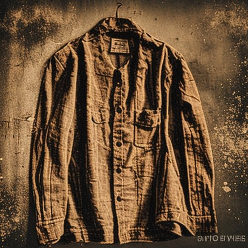<div class="play-overlay"><a href="adrian-paunescu-colind-pentru-tata-bolnav.html" class="play-btn-link" aria-label="Ascultă Colind pentru tată bolnav"><button class="play-btn">▶️</button></a></div><div class="song-badges"><span class="badge featured-badge">tata</span></div></div><div class="song-content"><div class="song-header"><h3 class="song-title"><a href="adrian-paunescu-colind-pentru-tata-bolnav.html">Colind pentru tată bolnav</a></h3><div class="song-meta"><span class="artist">Adrian Păunescu</span></div></div><div class="song-actions"><a href="adrian-paunescu-colind-pentru-tata-bolnav.html" class="btn btn-primary">▶️ Ascultă</a></div></div></div>
<div class="song-card" data-mood="tara" role="article"><div class="song-image-container"><div class="play-overlay"><a href="adrian-paunescu-colindul-celui-fara-de-tara.html" class="play-btn-link" aria-label="Ascultă Colindul celui fără de ţară"><button class="play-btn">▶️</button></a></div><div class="song-badges"><span class="badge featured-badge">tara</span></div></div><div class="song-content"><div class="song-header"><h3 class="song-title"><a href="adrian-paunescu-colindul-celui-fara-de-tara.html">Colindul celui fără de ţară</a></h3><div class="song-meta"><span class="artist">Adrian Păunescu</span></div></div><div class="song-actions"><a href="adrian-paunescu-colindul-celui-fara-de-tara.html" class="btn btn-primary">▶️ Ascultă</a></div></div></div>
<div class="song-card" data-mood="toamna" role="article"><div class="song-image-container"><div class="play-overlay"><a href="adrian-paunescu-condamnare-la-toamna.html" class="play-btn-link" aria-label="Ascultă Condamnare la toamnă"><button class="play-btn">▶️</button></a></div><div class="song-badges"><span class="badge featured-badge">toamna</span></div></div><div class="song-content"><div class="song-header"><h3 class="song-title"><a href="adrian-paunescu-condamnare-la-toamna.html">Condamnare la toamnă</a></h3><div class="song-meta"><span class="artist">Adrian Păunescu</span></div></div><div class="song-actions"><a href="adrian-paunescu-condamnare-la-toamna.html" class="btn btn-primary">▶️ Ascultă</a></div></div></div>
<div class="song-card" data-mood="tara" role="article"><div class="song-image-container"><div class="play-overlay"><a href="adrian-paunescu-copiii-de-tarani.html" class="play-btn-link" aria-label="Ascultă Copiii de țărani"><button class="play-btn">▶️</button></a></div><div class="song-badges"><span class="badge featured-badge">tara</span></div></div><div class="song-content"><div class="song-header"><h3 class="song-title"><a href="adrian-paunescu-copiii-de-tarani.html">Copiii de țărani</a></h3><div class="song-meta"><span class="artist">Adrian Păunescu</span></div></div><div class="song-actions"><a href="adrian-paunescu-copiii-de-tarani.html" class="btn btn-primary">▶️ Ascultă</a></div></div></div>
<div class="song-card" data-mood="copilarie" role="article"><div class="song-image-container">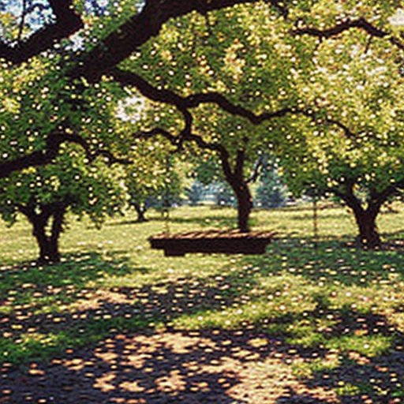<div class="play-overlay"><a href="adrian-paunescu-copilarie-cu-must.html" class="play-btn-link" aria-label="Ascultă Copilărie cu must"><button class="play-btn">▶️</button></a></div><div class="song-badges"><span class="badge featured-badge">copilarie</span></div></div><div class="song-content"><div class="song-header"><h3 class="song-title"><a href="adrian-paunescu-copilarie-cu-must.html">Copilărie cu must</a></h3><div class="song-meta"><span class="artist">Adrian Păunescu</span></div></div><div class="song-actions"><a href="adrian-paunescu-copilarie-cu-must.html" class="btn btn-primary">▶️ Ascultă</a></div></div></div>
<div class="song-card" data-mood="moarte" role="article"><div class="song-image-container"><div class="play-overlay"><a href="adrian-paunescu-carare-de-morti.html" class="play-btn-link" aria-label="Ascultă Cărare de morți"><button class="play-btn">▶️</button></a></div><div class="song-badges"><span class="badge featured-badge">moarte</span></div></div><div class="song-content"><div class="song-header"><h3 class="song-title"><a href="adrian-paunescu-carare-de-morti.html">Cărare de morți</a></h3><div class="song-meta"><span class="artist">Adrian Păunescu</span></div></div><div class="song-actions"><a href="adrian-paunescu-carare-de-morti.html" class="btn btn-primary">▶️ Ascultă</a></div></div></div>
<div class="song-card" data-mood="libertate" role="article"><div class="song-image-container"><div class="play-overlay"><a href="adrian-paunescu-dacii-liberi.html" class="play-btn-link" aria-label="Ascultă Dacii liberi"><button class="play-btn">▶️</button></a></div><div class="song-badges"><span class="badge featured-badge">libertate</span></div></div><div class="song-content"><div class="song-header"><h3 class="song-title"><a href="adrian-paunescu-dacii-liberi.html">Dacii liberi</a></h3><div class="song-meta"><span class="artist">Adrian Păunescu</span></div></div><div class="song-actions"><a href="adrian-paunescu-dacii-liberi.html" class="btn btn-primary">▶️ Ascultă</a></div></div></div>
<div class="song-card" data-mood="luna_stele" role="article"><div class="song-image-container">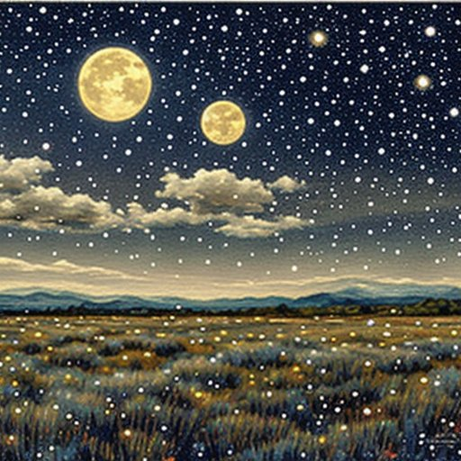<div class="play-overlay"><a href="adrian-paunescu-delta-lunara.html" class="play-btn-link" aria-label="Ascultă Delta lunară"><button class="play-btn">▶️</button></a></div><div class="song-badges"><span class="badge featured-badge">luna_stele</span></div></div><div class="song-content"><div class="song-header"><h3 class="song-title"><a href="adrian-paunescu-delta-lunara.html">Delta lunară</a></h3><div class="song-meta"><span class="artist">Adrian Păunescu</span></div></div><div class="song-actions"><a href="adrian-paunescu-delta-lunara.html" class="btn btn-primary">▶️ Ascultă</a></div></div></div>
<div class="song-card" data-mood="caldura" role="article"><div class="song-image-container"><div class="play-overlay"><a href="ady-endre-amintire-de-o-noapte-de-vara-emlekezes-egy-nyar-ejszakara.html" class="play-btn-link" aria-label="Ascultă Amintire de o noapte de vară - (Emlékezés egy nyár-éjszakára)"><button class="play-btn">▶️</button></a></div><div class="song-badges"><span class="badge featured-badge">caldura</span></div></div><div class="song-content"><div class="song-header"><h3 class="song-title"><a href="ady-endre-amintire-de-o-noapte-de-vara-emlekezes-egy-nyar-ejszakara.html">Amintire de o noapte de vară - (Emlékezés egy nyár-éjszakára)</a></h3><div class="song-meta"><span class="artist">Ady Endre</span></div></div><div class="song-actions"><a href="ady-endre-amintire-de-o-noapte-de-vara-emlekezes-egy-nyar-ejszakara.html" class="btn btn-primary">▶️ Ascultă</a></div></div></div>
<div class="song-card" data-mood="timp" role="article"><div class="song-image-container"><div class="play-overlay"><a href="ady-endre-cei-ce-vesnic-zabovesc-akik-mindig-elkesnek.html" class="play-btn-link" aria-label="Ascultă Cei ce veșnic zăbovesc - (Akik mindig elkésnek)"><button class="play-btn">▶️</button></a></div><div class="song-badges"><span class="badge featured-badge">timp</span></div></div><div class="song-content"><div class="song-header"><h3 class="song-title"><a href="ady-endre-cei-ce-vesnic-zabovesc-akik-mindig-elkesnek.html">Cei ce veșnic zăbovesc - (Akik mindig elkésnek)</a></h3><div class="song-meta"><span class="artist">Ady Endre</span></div></div><div class="song-actions"><a href="ady-endre-cei-ce-vesnic-zabovesc-akik-mindig-elkesnek.html" class="btn btn-primary">▶️ Ascultă</a></div></div></div>
<div class="song-card" data-mood="caldura" role="article"><div class="song-image-container"><div class="play-overlay"><a href="ady-endre-caldura-ta-a-te-melegseged.html" class="play-btn-link" aria-label="Ascultă Căldura ta - (A te melegséged)"><button class="play-btn">▶️</button></a></div><div class="song-badges"><span class="badge featured-badge">caldura</span></div></div><div class="song-content"><div class="song-header"><h3 class="song-title"><a href="ady-endre-caldura-ta-a-te-melegseged.html">Căldura ta - (A te melegséged)</a></h3><div class="song-meta"><span class="artist">Ady Endre</span></div></div><div class="song-actions"><a href="ady-endre-caldura-ta-a-te-melegseged.html" class="btn btn-primary">▶️ Ascultă</a></div></div></div>
<div class="song-card" data-mood="mare" role="article"><div class="song-image-container">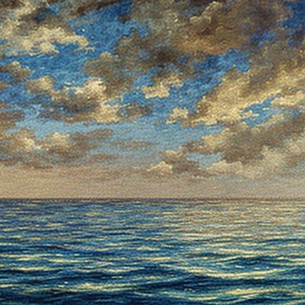<div class="play-overlay"><a href="ady-endre-de-la-ier-la-ocean-az-ert-l-az-oceanig.html" class="play-btn-link" aria-label="Ascultă De la Ier la Ocean - (Az Értől az Óceánig)"><button class="play-btn">▶️</button></a></div><div class="song-badges"><span class="badge featured-badge">mare</span></div></div><div class="song-content"><div class="song-header"><h3 class="song-title"><a href="ady-endre-de-la-ier-la-ocean-az-ert-l-az-oceanig.html">De la Ier la Ocean - (Az Értől az Óceánig)</a></h3><div class="song-meta"><span class="artist">Ady Endre</span></div></div><div class="song-actions"><a href="ady-endre-de-la-ier-la-ocean-az-ert-l-az-oceanig.html" class="btn btn-primary">▶️ Ascultă</a></div></div></div>
<div class="song-card" data-mood="lacrimi" role="article"><div class="song-image-container"><div class="play-overlay"><a href="ady-endre-doamna-lacrimilor-a-konnyek-asszonya.html" class="play-btn-link" aria-label="Ascultă Doamna lacrimilor - (A könnyek asszonya)"><button class="play-btn">▶️</button></a></div><div class="song-badges"><span class="badge featured-badge">lacrimi</span></div></div><div class="song-content"><div class="song-header"><h3 class="song-title"><a href="ady-endre-doamna-lacrimilor-a-konnyek-asszonya.html">Doamna lacrimilor - (A könnyek asszonya)</a></h3><div class="song-meta"><span class="artist">Ady Endre</span></div></div><div class="song-actions"><a href="ady-endre-doamna-lacrimilor-a-konnyek-asszonya.html" class="btn btn-primary">▶️ Ascultă</a></div></div></div>
<div class="song-card" data-mood="mare" role="article"><div class="song-image-container"><div class="play-overlay"><a href="ady-endre-singur-cu-marea-egyedul-a-tengerrel.html" class="play-btn-link" aria-label="Ascultă Singur cu marea - (Egyedül a tengerrel)"><button class="play-btn">▶️</button></a></div><div class="song-badges"><span class="badge featured-badge">mare</span></div></div><div class="song-content"><div class="song-header"><h3 class="song-title"><a href="ady-endre-singur-cu-marea-egyedul-a-tengerrel.html">Singur cu marea - (Egyedül a tengerrel)</a></h3><div class="song-meta"><span class="artist">Ady Endre</span></div></div><div class="song-actions"><a href="ady-endre-singur-cu-marea-egyedul-a-tengerrel.html" class="btn btn-primary">▶️ Ascultă</a></div></div></div>
<div class="song-card" data-mood="caldura" role="article"><div class="song-image-container"><div class="play-overlay"><a href="afanasii-fet-cand-sanul-tau-fraged-si-blanda-si-calda.html" class="play-btn-link" aria-label="Ascultă Când sânul tău fraged și blânda și calda"><button class="play-btn">▶️</button></a></div><div class="song-badges"><span class="badge featured-badge">caldura</span></div></div><div class="song-content"><div class="song-header"><h3 class="song-title"><a href="afanasii-fet-cand-sanul-tau-fraged-si-blanda-si-calda.html">Când sânul tău fraged și blânda și calda</a></h3><div class="song-meta"><span class="artist">Afanasii Fet</span></div></div><div class="song-actions"><a href="afanasii-fet-cand-sanul-tau-fraged-si-blanda-si-calda.html" class="btn btn-primary">▶️ Ascultă</a></div></div></div>
<div class="song-card" data-mood="casa" role="article"><div class="song-image-container"><div class="play-overlay"><a href="afanasii-fet-langa-camin-traducere-vbragagiu.html" class="play-btn-link" aria-label="Ascultă Lângă cămin - traducere V.Bragagiu"><button class="play-btn">▶️</button></a></div><div class="song-badges"><span class="badge featured-badge">casa</span></div></div><div class="song-content"><div class="song-header"><h3 class="song-title"><a href="afanasii-fet-langa-camin-traducere-vbragagiu.html">Lângă cămin - traducere V.Bragagiu</a></h3><div class="song-meta"><span class="artist">Afanasii Fet</span></div></div><div class="song-actions"><a href="afanasii-fet-langa-camin-traducere-vbragagiu.html" class="btn btn-primary">▶️ Ascultă</a></div></div></div>
<div class="song-card" data-mood="caldura" role="article"><div class="song-image-container"><div class="play-overlay"><a href="afanasii-fet-seara-limpede-de-vara-traducere-vbragagiu.html" class="play-btn-link" aria-label="Ascultă Seara limpede de vară - traducere V.Bragagiu"><button class="play-btn">▶️</button></a></div><div class="song-badges"><span class="badge featured-badge">caldura</span></div></div><div class="song-content"><div class="song-header"><h3 class="song-title"><a href="afanasii-fet-seara-limpede-de-vara-traducere-vbragagiu.html">Seara limpede de vară - traducere V.Bragagiu</a></h3><div class="song-meta"><span class="artist">Afanasii Fet</span></div></div><div class="song-actions"><a href="afanasii-fet-seara-limpede-de-vara-traducere-vbragagiu.html" class="btn btn-primary">▶️ Ascultă</a></div></div></div>
<div class="song-card" data-mood="soare" role="article"><div class="song-image-container">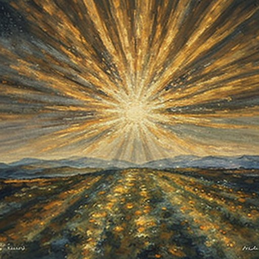<div class="play-overlay"><a href="afanasii-fet-tu-in-zori-n-o-trezi-cand-stapan.html" class="play-btn-link" aria-label="Ascultă Tu în zori n-o trezi, când stăpân"><button class="play-btn">▶️</button></a></div><div class="song-badges"><span class="badge featured-badge">soare</span></div></div><div class="song-content"><div class="song-header"><h3 class="song-title"><a href="afanasii-fet-tu-in-zori-n-o-trezi-cand-stapan.html">Tu în zori n-o trezi, când stăpân</a></h3><div class="song-meta"><span class="artist">Afanasii Fet</span></div></div><div class="song-actions"><a href="afanasii-fet-tu-in-zori-n-o-trezi-cand-stapan.html" class="btn btn-primary">▶️ Ascultă</a></div></div></div>
<div class="song-card" data-mood="iarna vant" role="article"><div class="song-image-container">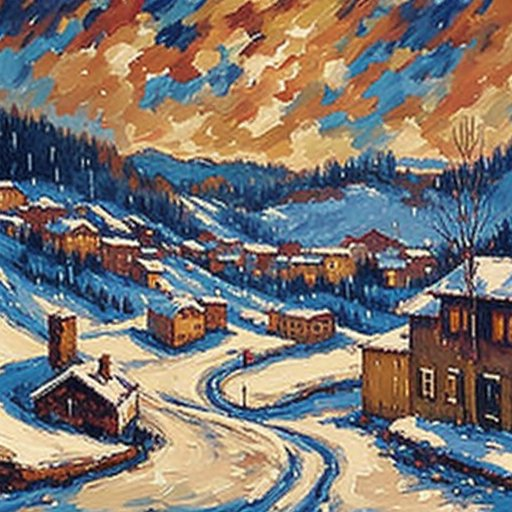<div class="play-overlay"><a href="afanasii-fet-viscol-viscolind.html" class="play-btn-link" aria-label="Ascultă Viscol, viscolind"><button class="play-btn">▶️</button></a></div><div class="song-badges"><span class="badge featured-badge">iarna</span></div></div><div class="song-content"><div class="song-header"><h3 class="song-title"><a href="afanasii-fet-viscol-viscolind.html">Viscol, viscolind</a></h3><div class="song-meta"><span class="artist">Afanasii Fet</span></div></div><div class="song-actions"><a href="afanasii-fet-viscol-viscolind.html" class="btn btn-primary">▶️ Ascultă</a></div></div></div>
<div class="song-card" data-mood="vant" role="article"><div class="song-image-container">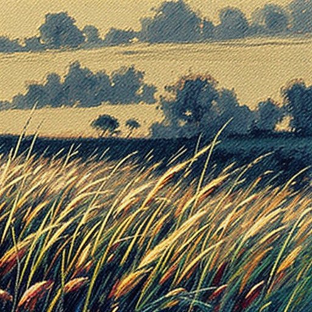<div class="play-overlay"><a href="afanasii-fet-vant-aspru-vant-cu-manie.html" class="play-btn-link" aria-label="Ascultă Vânt aspru, vânt cu mânie"><button class="play-btn">▶️</button></a></div><div class="song-badges"><span class="badge featured-badge">vant</span></div></div><div class="song-content"><div class="song-header"><h3 class="song-title"><a href="afanasii-fet-vant-aspru-vant-cu-manie.html">Vânt aspru, vânt cu mânie</a></h3><div class="song-meta"><span class="artist">Afanasii Fet</span></div></div><div class="song-actions"><a href="afanasii-fet-vant-aspru-vant-cu-manie.html" class="btn btn-primary">▶️ Ascultă</a></div></div></div>
<div class="song-card" data-mood="casa" role="article"><div class="song-image-container"><div class="play-overlay"><a href="nichita-stanescu-acasa.html" class="play-btn-link" aria-label="Ascultă Acasă"><button class="play-btn">▶️</button></a></div><div class="song-badges"><span class="badge featured-badge">casa</span></div></div><div class="song-content"><div class="song-header"><h3 class="song-title"><a href="nichita-stanescu-acasa.html">Acasă</a></h3><div class="song-meta"><span class="artist">Nichita Stănescu</span></div></div><div class="song-actions"><a href="nichita-stanescu-acasa.html" class="btn btn-primary">▶️ Ascultă</a></div></div></div>
<div class="song-card" data-mood="casa" role="article"><div class="song-image-container"><div class="play-overlay"><a href="nichita-stanescu-acasa-nimanuia.html" class="play-btn-link" aria-label="Ascultă Acasă nimanuia"><button class="play-btn">▶️</button></a></div><div class="song-badges"><span class="badge featured-badge">casa</span></div></div><div class="song-content"><div class="song-header"><h3 class="song-title"><a href="nichita-stanescu-acasa-nimanuia.html">Acasă nimanuia</a></h3><div class="song-meta"><span class="artist">Nichita Stănescu</span></div></div><div class="song-actions"><a href="nichita-stanescu-acasa-nimanuia.html" class="btn btn-primary">▶️ Ascultă</a></div></div></div>
<div class="song-card" data-mood="toamna" role="article"><div class="song-image-container"><div class="play-overlay"><a href="nichita-stanescu-autoportret-pe-o-frunza-de-toamna.html" class="play-btn-link" aria-label="Ascultă Autoportret pe o frunză de toamnă"><button class="play-btn">▶️</button></a></div><div class="song-badges"><span class="badge featured-badge">toamna</span></div></div><div class="song-content"><div class="song-header"><h3 class="song-title"><a href="nichita-stanescu-autoportret-pe-o-frunza-de-toamna.html">Autoportret pe o frunză de toamnă</a></h3><div class="song-meta"><span class="artist">Nichita Stănescu</span></div></div><div class="song-actions"><a href="nichita-stanescu-autoportret-pe-o-frunza-de-toamna.html" class="btn btn-primary">▶️ Ascultă</a></div></div></div>
<div class="song-card" data-mood="dumnezeu" role="article"><div class="song-image-container">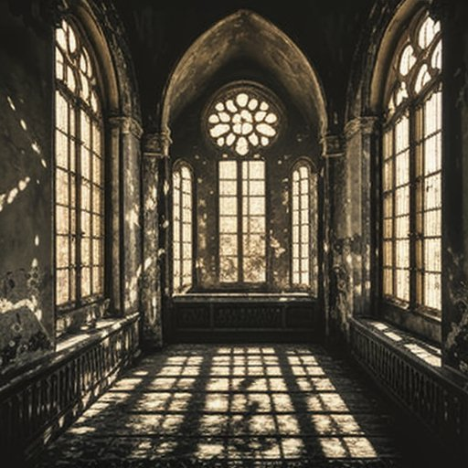<div class="play-overlay"><a href="nichita-stanescu-cautarea-tonului.html" class="play-btn-link" aria-label="Ascultă Căutarea tonului"><button class="play-btn">▶️</button></a></div><div class="song-badges"><span class="badge featured-badge">dumnezeu</span></div></div><div class="song-content"><div class="song-header"><h3 class="song-title"><a href="nichita-stanescu-cautarea-tonului.html">Căutarea tonului</a></h3><div class="song-meta"><span class="artist">Nichita Stănescu</span></div></div><div class="song-actions"><a href="nichita-stanescu-cautarea-tonului.html" class="btn btn-primary">▶️ Ascultă</a></div></div></div>
<div class="song-card" data-mood="timp" role="article"><div class="song-image-container"><div class="play-overlay"><a href="nichita-stanescu-dreptul-la-timp-iii.html" class="play-btn-link" aria-label="Ascultă Dreptul la timp III"><button class="play-btn">▶️</button></a></div><div class="song-badges"><span class="badge featured-badge">timp</span></div></div><div class="song-content"><div class="song-header"><h3 class="song-title"><a href="nichita-stanescu-dreptul-la-timp-iii.html">Dreptul la timp III</a></h3><div class="song-meta"><span class="artist">Nichita Stănescu</span></div></div><div class="song-actions"><a href="nichita-stanescu-dreptul-la-timp-iii.html" class="btn btn-primary">▶️ Ascultă</a></div></div></div>
<div class="song-card" data-mood="ploaie" role="article"><div class="song-image-container">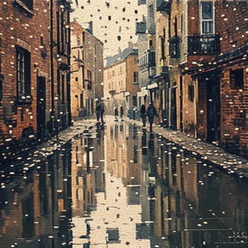<div class="play-overlay"><a href="nichita-stanescu-da-doamne-o-ploaie-albastra.html" class="play-btn-link" aria-label="Ascultă Dă, Doamne, o ploaie albastră"><button class="play-btn">▶️</button></a></div><div class="song-badges"><span class="badge featured-badge">ploaie</span></div></div><div class="song-content"><div class="song-header"><h3 class="song-title"><a href="nichita-stanescu-da-doamne-o-ploaie-albastra.html">Dă, Doamne, o ploaie albastră</a></h3><div class="song-meta"><span class="artist">Nichita Stănescu</span></div></div><div class="song-actions"><a href="nichita-stanescu-da-doamne-o-ploaie-albastra.html" class="btn btn-primary">▶️ Ascultă</a></div></div></div>
<div class="song-card" data-mood="toamna" role="article"><div class="song-image-container"><div class="play-overlay"><a href="nichita-stanescu-frunza-verde-de-albastru.html" class="play-btn-link" aria-label="Ascultă Frunză Verde De Albastru"><button class="play-btn">▶️</button></a></div><div class="song-badges"><span class="badge featured-badge">toamna</span></div></div><div class="song-content"><div class="song-header"><h3 class="song-title"><a href="nichita-stanescu-frunza-verde-de-albastru.html">Frunză Verde De Albastru</a></h3><div class="song-meta"><span class="artist">Nichita Stănescu</span></div></div><div class="song-actions"><a href="nichita-stanescu-frunza-verde-de-albastru.html" class="btn btn-primary">▶️ Ascultă</a></div></div></div>
<div class="song-card" data-mood="ploaie" role="article"><div class="song-image-container"><div class="play-overlay"><a href="nichita-stanescu-moartea-pasarilor.html" class="play-btn-link" aria-label="Ascultă Moartea păsărilor"><button class="play-btn">▶️</button></a></div><div class="song-badges"><span class="badge featured-badge">ploaie</span></div></div><div class="song-content"><div class="song-header"><h3 class="song-title"><a href="nichita-stanescu-moartea-pasarilor.html">Moartea păsărilor</a></h3><div class="song-meta"><span class="artist">Nichita Stănescu</span></div></div><div class="song-actions"><a href="nichita-stanescu-moartea-pasarilor.html" class="btn btn-primary">▶️ Ascultă</a></div></div></div>
<div class="song-card" data-mood="iarna ochi" role="article"><div class="song-image-container"><div class="play-overlay"><a href="nichita-stanescu-ninge-cu-ochi.html" class="play-btn-link" aria-label="Ascultă Ninge cu ochi"><button class="play-btn">▶️</button></a></div><div class="song-badges"><span class="badge featured-badge">iarna</span></div></div><div class="song-content"><div class="song-header"><h3 class="song-title"><a href="nichita-stanescu-ninge-cu-ochi.html">Ninge cu ochi</a></h3><div class="song-meta"><span class="artist">Nichita Stănescu</span></div></div><div class="song-actions"><a href="nichita-stanescu-ninge-cu-ochi.html" class="btn btn-primary">▶️ Ascultă</a></div></div></div>
<div class="song-card" data-mood="timp" role="article"><div class="song-image-container"><div class="play-overlay"><a href="nichita-stanescu-numai-o-clipa.html" class="play-btn-link" aria-label="Ascultă Numai o clipă"><button class="play-btn">▶️</button></a></div><div class="song-badges"><span class="badge featured-badge">timp</span></div></div><div class="song-content"><div class="song-header"><h3 class="song-title"><a href="nichita-stanescu-numai-o-clipa.html">Numai o clipă</a></h3><div class="song-meta"><span class="artist">Nichita Stănescu</span></div></div><div class="song-actions"><a href="nichita-stanescu-numai-o-clipa.html" class="btn btn-primary">▶️ Ascultă</a></div></div></div>
<div class="song-card" data-mood="lacrimi" role="article"><div class="song-image-container"><div class="play-overlay"><a href="nichita-stanescu-prin-simpla-luare.html" class="play-btn-link" aria-label="Ascultă Prin simpla luare"><button class="play-btn">▶️</button></a></div><div class="song-badges"><span class="badge featured-badge">lacrimi</span></div></div><div class="song-content"><div class="song-header"><h3 class="song-title"><a href="nichita-stanescu-prin-simpla-luare.html">Prin simpla luare</a></h3><div class="song-meta"><span class="artist">Nichita Stănescu</span></div></div><div class="song-actions"><a href="nichita-stanescu-prin-simpla-luare.html" class="btn btn-primary">▶️ Ascultă</a></div></div></div>
<div class="song-card" data-mood="lacrimi" role="article"><div class="song-image-container"><div class="play-overlay"><a href="nichita-stanescu-rasu-plansu.html" class="play-btn-link" aria-label="Ascultă Râsu&#x27; plânsu&#x27;"><button class="play-btn">▶️</button></a></div><div class="song-badges"><span class="badge featured-badge">lacrimi</span></div></div><div class="song-content"><div class="song-header"><h3 class="song-title"><a href="nichita-stanescu-rasu-plansu.html">Râsu&#x27; plânsu&#x27;</a></h3><div class="song-meta"><span class="artist">Nichita Stănescu</span></div></div><div class="song-actions"><a href="nichita-stanescu-rasu-plansu.html" class="btn btn-primary">▶️ Ascultă</a></div></div></div>
<div class="song-card" data-mood="lacrimi" role="article"><div class="song-image-container"><div class="play-overlay"><a href="nichita-stanescu-rasu-plansu.html" class="play-btn-link" aria-label="Ascultă Râsu` plânsu`"><button class="play-btn">▶️</button></a></div><div class="song-badges"><span class="badge featured-badge">lacrimi</span></div></div><div class="song-content"><div class="song-header"><h3 class="song-title"><a href="nichita-stanescu-rasu-plansu.html">Râsu` plânsu`</a></h3><div class="song-meta"><span class="artist">Nichita Stănescu</span></div></div><div class="song-actions"><a href="nichita-stanescu-rasu-plansu.html" class="btn btn-primary">▶️ Ascultă</a></div></div></div>
<div class="song-card" data-mood="durere" role="article"><div class="song-image-container"><div class="play-overlay"><a href="nichita-stanescu-sa-nu-ne-ferim-de-suferinta.html" class="play-btn-link" aria-label="Ascultă Sa nu ne ferim de suferință"><button class="play-btn">▶️</button></a></div><div class="song-badges"><span class="badge featured-badge">durere</span></div></div><div class="song-content"><div class="song-header"><h3 class="song-title"><a href="nichita-stanescu-sa-nu-ne-ferim-de-suferinta.html">Sa nu ne ferim de suferință</a></h3><div class="song-meta"><span class="artist">Nichita Stănescu</span></div></div><div class="song-actions"><a href="nichita-stanescu-sa-nu-ne-ferim-de-suferinta.html" class="btn btn-primary">▶️ Ascultă</a></div></div></div>
<div class="song-card" data-mood="dor" role="article"><div class="song-image-container"><div class="play-overlay"><a href="nichita-stanescu-spunem-dor-si-atat.html" class="play-btn-link" aria-label="Ascultă Spunem Dor și atât"><button class="play-btn">▶️</button></a></div><div class="song-badges"><span class="badge featured-badge">dor</span></div></div><div class="song-content"><div class="song-header"><h3 class="song-title"><a href="nichita-stanescu-spunem-dor-si-atat.html">Spunem Dor și atât</a></h3><div class="song-meta"><span class="artist">Nichita Stănescu</span></div></div><div class="song-actions"><a href="nichita-stanescu-spunem-dor-si-atat.html" class="btn btn-primary">▶️ Ascultă</a></div></div></div>
<div class="song-card" data-mood="cuvant" role="article"><div class="song-image-container"><div class="play-overlay"><a href="nichita-stanescu-trecerea-de-la-notiuni-la-poezie-impotrivire-la-aspectul-pietros-al-versurilor-de-pana-acum.html" class="play-btn-link" aria-label="Ascultă Trecerea de la noţiuni la poezie, împotrivire la aspectul pietros al versurilor de până acum"><button class="play-btn">▶️</button></a></div><div class="song-badges"><span class="badge featured-badge">cuvant</span></div></div><div class="song-content"><div class="song-header"><h3 class="song-title"><a href="nichita-stanescu-trecerea-de-la-notiuni-la-poezie-impotrivire-la-aspectul-pietros-al-versurilor-de-pana-acum.html">Trecerea de la noţiuni la poezie, împotrivire la aspectul pietros al versurilor de până acum</a></h3><div class="song-meta"><span class="artist">Nichita Stănescu</span></div></div><div class="song-actions"><a href="nichita-stanescu-trecerea-de-la-notiuni-la-poezie-impotrivire-la-aspectul-pietros-al-versurilor-de-pana-acum.html" class="btn btn-primary">▶️ Ascultă</a></div></div></div>
<div class="song-card" data-mood="iarna" role="article"><div class="song-image-container"><div class="play-overlay"><a href="nichita-stanescu-zapada-viscolita.html" class="play-btn-link" aria-label="Ascultă Zapada viscolita"><button class="play-btn">▶️</button></a></div><div class="song-badges"><span class="badge featured-badge">iarna</span></div></div><div class="song-content"><div class="song-header"><h3 class="song-title"><a href="nichita-stanescu-zapada-viscolita.html">Zapada viscolita</a></h3><div class="song-meta"><span class="artist">Nichita Stănescu</span></div></div><div class="song-actions"><a href="nichita-stanescu-zapada-viscolita.html" class="btn btn-primary">▶️ Ascultă</a></div></div></div>
<div class="song-card" data-mood="cuvant" role="article"><div class="song-image-container"><div class="play-overlay"><a href="nichita-stanescu-impotriva-cuvintelor.html" class="play-btn-link" aria-label="Ascultă Împotriva cuvintelor"><button class="play-btn">▶️</button></a></div><div class="song-badges"><span class="badge featured-badge">cuvant</span></div></div><div class="song-content"><div class="song-header"><h3 class="song-title"><a href="nichita-stanescu-impotriva-cuvintelor.html">Împotriva cuvintelor</a></h3><div class="song-meta"><span class="artist">Nichita Stănescu</span></div></div><div class="song-actions"><a href="nichita-stanescu-impotriva-cuvintelor.html" class="btn btn-primary">▶️ Ascultă</a></div></div></div>
:::

::: {.no-results .hidden}
<div class="no-results-content"><div class="no-results-icon">🔍</div><h3>Niciun poem găsit</h3><p>Încearcă alt termen sau altă temă.</p><button class="btn btn-primary" id="clearFilters">Șterge filtrele</button></div>
:::

```{=html}
<style>
:root{
  --bg-card:#242b3d; --text:#e8eaed; --muted:#9aa0a6; --border:#3c4043;
  --primary:#4f9cf9; --accent:#e879f9;
}
.songs-hero{
  background:linear-gradient(135deg,#0f1419 0%,#1e3a8a 30%,#7c3aed 70%,#ec4899 100%);
  padding:clamp(2rem,5vw,4rem) 1rem; text-align:center; border-radius:0 0 18px 18px;
}
.hero-title{font-size:clamp(2rem,5vw,3rem); color:#fff; margin:0; font-weight:700; border:none;}
.hero-subtitle{font-size:clamp(1rem,3vw,1.4rem); color:rgba(255,255,255,.92); margin-top:.75rem;}
.hero-mood-filter{margin-top:1.5rem;}
.mood-filter{display:flex; justify-content:center; gap:.5rem; flex-wrap:wrap;}
.mood-btn{padding:.5rem 1rem; border:1px solid rgba(255,255,255,.35); border-radius:25px;
  background:rgba(255,255,255,.08); color:#fff; font-size:.9rem; cursor:pointer; transition:all .25s ease;}
.mood-btn:hover,.mood-btn.active{background:linear-gradient(45deg,var(--primary),var(--accent));
  border-color:var(--primary); transform:translateY(-2px);}
.search-stats-bar{display:flex; align-items:center; gap:2rem; padding:1rem 1.5rem;
  max-width:1200px; margin:0 auto; border-bottom:1px solid var(--border);}
.stats-container{display:flex; align-items:center; gap:2rem;}
.stat-item{text-align:center;}
.stat-number{display:block; font-size:1.5rem; font-weight:700;
  background:linear-gradient(45deg,var(--primary),var(--accent));
  -webkit-background-clip:text; -webkit-text-fill-color:transparent; background-clip:text;}
.stat-label{font-size:.9rem; color:var(--muted);}
.search-container{margin-left:auto; width:100%; max-width:420px;}
#songSearch{width:100%; padding:.8rem 1.5rem; border:2px solid var(--border); border-radius:50px;
  background:var(--bg-card); color:var(--text); font-size:1rem;}
#songSearch:focus{outline:none; border-color:var(--primary); box-shadow:0 0 0 3px rgba(79,156,249,.2);}
.songs-grid{display:grid; grid-template-columns:repeat(auto-fill,minmax(300px,1fr));
  gap:2rem; padding:2rem 1rem; max-width:1200px; margin:0 auto;}
.song-card{background:var(--bg-card); border-radius:15px; overflow:hidden;
  border:1px solid var(--border); transition:all .3s ease;}
.song-card:hover{transform:translateY(-5px); box-shadow:0 15px 35px rgba(79,156,249,.2); border-color:var(--primary);}
.song-image-container{position:relative; height:160px; overflow:hidden;}
.poem-cover{display:flex; align-items:center; justify-content:center;}
.song-image{width:100%; height:100%; object-fit:cover; transition:transform .3s ease;}
.song-card:hover .song-image{transform:scale(1.05);}
.play-overlay{position:absolute; inset:0; background:rgba(0,0,0,.55);
  display:flex; align-items:center; justify-content:center; opacity:0; transition:opacity .3s ease;}
.song-card:hover .play-overlay{opacity:1;}
.play-btn{background:linear-gradient(45deg,var(--primary),var(--accent)); border:none; border-radius:50%;
  width:60px; height:60px; font-size:1.5rem; color:#fff; cursor:pointer; transition:transform .3s ease;}
.play-btn:hover{transform:scale(1.1);}
.song-badges{position:absolute; top:1rem; right:1rem; display:flex; flex-direction:column; gap:.5rem;}
.badge{padding:.25rem .75rem; border-radius:15px; font-size:.8rem; font-weight:600; backdrop-filter:blur(10px);}
.featured-badge{background:rgba(79,156,249,.9); color:#fff; text-transform:capitalize;}
.song-content{padding:1.5rem;}
.song-header{margin-bottom:1rem;}
.song-title{margin:0 0 .5rem; font-size:1.25rem; font-weight:600;}
.song-title a{color:#fff; text-decoration:none;}
.song-title a:hover{background:linear-gradient(45deg,var(--primary),var(--accent));
  -webkit-background-clip:text; -webkit-text-fill-color:transparent; background-clip:text;}
.song-meta{font-size:.95rem; color:var(--muted); font-style:italic;}
.song-actions{display:flex; gap:.75rem; align-items:center; flex-wrap:wrap;}
.btn{padding:.5rem 1rem; border-radius:8px; text-decoration:none; font-size:.9rem; font-weight:500;
  cursor:pointer; border:none; display:inline-block;}
.btn-primary{background:linear-gradient(45deg,var(--primary),var(--accent)); color:#fff;}
.btn-primary:hover{transform:translateY(-2px); box-shadow:0 5px 15px rgba(79,156,249,.3);}
.no-results{grid-column:1/-1; text-align:center; padding:3rem; color:var(--muted);}
.no-results-icon{font-size:4rem; margin-bottom:1rem;}
.hidden{display:none;}
@media (max-width:768px){
  .songs-grid{grid-template-columns:1fr; padding:1rem; gap:1.5rem;}
  .search-stats-bar{flex-direction:column; gap:1.25rem;}
  .search-container{margin-left:0; max-width:none;}
}
</style>
```
