::: {.hero .songs-hero}
::: {.hero-content}
<h1 class="hero-title">📜 Poeții Noștri</h1>
<p class="hero-subtitle">Marea poezie a lumii — pusă pe muzică și imagine. Alege o temă.</p>
<div class="mood-filter hero-mood-filter" id="moodFilter" role="tablist" aria-label="Filtru tematic"></div>
:::
:::

::: {.search-stats-bar}
<div class="stats-container"><div class="stat-item"><span class="stat-number" id="totalSongs">0</span><span class="stat-label">Poeme</span></div>
<div class="stat-item"><span class="stat-number" id="totalMoods">0</span><span class="stat-label">Teme</span></div>
<div class="stat-item"><span class="stat-number" id="visibleSongs">0</span><span class="stat-label">Afișate</span></div></div>
<div class="search-container"><div class="search-input-wrapper"><input type="search" id="songSearch" placeholder="🔍 Caută după poet, titlu sau temă..." aria-label="Caută poeme"></div></div>
:::

::: {.songs-grid}
<div class="song-card" data-mood="singuratate" role="article"><div class="song-image-container"><div class="play-overlay"><a href="a-e-baconsky-batran-si-singur.html" class="play-btn-link" aria-label="Ascultă Bătrân și singur"><button class="play-btn">▶️</button></a></div><div class="song-badges"><span class="badge featured-badge">singuratate</span></div></div><div class="song-content"><div class="song-header"><h3 class="song-title"><a href="a-e-baconsky-batran-si-singur.html">Bătrân și singur</a></h3><div class="song-meta"><span class="artist">A. E. Baconsky</span></div></div><div class="song-actions"><a href="a-e-baconsky-batran-si-singur.html" class="btn btn-primary">▶️ Ascultă</a></div></div></div>
<div class="song-card" data-mood="caldura" role="article"><div class="song-image-container">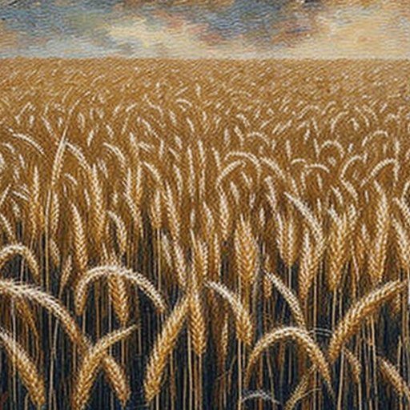<div class="play-overlay"><a href="a-e-baconsky-vara-tarzie.html" class="play-btn-link" aria-label="Ascultă Vara târzie"><button class="play-btn">▶️</button></a></div><div class="song-badges"><span class="badge featured-badge">caldura</span></div></div><div class="song-content"><div class="song-header"><h3 class="song-title"><a href="a-e-baconsky-vara-tarzie.html">Vara târzie</a></h3><div class="song-meta"><span class="artist">A. E. Baconsky</span></div></div><div class="song-actions"><a href="a-e-baconsky-vara-tarzie.html" class="btn btn-primary">▶️ Ascultă</a></div></div></div>
<div class="song-card" data-mood="drum" role="article"><div class="song-image-container">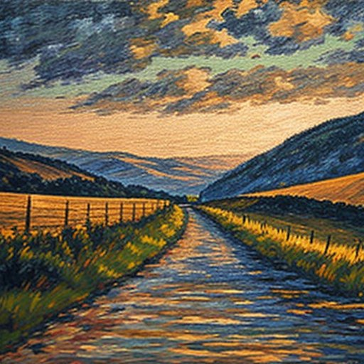<div class="play-overlay"><a href="adam-mickiewicz-ganduri-de-ziua-plecarii.html" class="play-btn-link" aria-label="Ascultă Gânduri de ziua plecării"><button class="play-btn">▶️</button></a></div><div class="song-badges"><span class="badge featured-badge">drum</span></div></div><div class="song-content"><div class="song-header"><h3 class="song-title"><a href="adam-mickiewicz-ganduri-de-ziua-plecarii.html">Gânduri de ziua plecării</a></h3><div class="song-meta"><span class="artist">Adam Mickiewicz</span></div></div><div class="song-actions"><a href="adam-mickiewicz-ganduri-de-ziua-plecarii.html" class="btn btn-primary">▶️ Ascultă</a></div></div></div>
<div class="song-card" data-mood="fericire" role="article"><div class="song-image-container">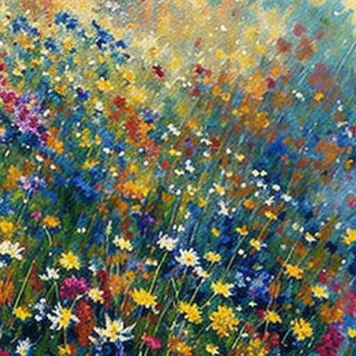<div class="play-overlay"><a href="adam-puslojic-bucurie.html" class="play-btn-link" aria-label="Ascultă Bucurie"><button class="play-btn">▶️</button></a></div><div class="song-badges"><span class="badge featured-badge">fericire</span></div></div><div class="song-content"><div class="song-header"><h3 class="song-title"><a href="adam-puslojic-bucurie.html">Bucurie</a></h3><div class="song-meta"><span class="artist">Adam Puslojić</span></div></div><div class="song-actions"><a href="adam-puslojic-bucurie.html" class="btn btn-primary">▶️ Ascultă</a></div></div></div>
<div class="song-card" data-mood="drum" role="article"><div class="song-image-container"><div class="play-overlay"><a href="adam-puslojic-mor-pe-drum.html" class="play-btn-link" aria-label="Ascultă Mor pe drum"><button class="play-btn">▶️</button></a></div><div class="song-badges"><span class="badge featured-badge">drum</span></div></div><div class="song-content"><div class="song-header"><h3 class="song-title"><a href="adam-puslojic-mor-pe-drum.html">Mor pe drum</a></h3><div class="song-meta"><span class="artist">Adam Puslojić</span></div></div><div class="song-actions"><a href="adam-puslojic-mor-pe-drum.html" class="btn btn-primary">▶️ Ascultă</a></div></div></div>
<div class="song-card" data-mood="frate" role="article"><div class="song-image-container"><div class="play-overlay"><a href="adam-puslojic-un-edict-nou-fratilor-mei-romani.html" class="play-btn-link" aria-label="Ascultă Un edict nou: fraţilor mei români"><button class="play-btn">▶️</button></a></div><div class="song-badges"><span class="badge featured-badge">frate</span></div></div><div class="song-content"><div class="song-header"><h3 class="song-title"><a href="adam-puslojic-un-edict-nou-fratilor-mei-romani.html">Un edict nou: fraţilor mei români</a></h3><div class="song-meta"><span class="artist">Adam Puslojić</span></div></div><div class="song-actions"><a href="adam-puslojic-un-edict-nou-fratilor-mei-romani.html" class="btn btn-primary">▶️ Ascultă</a></div></div></div>
<div class="song-card" data-mood="mama" role="article"><div class="song-image-container">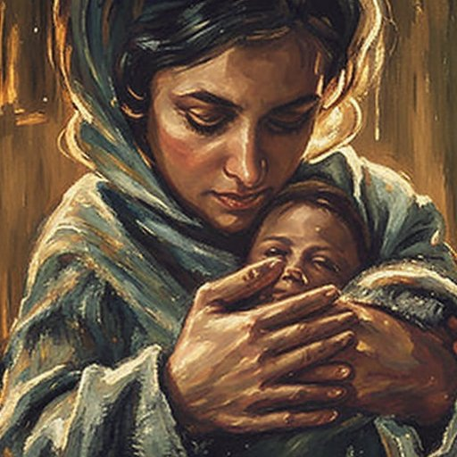<div class="play-overlay"><a href="adrian-paunescu-a-venit-aseara-mama.html" class="play-btn-link" aria-label="Ascultă A venit aseară mama"><button class="play-btn">▶️</button></a></div><div class="song-badges"><span class="badge featured-badge">mama</span></div></div><div class="song-content"><div class="song-header"><h3 class="song-title"><a href="adrian-paunescu-a-venit-aseara-mama.html">A venit aseară mama</a></h3><div class="song-meta"><span class="artist">Adrian Păunescu</span></div></div><div class="song-actions"><a href="adrian-paunescu-a-venit-aseara-mama.html" class="btn btn-primary">▶️ Ascultă</a></div></div></div>
<div class="song-card" data-mood="flori" role="article"><div class="song-image-container">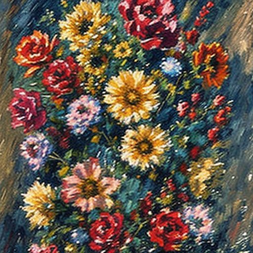<div class="play-overlay"><a href="adrian-paunescu-aceeasi-floare.html" class="play-btn-link" aria-label="Ascultă Aceeași floare"><button class="play-btn">▶️</button></a></div><div class="song-badges"><span class="badge featured-badge">flori</span></div></div><div class="song-content"><div class="song-header"><h3 class="song-title"><a href="adrian-paunescu-aceeasi-floare.html">Aceeași floare</a></h3><div class="song-meta"><span class="artist">Adrian Păunescu</span></div></div><div class="song-actions"><a href="adrian-paunescu-aceeasi-floare.html" class="btn btn-primary">▶️ Ascultă</a></div></div></div>
<div class="song-card" data-mood="tara" role="article"><div class="song-image-container"><div class="play-overlay"><a href="adrian-paunescu-adio-mama-patrie-adio.html" class="play-btn-link" aria-label="Ascultă Adio, mamă patrie, adio!"><button class="play-btn">▶️</button></a></div><div class="song-badges"><span class="badge featured-badge">tara</span></div></div><div class="song-content"><div class="song-header"><h3 class="song-title"><a href="adrian-paunescu-adio-mama-patrie-adio.html">Adio, mamă patrie, adio!</a></h3><div class="song-meta"><span class="artist">Adrian Păunescu</span></div></div><div class="song-actions"><a href="adrian-paunescu-adio-mama-patrie-adio.html" class="btn btn-primary">▶️ Ascultă</a></div></div></div>
<div class="song-card" data-mood="caldura" role="article"><div class="song-image-container"><div class="play-overlay"><a href="adrian-paunescu-adio-vara.html" class="play-btn-link" aria-label="Ascultă Adio, vară"><button class="play-btn">▶️</button></a></div><div class="song-badges"><span class="badge featured-badge">caldura</span></div></div><div class="song-content"><div class="song-header"><h3 class="song-title"><a href="adrian-paunescu-adio-vara.html">Adio, vară</a></h3><div class="song-meta"><span class="artist">Adrian Păunescu</span></div></div><div class="song-actions"><a href="adrian-paunescu-adio-vara.html" class="btn btn-primary">▶️ Ascultă</a></div></div></div>
<div class="song-card" data-mood="amintire" role="article"><div class="song-image-container">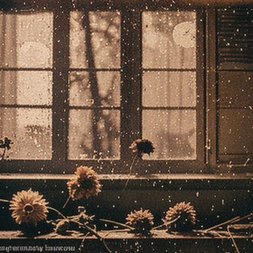<div class="play-overlay"><a href="adrian-paunescu-agresiva-amintire.html" class="play-btn-link" aria-label="Ascultă Agresiva amintire"><button class="play-btn">▶️</button></a></div><div class="song-badges"><span class="badge featured-badge">amintire</span></div></div><div class="song-content"><div class="song-header"><h3 class="song-title"><a href="adrian-paunescu-agresiva-amintire.html">Agresiva amintire</a></h3><div class="song-meta"><span class="artist">Adrian Păunescu</span></div></div><div class="song-actions"><a href="adrian-paunescu-agresiva-amintire.html" class="btn btn-primary">▶️ Ascultă</a></div></div></div>
<div class="song-card" data-mood="moarte" role="article"><div class="song-image-container">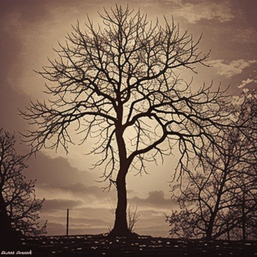<div class="play-overlay"><a href="adrian-paunescu-biet-nemuritor-la-zidul-mortii.html" class="play-btn-link" aria-label="Ascultă Biet nemuritor la zidul mortii"><button class="play-btn">▶️</button></a></div><div class="song-badges"><span class="badge featured-badge">moarte</span></div></div><div class="song-content"><div class="song-header"><h3 class="song-title"><a href="adrian-paunescu-biet-nemuritor-la-zidul-mortii.html">Biet nemuritor la zidul mortii</a></h3><div class="song-meta"><span class="artist">Adrian Păunescu</span></div></div><div class="song-actions"><a href="adrian-paunescu-biet-nemuritor-la-zidul-mortii.html" class="btn btn-primary">▶️ Ascultă</a></div></div></div>
<div class="song-card" data-mood="mama" role="article"><div class="song-image-container"><div class="play-overlay"><a href="adrian-paunescu-bocet-pentru-mama.html" class="play-btn-link" aria-label="Ascultă Bocet pentru mama"><button class="play-btn">▶️</button></a></div><div class="song-badges"><span class="badge featured-badge">mama</span></div></div><div class="song-content"><div class="song-header"><h3 class="song-title"><a href="adrian-paunescu-bocet-pentru-mama.html">Bocet pentru mama</a></h3><div class="song-meta"><span class="artist">Adrian Păunescu</span></div></div><div class="song-actions"><a href="adrian-paunescu-bocet-pentru-mama.html" class="btn btn-primary">▶️ Ascultă</a></div></div></div>
<div class="song-card" data-mood="moarte" role="article"><div class="song-image-container"><div class="play-overlay"><a href="adrian-paunescu-bocetul-lui-ion-cel-fara-mormant.html" class="play-btn-link" aria-label="Ascultă Bocetul lui Ion cel fără mormânt"><button class="play-btn">▶️</button></a></div><div class="song-badges"><span class="badge featured-badge">moarte</span></div></div><div class="song-content"><div class="song-header"><h3 class="song-title"><a href="adrian-paunescu-bocetul-lui-ion-cel-fara-mormant.html">Bocetul lui Ion cel fără mormânt</a></h3><div class="song-meta"><span class="artist">Adrian Păunescu</span></div></div><div class="song-actions"><a href="adrian-paunescu-bocetul-lui-ion-cel-fara-mormant.html" class="btn btn-primary">▶️ Ascultă</a></div></div></div>
<div class="song-card" data-mood="toamna" role="article"><div class="song-image-container"><div class="play-overlay"><a href="adrian-paunescu-ca-o-reverenta-frunza.html" class="play-btn-link" aria-label="Ascultă Ca o reverenţă, frunza"><button class="play-btn">▶️</button></a></div><div class="song-badges"><span class="badge featured-badge">toamna</span></div></div><div class="song-content"><div class="song-header"><h3 class="song-title"><a href="adrian-paunescu-ca-o-reverenta-frunza.html">Ca o reverenţă, frunza</a></h3><div class="song-meta"><span class="artist">Adrian Păunescu</span></div></div><div class="song-actions"><a href="adrian-paunescu-ca-o-reverenta-frunza.html" class="btn btn-primary">▶️ Ascultă</a></div></div></div>
<div class="song-card" data-mood="cuvant" role="article"><div class="song-image-container"><div class="play-overlay"><a href="adrian-paunescu-cartea-cartilor-de-poezie-prefata.html" class="play-btn-link" aria-label="Ascultă Cartea cărţilor de poezie (prefață)"><button class="play-btn">▶️</button></a></div><div class="song-badges"><span class="badge featured-badge">cuvant</span></div></div><div class="song-content"><div class="song-header"><h3 class="song-title"><a href="adrian-paunescu-cartea-cartilor-de-poezie-prefata.html">Cartea cărţilor de poezie (prefață)</a></h3><div class="song-meta"><span class="artist">Adrian Păunescu</span></div></div><div class="song-actions"><a href="adrian-paunescu-cartea-cartilor-de-poezie-prefata.html" class="btn btn-primary">▶️ Ascultă</a></div></div></div>
<div class="song-card" data-mood="casa" role="article"><div class="song-image-container">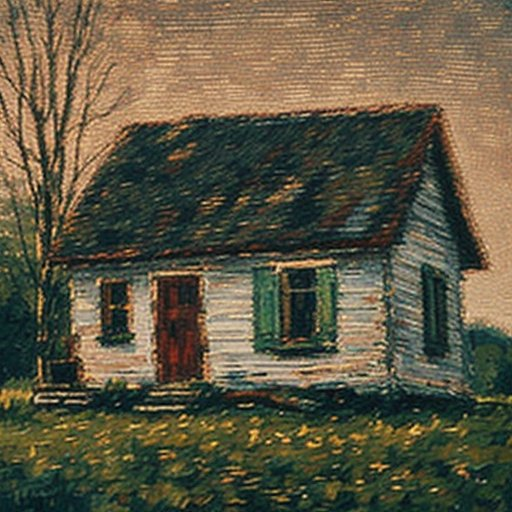<div class="play-overlay"><a href="adrian-paunescu-casa-de-lemn.html" class="play-btn-link" aria-label="Ascultă Casa de lemn"><button class="play-btn">▶️</button></a></div><div class="song-badges"><span class="badge featured-badge">casa</span></div></div><div class="song-content"><div class="song-header"><h3 class="song-title"><a href="adrian-paunescu-casa-de-lemn.html">Casa de lemn</a></h3><div class="song-meta"><span class="artist">Adrian Păunescu</span></div></div><div class="song-actions"><a href="adrian-paunescu-casa-de-lemn.html" class="btn btn-primary">▶️ Ascultă</a></div></div></div>
<div class="song-card" data-mood="caldura" role="article"><div class="song-image-container"><div class="play-overlay"><a href="adrian-paunescu-ce-toamna-mi-e-in-plin-delir-de-vara.html" class="play-btn-link" aria-label="Ascultă Ce toamnă mi-e, în plin delir de vară"><button class="play-btn">▶️</button></a></div><div class="song-badges"><span class="badge featured-badge">caldura</span></div></div><div class="song-content"><div class="song-header"><h3 class="song-title"><a href="adrian-paunescu-ce-toamna-mi-e-in-plin-delir-de-vara.html">Ce toamnă mi-e, în plin delir de vară</a></h3><div class="song-meta"><span class="artist">Adrian Păunescu</span></div></div><div class="song-actions"><a href="adrian-paunescu-ce-toamna-mi-e-in-plin-delir-de-vara.html" class="btn btn-primary">▶️ Ascultă</a></div></div></div>
<div class="song-card" data-mood="amintire" role="article"><div class="song-image-container"><div class="play-overlay"><a href="adrian-paunescu-cerere-de-uitare.html" class="play-btn-link" aria-label="Ascultă Cerere de uitare"><button class="play-btn">▶️</button></a></div><div class="song-badges"><span class="badge featured-badge">amintire</span></div></div><div class="song-content"><div class="song-header"><h3 class="song-title"><a href="adrian-paunescu-cerere-de-uitare.html">Cerere de uitare</a></h3><div class="song-meta"><span class="artist">Adrian Păunescu</span></div></div><div class="song-actions"><a href="adrian-paunescu-cerere-de-uitare.html" class="btn btn-primary">▶️ Ascultă</a></div></div></div>
<div class="song-card" data-mood="durere" role="article"><div class="song-image-container">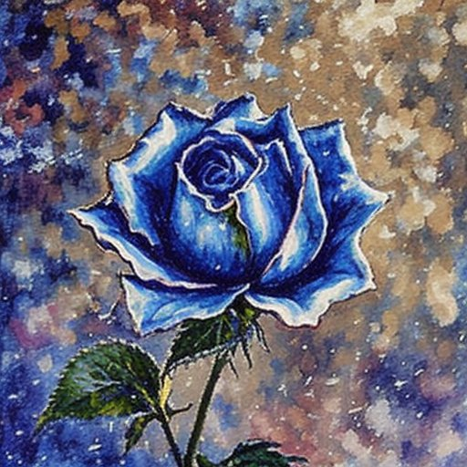<div class="play-overlay"><a href="adrian-paunescu-cersesc-suferinta.html" class="play-btn-link" aria-label="Ascultă Cerșesc suferința"><button class="play-btn">▶️</button></a></div><div class="song-badges"><span class="badge featured-badge">durere</span></div></div><div class="song-content"><div class="song-header"><h3 class="song-title"><a href="adrian-paunescu-cersesc-suferinta.html">Cerșesc suferința</a></h3><div class="song-meta"><span class="artist">Adrian Păunescu</span></div></div><div class="song-actions"><a href="adrian-paunescu-cersesc-suferinta.html" class="btn btn-primary">▶️ Ascultă</a></div></div></div>
<div class="song-card" data-mood="moarte" role="article"><div class="song-image-container"><div class="play-overlay"><a href="adrian-paunescu-cimitir-de-artisti.html" class="play-btn-link" aria-label="Ascultă Cimitir de artişti"><button class="play-btn">▶️</button></a></div><div class="song-badges"><span class="badge featured-badge">moarte</span></div></div><div class="song-content"><div class="song-header"><h3 class="song-title"><a href="adrian-paunescu-cimitir-de-artisti.html">Cimitir de artişti</a></h3><div class="song-meta"><span class="artist">Adrian Păunescu</span></div></div><div class="song-actions"><a href="adrian-paunescu-cimitir-de-artisti.html" class="btn btn-primary">▶️ Ascultă</a></div></div></div>
<div class="song-card" data-mood="mama tata" role="article"><div class="song-image-container"><div class="play-overlay"><a href="adrian-paunescu-colind-de-mama-si-tata.html" class="play-btn-link" aria-label="Ascultă Colind de mamă și tată"><button class="play-btn">▶️</button></a></div><div class="song-badges"><span class="badge featured-badge">mama</span></div></div><div class="song-content"><div class="song-header"><h3 class="song-title"><a href="adrian-paunescu-colind-de-mama-si-tata.html">Colind de mamă și tată</a></h3><div class="song-meta"><span class="artist">Adrian Păunescu</span></div></div><div class="song-actions"><a href="adrian-paunescu-colind-de-mama-si-tata.html" class="btn btn-primary">▶️ Ascultă</a></div></div></div>
<div class="song-card" data-mood="tata" role="article"><div class="song-image-container">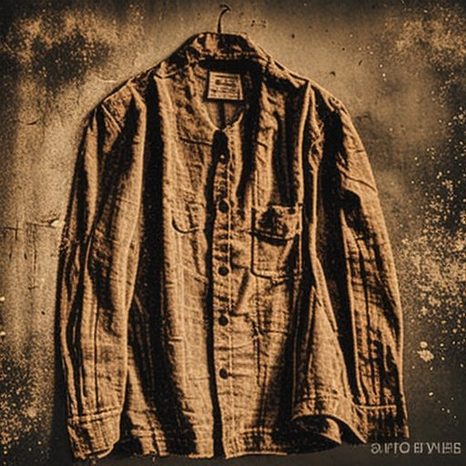<div class="play-overlay"><a href="adrian-paunescu-colind-pentru-tata-bolnav.html" class="play-btn-link" aria-label="Ascultă Colind pentru tată bolnav"><button class="play-btn">▶️</button></a></div><div class="song-badges"><span class="badge featured-badge">tata</span></div></div><div class="song-content"><div class="song-header"><h3 class="song-title"><a href="adrian-paunescu-colind-pentru-tata-bolnav.html">Colind pentru tată bolnav</a></h3><div class="song-meta"><span class="artist">Adrian Păunescu</span></div></div><div class="song-actions"><a href="adrian-paunescu-colind-pentru-tata-bolnav.html" class="btn btn-primary">▶️ Ascultă</a></div></div></div>
<div class="song-card" data-mood="tara" role="article"><div class="song-image-container"><div class="play-overlay"><a href="adrian-paunescu-colindul-celui-fara-de-tara.html" class="play-btn-link" aria-label="Ascultă Colindul celui fără de ţară"><button class="play-btn">▶️</button></a></div><div class="song-badges"><span class="badge featured-badge">tara</span></div></div><div class="song-content"><div class="song-header"><h3 class="song-title"><a href="adrian-paunescu-colindul-celui-fara-de-tara.html">Colindul celui fără de ţară</a></h3><div class="song-meta"><span class="artist">Adrian Păunescu</span></div></div><div class="song-actions"><a href="adrian-paunescu-colindul-celui-fara-de-tara.html" class="btn btn-primary">▶️ Ascultă</a></div></div></div>
<div class="song-card" data-mood="toamna" role="article"><div class="song-image-container"><div class="play-overlay"><a href="adrian-paunescu-condamnare-la-toamna.html" class="play-btn-link" aria-label="Ascultă Condamnare la toamnă"><button class="play-btn">▶️</button></a></div><div class="song-badges"><span class="badge featured-badge">toamna</span></div></div><div class="song-content"><div class="song-header"><h3 class="song-title"><a href="adrian-paunescu-condamnare-la-toamna.html">Condamnare la toamnă</a></h3><div class="song-meta"><span class="artist">Adrian Păunescu</span></div></div><div class="song-actions"><a href="adrian-paunescu-condamnare-la-toamna.html" class="btn btn-primary">▶️ Ascultă</a></div></div></div>
<div class="song-card" data-mood="tara" role="article"><div class="song-image-container"><div class="play-overlay"><a href="adrian-paunescu-copiii-de-tarani.html" class="play-btn-link" aria-label="Ascultă Copiii de țărani"><button class="play-btn">▶️</button></a></div><div class="song-badges"><span class="badge featured-badge">tara</span></div></div><div class="song-content"><div class="song-header"><h3 class="song-title"><a href="adrian-paunescu-copiii-de-tarani.html">Copiii de țărani</a></h3><div class="song-meta"><span class="artist">Adrian Păunescu</span></div></div><div class="song-actions"><a href="adrian-paunescu-copiii-de-tarani.html" class="btn btn-primary">▶️ Ascultă</a></div></div></div>
<div class="song-card" data-mood="copilarie" role="article"><div class="song-image-container">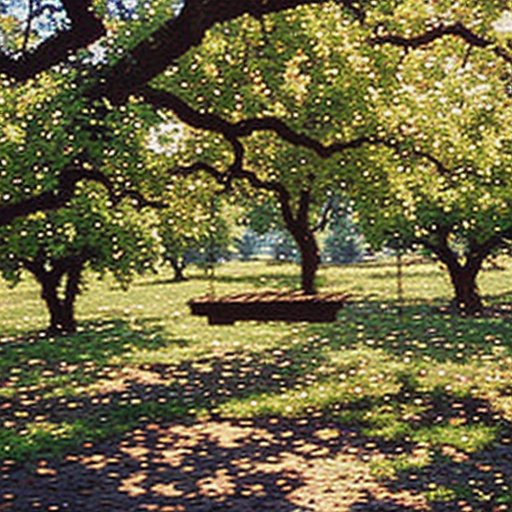<div class="play-overlay"><a href="adrian-paunescu-copilarie-cu-must.html" class="play-btn-link" aria-label="Ascultă Copilărie cu must"><button class="play-btn">▶️</button></a></div><div class="song-badges"><span class="badge featured-badge">copilarie</span></div></div><div class="song-content"><div class="song-header"><h3 class="song-title"><a href="adrian-paunescu-copilarie-cu-must.html">Copilărie cu must</a></h3><div class="song-meta"><span class="artist">Adrian Păunescu</span></div></div><div class="song-actions"><a href="adrian-paunescu-copilarie-cu-must.html" class="btn btn-primary">▶️ Ascultă</a></div></div></div>
<div class="song-card" data-mood="moarte" role="article"><div class="song-image-container"><div class="play-overlay"><a href="adrian-paunescu-carare-de-morti.html" class="play-btn-link" aria-label="Ascultă Cărare de morți"><button class="play-btn">▶️</button></a></div><div class="song-badges"><span class="badge featured-badge">moarte</span></div></div><div class="song-content"><div class="song-header"><h3 class="song-title"><a href="adrian-paunescu-carare-de-morti.html">Cărare de morți</a></h3><div class="song-meta"><span class="artist">Adrian Păunescu</span></div></div><div class="song-actions"><a href="adrian-paunescu-carare-de-morti.html" class="btn btn-primary">▶️ Ascultă</a></div></div></div>
<div class="song-card" data-mood="libertate" role="article"><div class="song-image-container"><div class="play-overlay"><a href="adrian-paunescu-dacii-liberi.html" class="play-btn-link" aria-label="Ascultă Dacii liberi"><button class="play-btn">▶️</button></a></div><div class="song-badges"><span class="badge featured-badge">libertate</span></div></div><div class="song-content"><div class="song-header"><h3 class="song-title"><a href="adrian-paunescu-dacii-liberi.html">Dacii liberi</a></h3><div class="song-meta"><span class="artist">Adrian Păunescu</span></div></div><div class="song-actions"><a href="adrian-paunescu-dacii-liberi.html" class="btn btn-primary">▶️ Ascultă</a></div></div></div>
<div class="song-card" data-mood="luna_stele" role="article"><div class="song-image-container">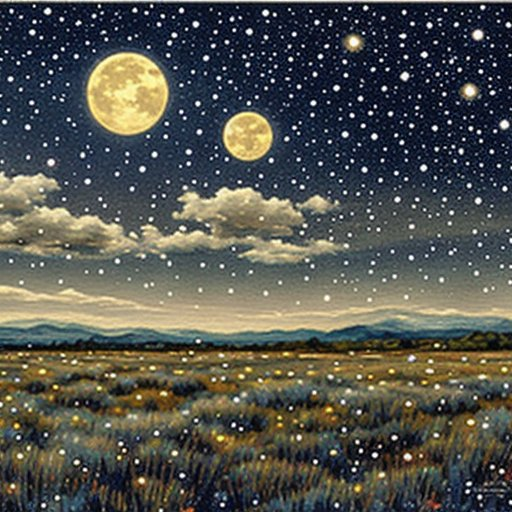<div class="play-overlay"><a href="adrian-paunescu-delta-lunara.html" class="play-btn-link" aria-label="Ascultă Delta lunară"><button class="play-btn">▶️</button></a></div><div class="song-badges"><span class="badge featured-badge">luna_stele</span></div></div><div class="song-content"><div class="song-header"><h3 class="song-title"><a href="adrian-paunescu-delta-lunara.html">Delta lunară</a></h3><div class="song-meta"><span class="artist">Adrian Păunescu</span></div></div><div class="song-actions"><a href="adrian-paunescu-delta-lunara.html" class="btn btn-primary">▶️ Ascultă</a></div></div></div>
<div class="song-card" data-mood="caldura" role="article"><div class="song-image-container"><div class="play-overlay"><a href="ady-endre-amintire-de-o-noapte-de-vara-emlekezes-egy-nyar-ejszakara.html" class="play-btn-link" aria-label="Ascultă Amintire de o noapte de vară - (Emlékezés egy nyár-éjszakára)"><button class="play-btn">▶️</button></a></div><div class="song-badges"><span class="badge featured-badge">caldura</span></div></div><div class="song-content"><div class="song-header"><h3 class="song-title"><a href="ady-endre-amintire-de-o-noapte-de-vara-emlekezes-egy-nyar-ejszakara.html">Amintire de o noapte de vară - (Emlékezés egy nyár-éjszakára)</a></h3><div class="song-meta"><span class="artist">Ady Endre</span></div></div><div class="song-actions"><a href="ady-endre-amintire-de-o-noapte-de-vara-emlekezes-egy-nyar-ejszakara.html" class="btn btn-primary">▶️ Ascultă</a></div></div></div>
<div class="song-card" data-mood="timp" role="article"><div class="song-image-container"><div class="play-overlay"><a href="ady-endre-cei-ce-vesnic-zabovesc-akik-mindig-elkesnek.html" class="play-btn-link" aria-label="Ascultă Cei ce veșnic zăbovesc - (Akik mindig elkésnek)"><button class="play-btn">▶️</button></a></div><div class="song-badges"><span class="badge featured-badge">timp</span></div></div><div class="song-content"><div class="song-header"><h3 class="song-title"><a href="ady-endre-cei-ce-vesnic-zabovesc-akik-mindig-elkesnek.html">Cei ce veșnic zăbovesc - (Akik mindig elkésnek)</a></h3><div class="song-meta"><span class="artist">Ady Endre</span></div></div><div class="song-actions"><a href="ady-endre-cei-ce-vesnic-zabovesc-akik-mindig-elkesnek.html" class="btn btn-primary">▶️ Ascultă</a></div></div></div>
<div class="song-card" data-mood="caldura" role="article"><div class="song-image-container"><div class="play-overlay"><a href="ady-endre-caldura-ta-a-te-melegseged.html" class="play-btn-link" aria-label="Ascultă Căldura ta - (A te melegséged)"><button class="play-btn">▶️</button></a></div><div class="song-badges"><span class="badge featured-badge">caldura</span></div></div><div class="song-content"><div class="song-header"><h3 class="song-title"><a href="ady-endre-caldura-ta-a-te-melegseged.html">Căldura ta - (A te melegséged)</a></h3><div class="song-meta"><span class="artist">Ady Endre</span></div></div><div class="song-actions"><a href="ady-endre-caldura-ta-a-te-melegseged.html" class="btn btn-primary">▶️ Ascultă</a></div></div></div>
<div class="song-card" data-mood="mare" role="article"><div class="song-image-container">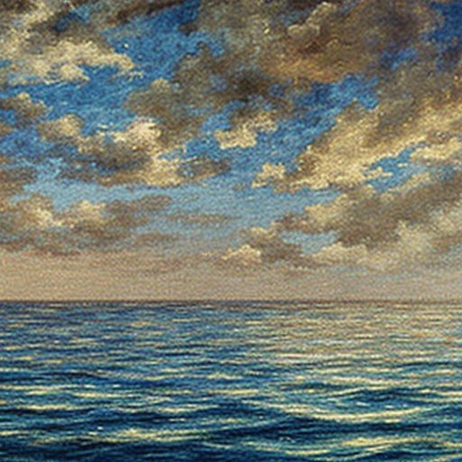<div class="play-overlay"><a href="ady-endre-de-la-ier-la-ocean-az-ert-l-az-oceanig.html" class="play-btn-link" aria-label="Ascultă De la Ier la Ocean - (Az Értől az Óceánig)"><button class="play-btn">▶️</button></a></div><div class="song-badges"><span class="badge featured-badge">mare</span></div></div><div class="song-content"><div class="song-header"><h3 class="song-title"><a href="ady-endre-de-la-ier-la-ocean-az-ert-l-az-oceanig.html">De la Ier la Ocean - (Az Értől az Óceánig)</a></h3><div class="song-meta"><span class="artist">Ady Endre</span></div></div><div class="song-actions"><a href="ady-endre-de-la-ier-la-ocean-az-ert-l-az-oceanig.html" class="btn btn-primary">▶️ Ascultă</a></div></div></div>
<div class="song-card" data-mood="lacrimi" role="article"><div class="song-image-container"><div class="play-overlay"><a href="ady-endre-doamna-lacrimilor-a-konnyek-asszonya.html" class="play-btn-link" aria-label="Ascultă Doamna lacrimilor - (A könnyek asszonya)"><button class="play-btn">▶️</button></a></div><div class="song-badges"><span class="badge featured-badge">lacrimi</span></div></div><div class="song-content"><div class="song-header"><h3 class="song-title"><a href="ady-endre-doamna-lacrimilor-a-konnyek-asszonya.html">Doamna lacrimilor - (A könnyek asszonya)</a></h3><div class="song-meta"><span class="artist">Ady Endre</span></div></div><div class="song-actions"><a href="ady-endre-doamna-lacrimilor-a-konnyek-asszonya.html" class="btn btn-primary">▶️ Ascultă</a></div></div></div>
<div class="song-card" data-mood="mare" role="article"><div class="song-image-container"><div class="play-overlay"><a href="ady-endre-singur-cu-marea-egyedul-a-tengerrel.html" class="play-btn-link" aria-label="Ascultă Singur cu marea - (Egyedül a tengerrel)"><button class="play-btn">▶️</button></a></div><div class="song-badges"><span class="badge featured-badge">mare</span></div></div><div class="song-content"><div class="song-header"><h3 class="song-title"><a href="ady-endre-singur-cu-marea-egyedul-a-tengerrel.html">Singur cu marea - (Egyedül a tengerrel)</a></h3><div class="song-meta"><span class="artist">Ady Endre</span></div></div><div class="song-actions"><a href="ady-endre-singur-cu-marea-egyedul-a-tengerrel.html" class="btn btn-primary">▶️ Ascultă</a></div></div></div>
<div class="song-card" data-mood="caldura" role="article"><div class="song-image-container"><div class="play-overlay"><a href="afanasii-fet-cand-sanul-tau-fraged-si-blanda-si-calda.html" class="play-btn-link" aria-label="Ascultă Când sânul tău fraged și blânda și calda"><button class="play-btn">▶️</button></a></div><div class="song-badges"><span class="badge featured-badge">caldura</span></div></div><div class="song-content"><div class="song-header"><h3 class="song-title"><a href="afanasii-fet-cand-sanul-tau-fraged-si-blanda-si-calda.html">Când sânul tău fraged și blânda și calda</a></h3><div class="song-meta"><span class="artist">Afanasii Fet</span></div></div><div class="song-actions"><a href="afanasii-fet-cand-sanul-tau-fraged-si-blanda-si-calda.html" class="btn btn-primary">▶️ Ascultă</a></div></div></div>
<div class="song-card" data-mood="casa" role="article"><div class="song-image-container"><div class="play-overlay"><a href="afanasii-fet-langa-camin-traducere-vbragagiu.html" class="play-btn-link" aria-label="Ascultă Lângă cămin - traducere V.Bragagiu"><button class="play-btn">▶️</button></a></div><div class="song-badges"><span class="badge featured-badge">casa</span></div></div><div class="song-content"><div class="song-header"><h3 class="song-title"><a href="afanasii-fet-langa-camin-traducere-vbragagiu.html">Lângă cămin - traducere V.Bragagiu</a></h3><div class="song-meta"><span class="artist">Afanasii Fet</span></div></div><div class="song-actions"><a href="afanasii-fet-langa-camin-traducere-vbragagiu.html" class="btn btn-primary">▶️ Ascultă</a></div></div></div>
<div class="song-card" data-mood="caldura" role="article"><div class="song-image-container"><div class="play-overlay"><a href="afanasii-fet-seara-limpede-de-vara-traducere-vbragagiu.html" class="play-btn-link" aria-label="Ascultă Seara limpede de vară - traducere V.Bragagiu"><button class="play-btn">▶️</button></a></div><div class="song-badges"><span class="badge featured-badge">caldura</span></div></div><div class="song-content"><div class="song-header"><h3 class="song-title"><a href="afanasii-fet-seara-limpede-de-vara-traducere-vbragagiu.html">Seara limpede de vară - traducere V.Bragagiu</a></h3><div class="song-meta"><span class="artist">Afanasii Fet</span></div></div><div class="song-actions"><a href="afanasii-fet-seara-limpede-de-vara-traducere-vbragagiu.html" class="btn btn-primary">▶️ Ascultă</a></div></div></div>
<div class="song-card" data-mood="soare" role="article"><div class="song-image-container">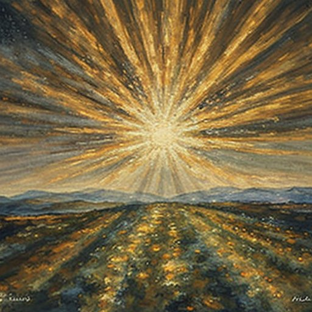<div class="play-overlay"><a href="afanasii-fet-tu-in-zori-n-o-trezi-cand-stapan.html" class="play-btn-link" aria-label="Ascultă Tu în zori n-o trezi, când stăpân"><button class="play-btn">▶️</button></a></div><div class="song-badges"><span class="badge featured-badge">soare</span></div></div><div class="song-content"><div class="song-header"><h3 class="song-title"><a href="afanasii-fet-tu-in-zori-n-o-trezi-cand-stapan.html">Tu în zori n-o trezi, când stăpân</a></h3><div class="song-meta"><span class="artist">Afanasii Fet</span></div></div><div class="song-actions"><a href="afanasii-fet-tu-in-zori-n-o-trezi-cand-stapan.html" class="btn btn-primary">▶️ Ascultă</a></div></div></div>
<div class="song-card" data-mood="iarna vant" role="article"><div class="song-image-container">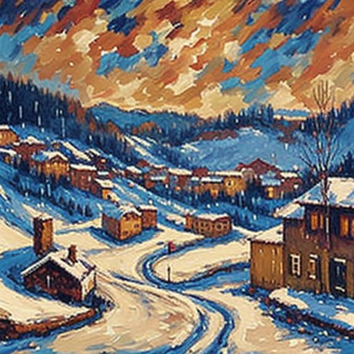<div class="play-overlay"><a href="afanasii-fet-viscol-viscolind.html" class="play-btn-link" aria-label="Ascultă Viscol, viscolind"><button class="play-btn">▶️</button></a></div><div class="song-badges"><span class="badge featured-badge">iarna</span></div></div><div class="song-content"><div class="song-header"><h3 class="song-title"><a href="afanasii-fet-viscol-viscolind.html">Viscol, viscolind</a></h3><div class="song-meta"><span class="artist">Afanasii Fet</span></div></div><div class="song-actions"><a href="afanasii-fet-viscol-viscolind.html" class="btn btn-primary">▶️ Ascultă</a></div></div></div>
<div class="song-card" data-mood="vant" role="article"><div class="song-image-container">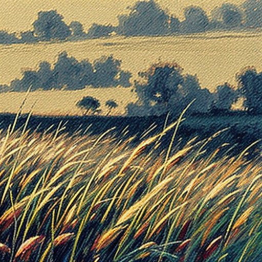<div class="play-overlay"><a href="afanasii-fet-vant-aspru-vant-cu-manie.html" class="play-btn-link" aria-label="Ascultă Vânt aspru, vânt cu mânie"><button class="play-btn">▶️</button></a></div><div class="song-badges"><span class="badge featured-badge">vant</span></div></div><div class="song-content"><div class="song-header"><h3 class="song-title"><a href="afanasii-fet-vant-aspru-vant-cu-manie.html">Vânt aspru, vânt cu mânie</a></h3><div class="song-meta"><span class="artist">Afanasii Fet</span></div></div><div class="song-actions"><a href="afanasii-fet-vant-aspru-vant-cu-manie.html" class="btn btn-primary">▶️ Ascultă</a></div></div></div>
<div class="song-card" data-mood="lumina soare" role="article"><div class="song-image-container">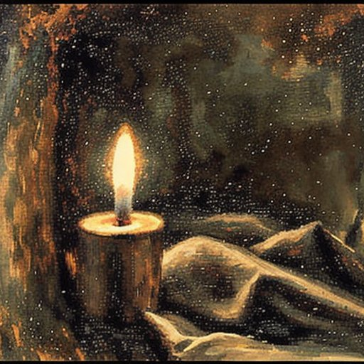<div class="play-overlay"><a href="agatha-bacovia-lumina-din-amurg.html" class="play-btn-link" aria-label="Ascultă Lumină din amurg"><button class="play-btn">▶️</button></a></div><div class="song-badges"><span class="badge featured-badge">lumina</span></div></div><div class="song-content"><div class="song-header"><h3 class="song-title"><a href="agatha-bacovia-lumina-din-amurg.html">Lumină din amurg</a></h3><div class="song-meta"><span class="artist">Agatha Bacovia</span></div></div><div class="song-actions"><a href="agatha-bacovia-lumina-din-amurg.html" class="btn btn-primary">▶️ Ascultă</a></div></div></div>
<div class="song-card" data-mood="fericire" role="article"><div class="song-image-container"><div class="play-overlay"><a href="alain-bosquet-bucuria.html" class="play-btn-link" aria-label="Ascultă Bucuria"><button class="play-btn">▶️</button></a></div><div class="song-badges"><span class="badge featured-badge">fericire</span></div></div><div class="song-content"><div class="song-header"><h3 class="song-title"><a href="alain-bosquet-bucuria.html">Bucuria</a></h3><div class="song-meta"><span class="artist">Alain Bosquet</span></div></div><div class="song-actions"><a href="alain-bosquet-bucuria.html" class="btn btn-primary">▶️ Ascultă</a></div></div></div>
<div class="song-card" data-mood="moarte" role="article"><div class="song-image-container"><div class="play-overlay"><a href="alain-bosquet-poet-mort.html" class="play-btn-link" aria-label="Ascultă Poet mort"><button class="play-btn">▶️</button></a></div><div class="song-badges"><span class="badge featured-badge">moarte</span></div></div><div class="song-content"><div class="song-header"><h3 class="song-title"><a href="alain-bosquet-poet-mort.html">Poet mort</a></h3><div class="song-meta"><span class="artist">Alain Bosquet</span></div></div><div class="song-actions"><a href="alain-bosquet-poet-mort.html" class="btn btn-primary">▶️ Ascultă</a></div></div></div>
<div class="song-card" data-mood="cuvant" role="article"><div class="song-image-container"><div class="play-overlay"><a href="alain-bosquet-poezie-fara-definitie.html" class="play-btn-link" aria-label="Ascultă Poezie fără definiție"><button class="play-btn">▶️</button></a></div><div class="song-badges"><span class="badge featured-badge">cuvant</span></div></div><div class="song-content"><div class="song-header"><h3 class="song-title"><a href="alain-bosquet-poezie-fara-definitie.html">Poezie fără definiție</a></h3><div class="song-meta"><span class="artist">Alain Bosquet</span></div></div><div class="song-actions"><a href="alain-bosquet-poezie-fara-definitie.html" class="btn btn-primary">▶️ Ascultă</a></div></div></div>
<div class="song-card" data-mood="cantec" role="article"><div class="song-image-container"><div class="play-overlay"><a href="alecu-russo-cantarea-romaniei.html" class="play-btn-link" aria-label="Ascultă Cantarea Romaniei"><button class="play-btn">▶️</button></a></div><div class="song-badges"><span class="badge featured-badge">cantec</span></div></div><div class="song-content"><div class="song-header"><h3 class="song-title"><a href="alecu-russo-cantarea-romaniei.html">Cantarea Romaniei</a></h3><div class="song-meta"><span class="artist">Alecu Russo</span></div></div><div class="song-actions"><a href="alecu-russo-cantarea-romaniei.html" class="btn btn-primary">▶️ Ascultă</a></div></div></div>
<div class="song-card" data-mood="cer" role="article"><div class="song-image-container"><div class="play-overlay"><a href="alejandra-pizarnik-cu-greu-exilata-din-cerul-inchis.html" class="play-btn-link" aria-label="Ascultă ~ Cu greu exilată din cerul închis"><button class="play-btn">▶️</button></a></div><div class="song-badges"><span class="badge featured-badge">cer</span></div></div><div class="song-content"><div class="song-header"><h3 class="song-title"><a href="alejandra-pizarnik-cu-greu-exilata-din-cerul-inchis.html">~ Cu greu exilată din cerul închis</a></h3><div class="song-meta"><span class="artist">Alejandra Pizarnik</span></div></div><div class="song-actions"><a href="alejandra-pizarnik-cu-greu-exilata-din-cerul-inchis.html" class="btn btn-primary">▶️ Ascultă</a></div></div></div>
<div class="song-card" data-mood="casa" role="article"><div class="song-image-container"><div class="play-overlay"><a href="aleksandr-blok-casei-puskin.html" class="play-btn-link" aria-label="Ascultă Casei Pușkin"><button class="play-btn">▶️</button></a></div><div class="song-badges"><span class="badge featured-badge">casa</span></div></div><div class="song-content"><div class="song-header"><h3 class="song-title"><a href="aleksandr-blok-casei-puskin.html">Casei Pușkin</a></h3><div class="song-meta"><span class="artist">Aleksandr Blok</span></div></div><div class="song-actions"><a href="aleksandr-blok-casei-puskin.html" class="btn btn-primary">▶️ Ascultă</a></div></div></div>
<div class="song-card" data-mood="amintire" role="article"><div class="song-image-container"><div class="play-overlay"><a href="aleksandr-blok-cand-imprejur-e-uitare.html" class="play-btn-link" aria-label="Ascultă Când împrejur e uitare"><button class="play-btn">▶️</button></a></div><div class="song-badges"><span class="badge featured-badge">amintire</span></div></div><div class="song-content"><div class="song-header"><h3 class="song-title"><a href="aleksandr-blok-cand-imprejur-e-uitare.html">Când împrejur e uitare</a></h3><div class="song-meta"><span class="artist">Aleksandr Blok</span></div></div><div class="song-actions"><a href="aleksandr-blok-cand-imprejur-e-uitare.html" class="btn btn-primary">▶️ Ascultă</a></div></div></div>
<div class="song-card" data-mood="vant" role="article"><div class="song-image-container"><div class="play-overlay"><a href="aleksandr-blok-furtuna-geme-ne-ncetat.html" class="play-btn-link" aria-label="Ascultă Furtuna geme ne-ncetat,"><button class="play-btn">▶️</button></a></div><div class="song-badges"><span class="badge featured-badge">vant</span></div></div><div class="song-content"><div class="song-header"><h3 class="song-title"><a href="aleksandr-blok-furtuna-geme-ne-ncetat.html">Furtuna geme ne-ncetat,</a></h3><div class="song-meta"><span class="artist">Aleksandr Blok</span></div></div><div class="song-actions"><a href="aleksandr-blok-furtuna-geme-ne-ncetat.html" class="btn btn-primary">▶️ Ascultă</a></div></div></div>
<div class="song-card" data-mood="soare" role="article"><div class="song-image-container"><div class="play-overlay"><a href="aleksandr-blok-harazitu-ne-a-soare.html" class="play-btn-link" aria-label="Ascultă Hărăzitu-ne-a Soare"><button class="play-btn">▶️</button></a></div><div class="song-badges"><span class="badge featured-badge">soare</span></div></div><div class="song-content"><div class="song-header"><h3 class="song-title"><a href="aleksandr-blok-harazitu-ne-a-soare.html">Hărăzitu-ne-a Soare</a></h3><div class="song-meta"><span class="artist">Aleksandr Blok</span></div></div><div class="song-actions"><a href="aleksandr-blok-harazitu-ne-a-soare.html" class="btn btn-primary">▶️ Ascultă</a></div></div></div>
<div class="song-card" data-mood="soare" role="article"><div class="song-image-container"><div class="play-overlay"><a href="aleksandr-blok-ma-voi-trezi-in-zori-de-dimineata.html" class="play-btn-link" aria-label="Ascultă Ma voi trezi in zori, de dimineata"><button class="play-btn">▶️</button></a></div><div class="song-badges"><span class="badge featured-badge">soare</span></div></div><div class="song-content"><div class="song-header"><h3 class="song-title"><a href="aleksandr-blok-ma-voi-trezi-in-zori-de-dimineata.html">Ma voi trezi in zori, de dimineata</a></h3><div class="song-meta"><span class="artist">Aleksandr Blok</span></div></div><div class="song-actions"><a href="aleksandr-blok-ma-voi-trezi-in-zori-de-dimineata.html" class="btn btn-primary">▶️ Ascultă</a></div></div></div>
<div class="song-card" data-mood="cer" role="article"><div class="song-image-container"><div class="play-overlay"><a href="aleksandr-blok-nu-i-minte-n-lume-cerul-sa-l-masoare.html" class="play-btn-link" aria-label="Ascultă Nu-i minte-n lume cerul să-l măsoare"><button class="play-btn">▶️</button></a></div><div class="song-badges"><span class="badge featured-badge">cer</span></div></div><div class="song-content"><div class="song-header"><h3 class="song-title"><a href="aleksandr-blok-nu-i-minte-n-lume-cerul-sa-l-masoare.html">Nu-i minte-n lume cerul să-l măsoare</a></h3><div class="song-meta"><span class="artist">Aleksandr Blok</span></div></div><div class="song-actions"><a href="aleksandr-blok-nu-i-minte-n-lume-cerul-sa-l-masoare.html" class="btn btn-primary">▶️ Ascultă</a></div></div></div>
<div class="song-card" data-mood="casa" role="article"><div class="song-image-container"><div class="play-overlay"><a href="aleksandr-blok-prin-casa-mi-plimb-amarul.html" class="play-btn-link" aria-label="Ascultă Prin casă-mi plimb amarul"><button class="play-btn">▶️</button></a></div><div class="song-badges"><span class="badge featured-badge">casa</span></div></div><div class="song-content"><div class="song-header"><h3 class="song-title"><a href="aleksandr-blok-prin-casa-mi-plimb-amarul.html">Prin casă-mi plimb amarul</a></h3><div class="song-meta"><span class="artist">Aleksandr Blok</span></div></div><div class="song-actions"><a href="aleksandr-blok-prin-casa-mi-plimb-amarul.html" class="btn btn-primary">▶️ Ascultă</a></div></div></div>
<div class="song-card" data-mood="libertate" role="article"><div class="song-image-container"><div class="play-overlay"><a href="aleksandr-blok-priveste-libertatea-n-cer.html" class="play-btn-link" aria-label="Ascultă Privește libertatea-n cer"><button class="play-btn">▶️</button></a></div><div class="song-badges"><span class="badge featured-badge">libertate</span></div></div><div class="song-content"><div class="song-header"><h3 class="song-title"><a href="aleksandr-blok-priveste-libertatea-n-cer.html">Privește libertatea-n cer</a></h3><div class="song-meta"><span class="artist">Aleksandr Blok</span></div></div><div class="song-actions"><a href="aleksandr-blok-priveste-libertatea-n-cer.html" class="btn btn-primary">▶️ Ascultă</a></div></div></div>
<div class="song-card" data-mood="libertate" role="article"><div class="song-image-container"><div class="play-overlay"><a href="aleksandr-blok-ravnesc-slavita-libertate.html" class="play-btn-link" aria-label="Ascultă Ravnesc slavita libertate"><button class="play-btn">▶️</button></a></div><div class="song-badges"><span class="badge featured-badge">libertate</span></div></div><div class="song-content"><div class="song-header"><h3 class="song-title"><a href="aleksandr-blok-ravnesc-slavita-libertate.html">Ravnesc slavita libertate</a></h3><div class="song-meta"><span class="artist">Aleksandr Blok</span></div></div><div class="song-actions"><a href="aleksandr-blok-ravnesc-slavita-libertate.html" class="btn btn-primary">▶️ Ascultă</a></div></div></div>
<div class="song-card" data-mood="caldura" role="article"><div class="song-image-container"><div class="play-overlay"><a href="aleksandr-blok-seara-de-vara.html" class="play-btn-link" aria-label="Ascultă Seara de vara"><button class="play-btn">▶️</button></a></div><div class="song-badges"><span class="badge featured-badge">caldura</span></div></div><div class="song-content"><div class="song-header"><h3 class="song-title"><a href="aleksandr-blok-seara-de-vara.html">Seara de vara</a></h3><div class="song-meta"><span class="artist">Aleksandr Blok</span></div></div><div class="song-actions"><a href="aleksandr-blok-seara-de-vara.html" class="btn btn-primary">▶️ Ascultă</a></div></div></div>
<div class="song-card" data-mood="vant" role="article"><div class="song-image-container"><div class="play-overlay"><a href="aleksandr-blok-vantul-mi-aduse-o-boare.html" class="play-btn-link" aria-label="Ascultă Vântul mi-aduse o boare"><button class="play-btn">▶️</button></a></div><div class="song-badges"><span class="badge featured-badge">vant</span></div></div><div class="song-content"><div class="song-header"><h3 class="song-title"><a href="aleksandr-blok-vantul-mi-aduse-o-boare.html">Vântul mi-aduse o boare</a></h3><div class="song-meta"><span class="artist">Aleksandr Blok</span></div></div><div class="song-actions"><a href="aleksandr-blok-vantul-mi-aduse-o-boare.html" class="btn btn-primary">▶️ Ascultă</a></div></div></div>
<div class="song-card" data-mood="amintire" role="article"><div class="song-image-container"><div class="play-overlay"><a href="aleksandr-puskin-amintire.html" class="play-btn-link" aria-label="Ascultă Amintire"><button class="play-btn">▶️</button></a></div><div class="song-badges"><span class="badge featured-badge">amintire</span></div></div><div class="song-content"><div class="song-header"><h3 class="song-title"><a href="aleksandr-puskin-amintire.html">Amintire</a></h3><div class="song-meta"><span class="artist">Aleksandr Puşkin</span></div></div><div class="song-actions"><a href="aleksandr-puskin-amintire.html" class="btn btn-primary">▶️ Ascultă</a></div></div></div>
<div class="song-card" data-mood="cuvant" role="article"><div class="song-image-container"><div class="play-overlay"><a href="aleksandr-puskin-catre-un-amic-versificator.html" class="play-btn-link" aria-label="Ascultă Catre un amic versificator"><button class="play-btn">▶️</button></a></div><div class="song-badges"><span class="badge featured-badge">cuvant</span></div></div><div class="song-content"><div class="song-header"><h3 class="song-title"><a href="aleksandr-puskin-catre-un-amic-versificator.html">Catre un amic versificator</a></h3><div class="song-meta"><span class="artist">Aleksandr Puşkin</span></div></div><div class="song-actions"><a href="aleksandr-puskin-catre-un-amic-versificator.html" class="btn btn-primary">▶️ Ascultă</a></div></div></div>
<div class="song-card" data-mood="libertate" role="article"><div class="song-image-container"><div class="play-overlay"><a href="aleksandr-puskin-libertatea.html" class="play-btn-link" aria-label="Ascultă Libertatea"><button class="play-btn">▶️</button></a></div><div class="song-badges"><span class="badge featured-badge">libertate</span></div></div><div class="song-content"><div class="song-header"><h3 class="song-title"><a href="aleksandr-puskin-libertatea.html">Libertatea</a></h3><div class="song-meta"><span class="artist">Aleksandr Puşkin</span></div></div><div class="song-actions"><a href="aleksandr-puskin-libertatea.html" class="btn btn-primary">▶️ Ascultă</a></div></div></div>
<div class="song-card" data-mood="libertate" role="article"><div class="song-image-container"><div class="play-overlay"><a href="aleksandr-puskin-oda-libertatii.html" class="play-btn-link" aria-label="Ascultă Odă Libertăţii"><button class="play-btn">▶️</button></a></div><div class="song-badges"><span class="badge featured-badge">libertate</span></div></div><div class="song-content"><div class="song-header"><h3 class="song-title"><a href="aleksandr-puskin-oda-libertatii.html">Odă Libertăţii</a></h3><div class="song-meta"><span class="artist">Aleksandr Puşkin</span></div></div><div class="song-actions"><a href="aleksandr-puskin-oda-libertatii.html" class="btn btn-primary">▶️ Ascultă</a></div></div></div>
<div class="song-card" data-mood="flori" role="article"><div class="song-image-container"><div class="play-overlay"><a href="alexandru-andritoiu-prinos-de-flori.html" class="play-btn-link" aria-label="Ascultă Prinos de flori"><button class="play-btn">▶️</button></a></div><div class="song-badges"><span class="badge featured-badge">flori</span></div></div><div class="song-content"><div class="song-header"><h3 class="song-title"><a href="alexandru-andritoiu-prinos-de-flori.html">Prinos de flori</a></h3><div class="song-meta"><span class="artist">Alexandru Andriţoiu</span></div></div><div class="song-actions"><a href="alexandru-andritoiu-prinos-de-flori.html" class="btn btn-primary">▶️ Ascultă</a></div></div></div>
<div class="song-card" data-mood="tara" role="article"><div class="song-image-container"><div class="play-overlay"><a href="alexandru-hrisoverghi-ruinelor-cetatii-neamtu.html" class="play-btn-link" aria-label="Ascultă Ruinelor cetăţii Neamţu"><button class="play-btn">▶️</button></a></div><div class="song-badges"><span class="badge featured-badge">tara</span></div></div><div class="song-content"><div class="song-header"><h3 class="song-title"><a href="alexandru-hrisoverghi-ruinelor-cetatii-neamtu.html">Ruinelor cetăţii Neamţu</a></h3><div class="song-meta"><span class="artist">Alexandru Hrisoverghi</span></div></div><div class="song-actions"><a href="alexandru-hrisoverghi-ruinelor-cetatii-neamtu.html" class="btn btn-primary">▶️ Ascultă</a></div></div></div>
<div class="song-card" data-mood="ploaie" role="article"><div class="song-image-container">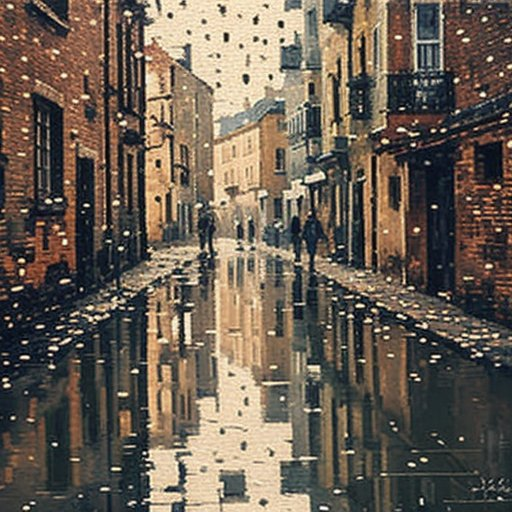<div class="play-overlay"><a href="alexandru-macedonski-cantecul-ploaiei.html" class="play-btn-link" aria-label="Ascultă Cântecul ploaiei"><button class="play-btn">▶️</button></a></div><div class="song-badges"><span class="badge featured-badge">ploaie</span></div></div><div class="song-content"><div class="song-header"><h3 class="song-title"><a href="alexandru-macedonski-cantecul-ploaiei.html">Cântecul ploaiei</a></h3><div class="song-meta"><span class="artist">Alexandru Macedonski</span></div></div><div class="song-actions"><a href="alexandru-macedonski-cantecul-ploaiei.html" class="btn btn-primary">▶️ Ascultă</a></div></div></div>
<div class="song-card" data-mood="moarte" role="article"><div class="song-image-container"><div class="play-overlay"><a href="alexandru-macedonski-filozofia-mortii.html" class="play-btn-link" aria-label="Ascultă Filozofia morții"><button class="play-btn">▶️</button></a></div><div class="song-badges"><span class="badge featured-badge">moarte</span></div></div><div class="song-content"><div class="song-header"><h3 class="song-title"><a href="alexandru-macedonski-filozofia-mortii.html">Filozofia morții</a></h3><div class="song-meta"><span class="artist">Alexandru Macedonski</span></div></div><div class="song-actions"><a href="alexandru-macedonski-filozofia-mortii.html" class="btn btn-primary">▶️ Ascultă</a></div></div></div>
<div class="song-card" data-mood="cer" role="article"><div class="song-image-container"><div class="play-overlay"><a href="alexandru-macedonski-psalmi-moderni-ix-n-am-in-ceruri.html" class="play-btn-link" aria-label="Ascultă Psalmi moderni IX - N-am în ceruri"><button class="play-btn">▶️</button></a></div><div class="song-badges"><span class="badge featured-badge">cer</span></div></div><div class="song-content"><div class="song-header"><h3 class="song-title"><a href="alexandru-macedonski-psalmi-moderni-ix-n-am-in-ceruri.html">Psalmi moderni IX - N-am în ceruri</a></h3><div class="song-meta"><span class="artist">Alexandru Macedonski</span></div></div><div class="song-actions"><a href="alexandru-macedonski-psalmi-moderni-ix-n-am-in-ceruri.html" class="btn btn-primary">▶️ Ascultă</a></div></div></div>
<div class="song-card" data-mood="timp" role="article"><div class="song-image-container"><div class="play-overlay"><a href="alexandru-philippide-ceasul-greu.html" class="play-btn-link" aria-label="Ascultă Ceasul greu"><button class="play-btn">▶️</button></a></div><div class="song-badges"><span class="badge featured-badge">timp</span></div></div><div class="song-content"><div class="song-header"><h3 class="song-title"><a href="alexandru-philippide-ceasul-greu.html">Ceasul greu</a></h3><div class="song-meta"><span class="artist">Alexandru Philippide</span></div></div><div class="song-actions"><a href="alexandru-philippide-ceasul-greu.html" class="btn btn-primary">▶️ Ascultă</a></div></div></div>
<div class="song-card" data-mood="timp" role="article"><div class="song-image-container"><div class="play-overlay"><a href="alexandru-philippide-fosile-n-roca-timpului.html" class="play-btn-link" aria-label="Ascultă Fosile-n roca timpului"><button class="play-btn">▶️</button></a></div><div class="song-badges"><span class="badge featured-badge">timp</span></div></div><div class="song-content"><div class="song-header"><h3 class="song-title"><a href="alexandru-philippide-fosile-n-roca-timpului.html">Fosile-n roca timpului</a></h3><div class="song-meta"><span class="artist">Alexandru Philippide</span></div></div><div class="song-actions"><a href="alexandru-philippide-fosile-n-roca-timpului.html" class="btn btn-primary">▶️ Ascultă</a></div></div></div>
<div class="song-card" data-mood="vant" role="article"><div class="song-image-container"><div class="play-overlay"><a href="alexandru-philippide-pastel-pustiu.html" class="play-btn-link" aria-label="Ascultă Pastel pustiu"><button class="play-btn">▶️</button></a></div><div class="song-badges"><span class="badge featured-badge">vant</span></div></div><div class="song-content"><div class="song-header"><h3 class="song-title"><a href="alexandru-philippide-pastel-pustiu.html">Pastel pustiu</a></h3><div class="song-meta"><span class="artist">Alexandru Philippide</span></div></div><div class="song-actions"><a href="alexandru-philippide-pastel-pustiu.html" class="btn btn-primary">▶️ Ascultă</a></div></div></div>
<div class="song-card" data-mood="dor" role="article"><div class="song-image-container"><div class="play-overlay"><a href="alexandru-vlahuta-ce-dor.html" class="play-btn-link" aria-label="Ascultă Ce dor..."><button class="play-btn">▶️</button></a></div><div class="song-badges"><span class="badge featured-badge">dor</span></div></div><div class="song-content"><div class="song-header"><h3 class="song-title"><a href="alexandru-vlahuta-ce-dor.html">Ce dor...</a></h3><div class="song-meta"><span class="artist">Alexandru Vlahuţă</span></div></div><div class="song-actions"><a href="alexandru-vlahuta-ce-dor.html" class="btn btn-primary">▶️ Ascultă</a></div></div></div>
<div class="song-card" data-mood="fericire" role="article"><div class="song-image-container"><div class="play-overlay"><a href="alexandru-vlahuta-ce-fericiti-am-fi-mpreuna.html" class="play-btn-link" aria-label="Ascultă Ce fericiţi am fi-mpreună!"><button class="play-btn">▶️</button></a></div><div class="song-badges"><span class="badge featured-badge">fericire</span></div></div><div class="song-content"><div class="song-header"><h3 class="song-title"><a href="alexandru-vlahuta-ce-fericiti-am-fi-mpreuna.html">Ce fericiţi am fi-mpreună!</a></h3><div class="song-meta"><span class="artist">Alexandru Vlahuţă</span></div></div><div class="song-actions"><a href="alexandru-vlahuta-ce-fericiti-am-fi-mpreuna.html" class="btn btn-primary">▶️ Ascultă</a></div></div></div>
<div class="song-card" data-mood="tara" role="article"><div class="song-image-container"><div class="play-overlay"><a href="alexandru-vlahuta-carmacii.html" class="play-btn-link" aria-label="Ascultă Cârmacii"><button class="play-btn">▶️</button></a></div><div class="song-badges"><span class="badge featured-badge">tara</span></div></div><div class="song-content"><div class="song-header"><h3 class="song-title"><a href="alexandru-vlahuta-carmacii.html">Cârmacii</a></h3><div class="song-meta"><span class="artist">Alexandru Vlahuţă</span></div></div><div class="song-actions"><a href="alexandru-vlahuta-carmacii.html" class="btn btn-primary">▶️ Ascultă</a></div></div></div>
<div class="song-card" data-mood="cantec" role="article"><div class="song-image-container"><div class="play-overlay"><a href="alexandru-vlahuta-eternul-cantec.html" class="play-btn-link" aria-label="Ascultă Eternul cântec"><button class="play-btn">▶️</button></a></div><div class="song-badges"><span class="badge featured-badge">cantec</span></div></div><div class="song-content"><div class="song-header"><h3 class="song-title"><a href="alexandru-vlahuta-eternul-cantec.html">Eternul cântec</a></h3><div class="song-meta"><span class="artist">Alexandru Vlahuţă</span></div></div><div class="song-actions"><a href="alexandru-vlahuta-eternul-cantec.html" class="btn btn-primary">▶️ Ascultă</a></div></div></div>
<div class="song-card" data-mood="dumnezeu" role="article"><div class="song-image-container">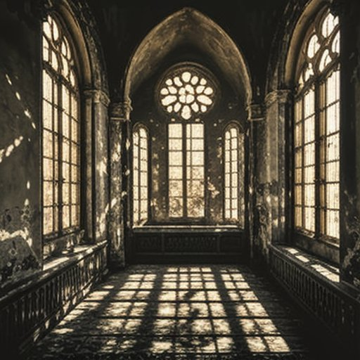<div class="play-overlay"><a href="alexandru-vlahuta-la-icoana.html" class="play-btn-link" aria-label="Ascultă La icoană"><button class="play-btn">▶️</button></a></div><div class="song-badges"><span class="badge featured-badge">dumnezeu</span></div></div><div class="song-content"><div class="song-header"><h3 class="song-title"><a href="alexandru-vlahuta-la-icoana.html">La icoană</a></h3><div class="song-meta"><span class="artist">Alexandru Vlahuţă</span></div></div><div class="song-actions"><a href="alexandru-vlahuta-la-icoana.html" class="btn btn-primary">▶️ Ascultă</a></div></div></div>
<div class="song-card" data-mood="luna_stele noapte" role="article"><div class="song-image-container"><div class="play-overlay"><a href="alexandru-vlahuta-luna-si-noaptea.html" class="play-btn-link" aria-label="Ascultă Luna şi noaptea"><button class="play-btn">▶️</button></a></div><div class="song-badges"><span class="badge featured-badge">luna_stele</span></div></div><div class="song-content"><div class="song-header"><h3 class="song-title"><a href="alexandru-vlahuta-luna-si-noaptea.html">Luna şi noaptea</a></h3><div class="song-meta"><span class="artist">Alexandru Vlahuţă</span></div></div><div class="song-actions"><a href="alexandru-vlahuta-luna-si-noaptea.html" class="btn btn-primary">▶️ Ascultă</a></div></div></div>
<div class="song-card" data-mood="soare" role="article"><div class="song-image-container"><div class="play-overlay"><a href="alexei-mateevici-cantecul-zorilor.html" class="play-btn-link" aria-label="Ascultă Cantecul Zorilor"><button class="play-btn">▶️</button></a></div><div class="song-badges"><span class="badge featured-badge">soare</span></div></div><div class="song-content"><div class="song-header"><h3 class="song-title"><a href="alexei-mateevici-cantecul-zorilor.html">Cantecul Zorilor</a></h3><div class="song-meta"><span class="artist">Alexei Mateevici</span></div></div><div class="song-actions"><a href="alexei-mateevici-cantecul-zorilor.html" class="btn btn-primary">▶️ Ascultă</a></div></div></div>
<div class="song-card" data-mood="cantec" role="article"><div class="song-image-container"><div class="play-overlay"><a href="alexei-mateevici-cantarea-slavei.html" class="play-btn-link" aria-label="Ascultă Cântarea slavei"><button class="play-btn">▶️</button></a></div><div class="song-badges"><span class="badge featured-badge">cantec</span></div></div><div class="song-content"><div class="song-header"><h3 class="song-title"><a href="alexei-mateevici-cantarea-slavei.html">Cântarea slavei</a></h3><div class="song-meta"><span class="artist">Alexei Mateevici</span></div></div><div class="song-actions"><a href="alexei-mateevici-cantarea-slavei.html" class="btn btn-primary">▶️ Ascultă</a></div></div></div>
<div class="song-card" data-mood="cantec" role="article"><div class="song-image-container"><div class="play-overlay"><a href="alexei-mateevici-cantecul-clopotului.html" class="play-btn-link" aria-label="Ascultă Cântecul Clopotului"><button class="play-btn">▶️</button></a></div><div class="song-badges"><span class="badge featured-badge">cantec</span></div></div><div class="song-content"><div class="song-header"><h3 class="song-title"><a href="alexei-mateevici-cantecul-clopotului.html">Cântecul Clopotului</a></h3><div class="song-meta"><span class="artist">Alexei Mateevici</span></div></div><div class="song-actions"><a href="alexei-mateevici-cantecul-clopotului.html" class="btn btn-primary">▶️ Ascultă</a></div></div></div>
<div class="song-card" data-mood="dor" role="article"><div class="song-image-container"><div class="play-overlay"><a href="alexei-mateevici-dorul.html" class="play-btn-link" aria-label="Ascultă Dorul"><button class="play-btn">▶️</button></a></div><div class="song-badges"><span class="badge featured-badge">dor</span></div></div><div class="song-content"><div class="song-header"><h3 class="song-title"><a href="alexei-mateevici-dorul.html">Dorul</a></h3><div class="song-meta"><span class="artist">Alexei Mateevici</span></div></div><div class="song-actions"><a href="alexei-mateevici-dorul.html" class="btn btn-primary">▶️ Ascultă</a></div></div></div>
<div class="song-card" data-mood="dumnezeu" role="article"><div class="song-image-container"><div class="play-overlay"><a href="alexei-mateevici-hristos-in-biserica-ierusalimului.html" class="play-btn-link" aria-label="Ascultă Hristos în biserica Ierusalimului"><button class="play-btn">▶️</button></a></div><div class="song-badges"><span class="badge featured-badge">dumnezeu</span></div></div><div class="song-content"><div class="song-header"><h3 class="song-title"><a href="alexei-mateevici-hristos-in-biserica-ierusalimului.html">Hristos în biserica Ierusalimului</a></h3><div class="song-meta"><span class="artist">Alexei Mateevici</span></div></div><div class="song-actions"><a href="alexei-mateevici-hristos-in-biserica-ierusalimului.html" class="btn btn-primary">▶️ Ascultă</a></div></div></div>
<div class="song-card" data-mood="tara" role="article"><div class="song-image-container"><div class="play-overlay"><a href="alexei-mateevici-tara.html" class="play-btn-link" aria-label="Ascultă Tara"><button class="play-btn">▶️</button></a></div><div class="song-badges"><span class="badge featured-badge">tara</span></div></div><div class="song-content"><div class="song-header"><h3 class="song-title"><a href="alexei-mateevici-tara.html">Tara</a></h3><div class="song-meta"><span class="artist">Alexei Mateevici</span></div></div><div class="song-actions"><a href="alexei-mateevici-tara.html" class="btn btn-primary">▶️ Ascultă</a></div></div></div>
<div class="song-card" data-mood="ploaie" role="article"><div class="song-image-container"><div class="play-overlay"><a href="alice-calugaru-cantec-de-ploaie.html" class="play-btn-link" aria-label="Ascultă Cântec de ploaie"><button class="play-btn">▶️</button></a></div><div class="song-badges"><span class="badge featured-badge">ploaie</span></div></div><div class="song-content"><div class="song-header"><h3 class="song-title"><a href="alice-calugaru-cantec-de-ploaie.html">Cântec de ploaie</a></h3><div class="song-meta"><span class="artist">Alice Călugăru</span></div></div><div class="song-actions"><a href="alice-calugaru-cantec-de-ploaie.html" class="btn btn-primary">▶️ Ascultă</a></div></div></div>
<div class="song-card" data-mood="timp" role="article"><div class="song-image-container"><div class="play-overlay"><a href="alphonse-de-lamartine-timpul-trecut.html" class="play-btn-link" aria-label="Ascultă Timpul trecut"><button class="play-btn">▶️</button></a></div><div class="song-badges"><span class="badge featured-badge">timp</span></div></div><div class="song-content"><div class="song-header"><h3 class="song-title"><a href="alphonse-de-lamartine-timpul-trecut.html">Timpul trecut</a></h3><div class="song-meta"><span class="artist">Alphonse de Lamartine</span></div></div><div class="song-actions"><a href="alphonse-de-lamartine-timpul-trecut.html" class="btn btn-primary">▶️ Ascultă</a></div></div></div>
<div class="song-card" data-mood="casa" role="article"><div class="song-image-container"><div class="play-overlay"><a href="ana-blandiana-acasa.html" class="play-btn-link" aria-label="Ascultă Acasă"><button class="play-btn">▶️</button></a></div><div class="song-badges"><span class="badge featured-badge">casa</span></div></div><div class="song-content"><div class="song-header"><h3 class="song-title"><a href="ana-blandiana-acasa.html">Acasă</a></h3><div class="song-meta"><span class="artist">Ana Blandiana</span></div></div><div class="song-actions"><a href="ana-blandiana-acasa.html" class="btn btn-primary">▶️ Ascultă</a></div></div></div>
<div class="song-card" data-mood="mare" role="article"><div class="song-image-container"><div class="play-overlay"><a href="ana-blandiana-corabia-cu-poeti.html" class="play-btn-link" aria-label="Ascultă Corabia cu poeţi"><button class="play-btn">▶️</button></a></div><div class="song-badges"><span class="badge featured-badge">mare</span></div></div><div class="song-content"><div class="song-header"><h3 class="song-title"><a href="ana-blandiana-corabia-cu-poeti.html">Corabia cu poeţi</a></h3><div class="song-meta"><span class="artist">Ana Blandiana</span></div></div><div class="song-actions"><a href="ana-blandiana-corabia-cu-poeti.html" class="btn btn-primary">▶️ Ascultă</a></div></div></div>
<div class="song-card" data-mood="ploaie" role="article"><div class="song-image-container"><div class="play-overlay"><a href="ana-blandiana-descantec-de-ploaie-1008.html" class="play-btn-link" aria-label="Ascultă Descântec de ploaie"><button class="play-btn">▶️</button></a></div><div class="song-badges"><span class="badge featured-badge">ploaie</span></div></div><div class="song-content"><div class="song-header"><h3 class="song-title"><a href="ana-blandiana-descantec-de-ploaie-1008.html">Descântec de ploaie</a></h3><div class="song-meta"><span class="artist">Ana Blandiana</span></div></div><div class="song-actions"><a href="ana-blandiana-descantec-de-ploaie-1008.html" class="btn btn-primary">▶️ Ascultă</a></div></div></div>
<div class="song-card" data-mood="fericire" role="article"><div class="song-image-container"><div class="play-overlay"><a href="ana-blandiana-fericire.html" class="play-btn-link" aria-label="Ascultă Fericire"><button class="play-btn">▶️</button></a></div><div class="song-badges"><span class="badge featured-badge">fericire</span></div></div><div class="song-content"><div class="song-header"><h3 class="song-title"><a href="ana-blandiana-fericire.html">Fericire</a></h3><div class="song-meta"><span class="artist">Ana Blandiana</span></div></div><div class="song-actions"><a href="ana-blandiana-fericire.html" class="btn btn-primary">▶️ Ascultă</a></div></div></div>
<div class="song-card" data-mood="lacrimi" role="article"><div class="song-image-container"><div class="play-overlay"><a href="ana-blandiana-hohotul.html" class="play-btn-link" aria-label="Ascultă Hohotul"><button class="play-btn">▶️</button></a></div><div class="song-badges"><span class="badge featured-badge">lacrimi</span></div></div><div class="song-content"><div class="song-header"><h3 class="song-title"><a href="ana-blandiana-hohotul.html">Hohotul</a></h3><div class="song-meta"><span class="artist">Ana Blandiana</span></div></div><div class="song-actions"><a href="ana-blandiana-hohotul.html" class="btn btn-primary">▶️ Ascultă</a></div></div></div>
<div class="song-card" data-mood="fericire" role="article"><div class="song-image-container"><div class="play-overlay"><a href="ana-blandiana-la-ce-serveste-bucuria.html" class="play-btn-link" aria-label="Ascultă La ce serveşte bucuria"><button class="play-btn">▶️</button></a></div><div class="song-badges"><span class="badge featured-badge">fericire</span></div></div><div class="song-content"><div class="song-header"><h3 class="song-title"><a href="ana-blandiana-la-ce-serveste-bucuria.html">La ce serveşte bucuria</a></h3><div class="song-meta"><span class="artist">Ana Blandiana</span></div></div><div class="song-actions"><a href="ana-blandiana-la-ce-serveste-bucuria.html" class="btn btn-primary">▶️ Ascultă</a></div></div></div>
<div class="song-card" data-mood="lumina soare" role="article"><div class="song-image-container"><div class="play-overlay"><a href="ana-blandiana-moarte-in-lumina.html" class="play-btn-link" aria-label="Ascultă Moarte in lumină"><button class="play-btn">▶️</button></a></div><div class="song-badges"><span class="badge featured-badge">lumina</span></div></div><div class="song-content"><div class="song-header"><h3 class="song-title"><a href="ana-blandiana-moarte-in-lumina.html">Moarte in lumină</a></h3><div class="song-meta"><span class="artist">Ana Blandiana</span></div></div><div class="song-actions"><a href="ana-blandiana-moarte-in-lumina.html" class="btn btn-primary">▶️ Ascultă</a></div></div></div>
<div class="song-card" data-mood="iarna" role="article"><div class="song-image-container"><div class="play-overlay"><a href="ana-blandiana-ninge-cu-dusmanie.html" class="play-btn-link" aria-label="Ascultă Ninge cu duşmănie"><button class="play-btn">▶️</button></a></div><div class="song-badges"><span class="badge featured-badge">iarna</span></div></div><div class="song-content"><div class="song-header"><h3 class="song-title"><a href="ana-blandiana-ninge-cu-dusmanie.html">Ninge cu duşmănie</a></h3><div class="song-meta"><span class="artist">Ana Blandiana</span></div></div><div class="song-actions"><a href="ana-blandiana-ninge-cu-dusmanie.html" class="btn btn-primary">▶️ Ascultă</a></div></div></div>
<div class="song-card" data-mood="amintire" role="article"><div class="song-image-container"><div class="play-overlay"><a href="ana-blandiana-nu-mi-voi-mai-aminti.html" class="play-btn-link" aria-label="Ascultă Nu-mi voi mai aminti"><button class="play-btn">▶️</button></a></div><div class="song-badges"><span class="badge featured-badge">amintire</span></div></div><div class="song-content"><div class="song-header"><h3 class="song-title"><a href="ana-blandiana-nu-mi-voi-mai-aminti.html">Nu-mi voi mai aminti</a></h3><div class="song-meta"><span class="artist">Ana Blandiana</span></div></div><div class="song-actions"><a href="ana-blandiana-nu-mi-voi-mai-aminti.html" class="btn btn-primary">▶️ Ascultă</a></div></div></div>
<div class="song-card" data-mood="tata" role="article"><div class="song-image-container"><div class="play-overlay"><a href="ana-blandiana-parintii.html" class="play-btn-link" aria-label="Ascultă Părinții"><button class="play-btn">▶️</button></a></div><div class="song-badges"><span class="badge featured-badge">tata</span></div></div><div class="song-content"><div class="song-header"><h3 class="song-title"><a href="ana-blandiana-parintii.html">Părinții</a></h3><div class="song-meta"><span class="artist">Ana Blandiana</span></div></div><div class="song-actions"><a href="ana-blandiana-parintii.html" class="btn btn-primary">▶️ Ascultă</a></div></div></div>
<div class="song-card" data-mood="singuratate" role="article"><div class="song-image-container"><div class="play-overlay"><a href="ana-blandiana-singuratatea.html" class="play-btn-link" aria-label="Ascultă Singuratatea"><button class="play-btn">▶️</button></a></div><div class="song-badges"><span class="badge featured-badge">singuratate</span></div></div><div class="song-content"><div class="song-header"><h3 class="song-title"><a href="ana-blandiana-singuratatea.html">Singuratatea</a></h3><div class="song-meta"><span class="artist">Ana Blandiana</span></div></div><div class="song-actions"><a href="ana-blandiana-singuratatea.html" class="btn btn-primary">▶️ Ascultă</a></div></div></div>
<div class="song-card" data-mood="tata" role="article"><div class="song-image-container"><div class="play-overlay"><a href="ana-blandiana-tara-parintilor.html" class="play-btn-link" aria-label="Ascultă Ţara părinţilor"><button class="play-btn">▶️</button></a></div><div class="song-badges"><span class="badge featured-badge">tata</span></div></div><div class="song-content"><div class="song-header"><h3 class="song-title"><a href="ana-blandiana-tara-parintilor.html">Ţara părinţilor</a></h3><div class="song-meta"><span class="artist">Ana Blandiana</span></div></div><div class="song-actions"><a href="ana-blandiana-tara-parintilor.html" class="btn btn-primary">▶️ Ascultă</a></div></div></div>
<div class="song-card" data-mood="mare" role="article"><div class="song-image-container"><div class="play-overlay"><a href="ana-blandiana-tarm.html" class="play-btn-link" aria-label="Ascultă Ţărm"><button class="play-btn">▶️</button></a></div><div class="song-badges"><span class="badge featured-badge">mare</span></div></div><div class="song-content"><div class="song-header"><h3 class="song-title"><a href="ana-blandiana-tarm.html">Ţărm</a></h3><div class="song-meta"><span class="artist">Ana Blandiana</span></div></div><div class="song-actions"><a href="ana-blandiana-tarm.html" class="btn btn-primary">▶️ Ascultă</a></div></div></div>
<div class="song-card" data-mood="amintire" role="article"><div class="song-image-container"><div class="play-overlay"><a href="anna-ahmatova-acel-oras-din-amintire.html" class="play-btn-link" aria-label="Ascultă Acel oraș din amintire"><button class="play-btn">▶️</button></a></div><div class="song-badges"><span class="badge featured-badge">amintire</span></div></div><div class="song-content"><div class="song-header"><h3 class="song-title"><a href="anna-ahmatova-acel-oras-din-amintire.html">Acel oraș din amintire</a></h3><div class="song-meta"><span class="artist">Anna Ahmatova</span></div></div><div class="song-actions"><a href="anna-ahmatova-acel-oras-din-amintire.html" class="btn btn-primary">▶️ Ascultă</a></div></div></div>
<div class="song-card" data-mood="amintire" role="article"><div class="song-image-container"><div class="play-overlay"><a href="anna-ahmatova-beciul-amintirii.html" class="play-btn-link" aria-label="Ascultă Beciul amintirii"><button class="play-btn">▶️</button></a></div><div class="song-badges"><span class="badge featured-badge">amintire</span></div></div><div class="song-content"><div class="song-header"><h3 class="song-title"><a href="anna-ahmatova-beciul-amintirii.html">Beciul amintirii</a></h3><div class="song-meta"><span class="artist">Anna Ahmatova</span></div></div><div class="song-actions"><a href="anna-ahmatova-beciul-amintirii.html" class="btn btn-primary">▶️ Ascultă</a></div></div></div>
<div class="song-card" data-mood="amintire" role="article"><div class="song-image-container"><div class="play-overlay"><a href="anna-ahmatova-din-amintirea-ta-voi-smulge-aceasta-zi.html" class="play-btn-link" aria-label="Ascultă Din amintirea ta voi smulge-această zi"><button class="play-btn">▶️</button></a></div><div class="song-badges"><span class="badge featured-badge">amintire</span></div></div><div class="song-content"><div class="song-header"><h3 class="song-title"><a href="anna-ahmatova-din-amintirea-ta-voi-smulge-aceasta-zi.html">Din amintirea ta voi smulge-această zi</a></h3><div class="song-meta"><span class="artist">Anna Ahmatova</span></div></div><div class="song-actions"><a href="anna-ahmatova-din-amintirea-ta-voi-smulge-aceasta-zi.html" class="btn btn-primary">▶️ Ascultă</a></div></div></div>
<div class="song-card" data-mood="amintire" role="article"><div class="song-image-container"><div class="play-overlay"><a href="anna-ahmatova-dureroasa-amintirea-iubirii.html" class="play-btn-link" aria-label="Ascultă Dureroasă − amintirea iubirii!"><button class="play-btn">▶️</button></a></div><div class="song-badges"><span class="badge featured-badge">amintire</span></div></div><div class="song-content"><div class="song-header"><h3 class="song-title"><a href="anna-ahmatova-dureroasa-amintirea-iubirii.html">Dureroasă − amintirea iubirii!</a></h3><div class="song-meta"><span class="artist">Anna Ahmatova</span></div></div><div class="song-actions"><a href="anna-ahmatova-dureroasa-amintirea-iubirii.html" class="btn btn-primary">▶️ Ascultă</a></div></div></div>
<div class="song-card" data-mood="amintire" role="article"><div class="song-image-container"><div class="play-overlay"><a href="anna-ahmatova-in-scrinu-amintirii.html" class="play-btn-link" aria-label="Ascultă În scrinu-amintirii"><button class="play-btn">▶️</button></a></div><div class="song-badges"><span class="badge featured-badge">amintire</span></div></div><div class="song-content"><div class="song-header"><h3 class="song-title"><a href="anna-ahmatova-in-scrinu-amintirii.html">În scrinu-amintirii</a></h3><div class="song-meta"><span class="artist">Anna Ahmatova</span></div></div><div class="song-actions"><a href="anna-ahmatova-in-scrinu-amintirii.html" class="btn btn-primary">▶️ Ascultă</a></div></div></div>
<div class="song-card" data-mood="tara" role="article"><div class="song-image-container"><div class="play-overlay"><a href="anonim-sir-patrick-spens-balada-anonima.html" class="play-btn-link" aria-label="Ascultă Sir Patrick Spens (baladă anonimă)"><button class="play-btn">▶️</button></a></div><div class="song-badges"><span class="badge featured-badge">tara</span></div></div><div class="song-content"><div class="song-header"><h3 class="song-title"><a href="anonim-sir-patrick-spens-balada-anonima.html">Sir Patrick Spens (baladă anonimă)</a></h3><div class="song-meta"><span class="artist">Anonim</span></div></div><div class="song-actions"><a href="anonim-sir-patrick-spens-balada-anonima.html" class="btn btn-primary">▶️ Ascultă</a></div></div></div>
<div class="song-card" data-mood="iubire" role="article"><div class="song-image-container"><div class="play-overlay"><a href="antoine-de-saint-exupery-citadela-fragmente-5126.html" class="play-btn-link" aria-label="Ascultă Citadela - fragmente"><button class="play-btn">▶️</button></a></div><div class="song-badges"><span class="badge featured-badge">iubire</span></div></div><div class="song-content"><div class="song-header"><h3 class="song-title"><a href="antoine-de-saint-exupery-citadela-fragmente-5126.html">Citadela - fragmente</a></h3><div class="song-meta"><span class="artist">Antoine de Saint-Exupery</span></div></div><div class="song-actions"><a href="antoine-de-saint-exupery-citadela-fragmente-5126.html" class="btn btn-primary">▶️ Ascultă</a></div></div></div>
<div class="song-card" data-mood="amintire" role="article"><div class="song-image-container"><div class="play-overlay"><a href="antonio-machado-amintire-din-copilarie.html" class="play-btn-link" aria-label="Ascultă Amintire din copilărie"><button class="play-btn">▶️</button></a></div><div class="song-badges"><span class="badge featured-badge">amintire</span></div></div><div class="song-content"><div class="song-header"><h3 class="song-title"><a href="antonio-machado-amintire-din-copilarie.html">Amintire din copilărie</a></h3><div class="song-meta"><span class="artist">Antonio Machado</span></div></div><div class="song-actions"><a href="antonio-machado-amintire-din-copilarie.html" class="btn btn-primary">▶️ Ascultă</a></div></div></div>
<div class="song-card" data-mood="drum" role="article"><div class="song-image-container"><div class="play-overlay"><a href="antonio-machado-calatorule.html" class="play-btn-link" aria-label="Ascultă Călătorule"><button class="play-btn">▶️</button></a></div><div class="song-badges"><span class="badge featured-badge">drum</span></div></div><div class="song-content"><div class="song-header"><h3 class="song-title"><a href="antonio-machado-calatorule.html">Călătorule</a></h3><div class="song-meta"><span class="artist">Antonio Machado</span></div></div><div class="song-actions"><a href="antonio-machado-calatorule.html" class="btn btn-primary">▶️ Ascultă</a></div></div></div>
<div class="song-card" data-mood="drum" role="article"><div class="song-image-container"><div class="play-overlay"><a href="antonio-machado-calatorule-nu-i-cale.html" class="play-btn-link" aria-label="Ascultă Călătorule, nu-i cale..."><button class="play-btn">▶️</button></a></div><div class="song-badges"><span class="badge featured-badge">drum</span></div></div><div class="song-content"><div class="song-header"><h3 class="song-title"><a href="antonio-machado-calatorule-nu-i-cale.html">Călătorule, nu-i cale...</a></h3><div class="song-meta"><span class="artist">Antonio Machado</span></div></div><div class="song-actions"><a href="antonio-machado-calatorule-nu-i-cale.html" class="btn btn-primary">▶️ Ascultă</a></div></div></div>
<div class="song-card" data-mood="dumnezeu" role="article"><div class="song-image-container"><div class="play-overlay"><a href="arany-jnos-coana-agnes-agnes-asszony.html" class="play-btn-link" aria-label="Ascultă Coana Ágnes - (Ágnes asszony)"><button class="play-btn">▶️</button></a></div><div class="song-badges"><span class="badge featured-badge">dumnezeu</span></div></div><div class="song-content"><div class="song-header"><h3 class="song-title"><a href="arany-jnos-coana-agnes-agnes-asszony.html">Coana Ágnes - (Ágnes asszony)</a></h3><div class="song-meta"><span class="artist">Arany János</span></div></div><div class="song-actions"><a href="arany-jnos-coana-agnes-agnes-asszony.html" class="btn btn-primary">▶️ Ascultă</a></div></div></div>
<div class="song-card" data-mood="mare" role="article"><div class="song-image-container"><div class="play-overlay"><a href="aron-cotrus-corabia-verde.html" class="play-btn-link" aria-label="Ascultă Corabia verde"><button class="play-btn">▶️</button></a></div><div class="song-badges"><span class="badge featured-badge">mare</span></div></div><div class="song-content"><div class="song-header"><h3 class="song-title"><a href="aron-cotrus-corabia-verde.html">Corabia verde</a></h3><div class="song-meta"><span class="artist">Aron Cotruș</span></div></div><div class="song-actions"><a href="aron-cotrus-corabia-verde.html" class="btn btn-primary">▶️ Ascultă</a></div></div></div>
<div class="song-card" data-mood="libertate" role="article"><div class="song-image-container"><div class="play-overlay"><a href="aron-cotrus-cantecul-libertatii.html" class="play-btn-link" aria-label="Ascultă Cântecul libertății"><button class="play-btn">▶️</button></a></div><div class="song-badges"><span class="badge featured-badge">libertate</span></div></div><div class="song-content"><div class="song-header"><h3 class="song-title"><a href="aron-cotrus-cantecul-libertatii.html">Cântecul libertății</a></h3><div class="song-meta"><span class="artist">Aron Cotruș</span></div></div><div class="song-actions"><a href="aron-cotrus-cantecul-libertatii.html" class="btn btn-primary">▶️ Ascultă</a></div></div></div>
<div class="song-card" data-mood="drum" role="article"><div class="song-image-container"><div class="play-overlay"><a href="aron-cotrus-o-plecarile.html" class="play-btn-link" aria-label="Ascultă O, plecările"><button class="play-btn">▶️</button></a></div><div class="song-badges"><span class="badge featured-badge">drum</span></div></div><div class="song-content"><div class="song-header"><h3 class="song-title"><a href="aron-cotrus-o-plecarile.html">O, plecările</a></h3><div class="song-meta"><span class="artist">Aron Cotruș</span></div></div><div class="song-actions"><a href="aron-cotrus-o-plecarile.html" class="btn btn-primary">▶️ Ascultă</a></div></div></div>
<div class="song-card" data-mood="mare" role="article"><div class="song-image-container"><div class="play-overlay"><a href="arthur-rimbaud-corabia-beata.html" class="play-btn-link" aria-label="Ascultă Corabia beată"><button class="play-btn">▶️</button></a></div><div class="song-badges"><span class="badge featured-badge">mare</span></div></div><div class="song-content"><div class="song-header"><h3 class="song-title"><a href="arthur-rimbaud-corabia-beata.html">Corabia beată</a></h3><div class="song-meta"><span class="artist">Arthur Rimbaud</span></div></div><div class="song-actions"><a href="arthur-rimbaud-corabia-beata.html" class="btn btn-primary">▶️ Ascultă</a></div></div></div>
<div class="song-card" data-mood="timp" role="article"><div class="song-image-container"><div class="play-overlay"><a href="artur-enasescu-clipe-din-urma.html" class="play-btn-link" aria-label="Ascultă Clipe din urmă"><button class="play-btn">▶️</button></a></div><div class="song-badges"><span class="badge featured-badge">timp</span></div></div><div class="song-content"><div class="song-header"><h3 class="song-title"><a href="artur-enasescu-clipe-din-urma.html">Clipe din urmă</a></h3><div class="song-meta"><span class="artist">Artur Enăşescu</span></div></div><div class="song-actions"><a href="artur-enasescu-clipe-din-urma.html" class="btn btn-primary">▶️ Ascultă</a></div></div></div>
<div class="song-card" data-mood="mama" role="article"><div class="song-image-container"><div class="play-overlay"><a href="attila-jozsef-mama-mama.html" class="play-btn-link" aria-label="Ascultă Mama - (Mama)"><button class="play-btn">▶️</button></a></div><div class="song-badges"><span class="badge featured-badge">mama</span></div></div><div class="song-content"><div class="song-header"><h3 class="song-title"><a href="attila-jozsef-mama-mama.html">Mama - (Mama)</a></h3><div class="song-meta"><span class="artist">Attila József</span></div></div><div class="song-actions"><a href="attila-jozsef-mama-mama.html" class="btn btn-primary">▶️ Ascultă</a></div></div></div>
<div class="song-card" data-mood="lacrimi" role="article"><div class="song-image-container"><div class="play-overlay"><a href="attila-jozsef-suspin-sohaj.html" class="play-btn-link" aria-label="Ascultă Suspin - (Sóhaj)"><button class="play-btn">▶️</button></a></div><div class="song-badges"><span class="badge featured-badge">lacrimi</span></div></div><div class="song-content"><div class="song-header"><h3 class="song-title"><a href="attila-jozsef-suspin-sohaj.html">Suspin - (Sóhaj)</a></h3><div class="song-meta"><span class="artist">Attila József</span></div></div><div class="song-actions"><a href="attila-jozsef-suspin-sohaj.html" class="btn btn-primary">▶️ Ascultă</a></div></div></div>
<div class="song-card" data-mood="cer" role="article"><div class="song-image-container"><div class="play-overlay"><a href="attila-jozsef-trenul-blindat-al-cerului.html" class="play-btn-link" aria-label="Ascultă Trenul blindat al cerului"><button class="play-btn">▶️</button></a></div><div class="song-badges"><span class="badge featured-badge">cer</span></div></div><div class="song-content"><div class="song-header"><h3 class="song-title"><a href="attila-jozsef-trenul-blindat-al-cerului.html">Trenul blindat al cerului</a></h3><div class="song-meta"><span class="artist">Attila József</span></div></div><div class="song-actions"><a href="attila-jozsef-trenul-blindat-al-cerului.html" class="btn btn-primary">▶️ Ascultă</a></div></div></div>
<div class="song-card" data-mood="cuvant" role="article"><div class="song-image-container"><div class="play-overlay"><a href="attila-jozsef-vers-simplu-egyszer-vers.html" class="play-btn-link" aria-label="Ascultă Vers simplu - (Egyszerű vers)"><button class="play-btn">▶️</button></a></div><div class="song-badges"><span class="badge featured-badge">cuvant</span></div></div><div class="song-content"><div class="song-header"><h3 class="song-title"><a href="attila-jozsef-vers-simplu-egyszer-vers.html">Vers simplu - (Egyszerű vers)</a></h3><div class="song-meta"><span class="artist">Attila József</span></div></div><div class="song-actions"><a href="attila-jozsef-vers-simplu-egyszer-vers.html" class="btn btn-primary">▶️ Ascultă</a></div></div></div>
<div class="song-card" data-mood="durere" role="article"><div class="song-image-container"><div class="play-overlay"><a href="attila-jozsef-de-chin-ma-tin-funiile-aspre-a-kinhoz-kotnek-kemeny-kotelek-40489.html" class="play-btn-link" aria-label="Ascultă [De chin mă țin funiile aspre…] - [A kínhoz kötnek kemény kötelek…]"><button class="play-btn">▶️</button></a></div><div class="song-badges"><span class="badge featured-badge">durere</span></div></div><div class="song-content"><div class="song-header"><h3 class="song-title"><a href="attila-jozsef-de-chin-ma-tin-funiile-aspre-a-kinhoz-kotnek-kemeny-kotelek-40489.html">[De chin mă țin funiile aspre…] - [A kínhoz kötnek kemény kötelek…]</a></h3><div class="song-meta"><span class="artist">Attila József</span></div></div><div class="song-actions"><a href="attila-jozsef-de-chin-ma-tin-funiile-aspre-a-kinhoz-kotnek-kemeny-kotelek-40489.html" class="btn btn-primary">▶️ Ascultă</a></div></div></div>
<div class="song-card" data-mood="luna_stele" role="article"><div class="song-image-container"><div class="play-overlay"><a href="aurel-rau-jocul-de-a-stelele.html" class="play-btn-link" aria-label="Ascultă Jocul de-a stelele"><button class="play-btn">▶️</button></a></div><div class="song-badges"><span class="badge featured-badge">luna_stele</span></div></div><div class="song-content"><div class="song-header"><h3 class="song-title"><a href="aurel-rau-jocul-de-a-stelele.html">Jocul de-a stelele</a></h3><div class="song-meta"><span class="artist">Aurel Rău</span></div></div><div class="song-actions"><a href="aurel-rau-jocul-de-a-stelele.html" class="btn btn-primary">▶️ Ascultă</a></div></div></div>
<div class="song-card" data-mood="libertate" role="article"><div class="song-image-container"><div class="play-overlay"><a href="benedict-corlaciu-pentru-omul-meu-liber.html" class="play-btn-link" aria-label="Ascultă Pentru omul meu liber"><button class="play-btn">▶️</button></a></div><div class="song-badges"><span class="badge featured-badge">libertate</span></div></div><div class="song-content"><div class="song-header"><h3 class="song-title"><a href="benedict-corlaciu-pentru-omul-meu-liber.html">Pentru omul meu liber</a></h3><div class="song-meta"><span class="artist">Benedict Corlaciu</span></div></div><div class="song-actions"><a href="benedict-corlaciu-pentru-omul-meu-liber.html" class="btn btn-primary">▶️ Ascultă</a></div></div></div>
<div class="song-card" data-mood="moarte" role="article"><div class="song-image-container"><div class="play-overlay"><a href="benjamin-fondane-lui-armand-pascal-in-moarte.html" class="play-btn-link" aria-label="Ascultă Lui Armand Pascal, în moarte."><button class="play-btn">▶️</button></a></div><div class="song-badges"><span class="badge featured-badge">moarte</span></div></div><div class="song-content"><div class="song-header"><h3 class="song-title"><a href="benjamin-fondane-lui-armand-pascal-in-moarte.html">Lui Armand Pascal, în moarte.</a></h3><div class="song-meta"><span class="artist">Benjamin Fondane</span></div></div><div class="song-actions"><a href="benjamin-fondane-lui-armand-pascal-in-moarte.html" class="btn btn-primary">▶️ Ascultă</a></div></div></div>
<div class="song-card" data-mood="fericire" role="article"><div class="song-image-container"><div class="play-overlay"><a href="bertolt-brecht-despre-fericirea-de-a-darui.html" class="play-btn-link" aria-label="Ascultă Despre fericirea de a dărui"><button class="play-btn">▶️</button></a></div><div class="song-badges"><span class="badge featured-badge">fericire</span></div></div><div class="song-content"><div class="song-header"><h3 class="song-title"><a href="bertolt-brecht-despre-fericirea-de-a-darui.html">Despre fericirea de a dărui</a></h3><div class="song-meta"><span class="artist">Bertolt Brecht</span></div></div><div class="song-actions"><a href="bertolt-brecht-despre-fericirea-de-a-darui.html" class="btn btn-primary">▶️ Ascultă</a></div></div></div>
<div class="song-card" data-mood="dor" role="article"><div class="song-image-container"><div class="play-overlay"><a href="bogdan-petriceicu-hasdeu-dorul.html" class="play-btn-link" aria-label="Ascultă Dorul"><button class="play-btn">▶️</button></a></div><div class="song-badges"><span class="badge featured-badge">dor</span></div></div><div class="song-content"><div class="song-header"><h3 class="song-title"><a href="bogdan-petriceicu-hasdeu-dorul.html">Dorul</a></h3><div class="song-meta"><span class="artist">Bogdan Petriceicu Haşdeu</span></div></div><div class="song-actions"><a href="bogdan-petriceicu-hasdeu-dorul.html" class="btn btn-primary">▶️ Ascultă</a></div></div></div>
<div class="song-card" data-mood="lacrimi" role="article"><div class="song-image-container"><div class="play-overlay"><a href="boris-pasternak-februar-fa-rost-de-cerneala-si-plangi.html" class="play-btn-link" aria-label="Ascultă Februar. Fă rost de cerneală şi plângi!"><button class="play-btn">▶️</button></a></div><div class="song-badges"><span class="badge featured-badge">lacrimi</span></div></div><div class="song-content"><div class="song-header"><h3 class="song-title"><a href="boris-pasternak-februar-fa-rost-de-cerneala-si-plangi.html">Februar. Fă rost de cerneală şi plângi!</a></h3><div class="song-meta"><span class="artist">Boris Pasternak</span></div></div><div class="song-actions"><a href="boris-pasternak-februar-fa-rost-de-cerneala-si-plangi.html" class="btn btn-primary">▶️ Ascultă</a></div></div></div>
<div class="song-card" data-mood="caldura" role="article"><div class="song-image-container"><div class="play-overlay"><a href="boris-pasternak-vara-in-oras.html" class="play-btn-link" aria-label="Ascultă Vara în oraş"><button class="play-btn">▶️</button></a></div><div class="song-badges"><span class="badge featured-badge">caldura</span></div></div><div class="song-content"><div class="song-header"><h3 class="song-title"><a href="boris-pasternak-vara-in-oras.html">Vara în oraş</a></h3><div class="song-meta"><span class="artist">Boris Pasternak</span></div></div><div class="song-actions"><a href="boris-pasternak-vara-in-oras.html" class="btn btn-primary">▶️ Ascultă</a></div></div></div>
<div class="song-card" data-mood="casa" role="article"><div class="song-image-container"><div class="play-overlay"><a href="carlos-drummond-de-andrade-casa-timpului-pierdut.html" class="play-btn-link" aria-label="Ascultă Casa timpului pierdut"><button class="play-btn">▶️</button></a></div><div class="song-badges"><span class="badge featured-badge">casa</span></div></div><div class="song-content"><div class="song-header"><h3 class="song-title"><a href="carlos-drummond-de-andrade-casa-timpului-pierdut.html">Casa timpului pierdut</a></h3><div class="song-meta"><span class="artist">Carlos Drummond de Andrade</span></div></div><div class="song-actions"><a href="carlos-drummond-de-andrade-casa-timpului-pierdut.html" class="btn btn-primary">▶️ Ascultă</a></div></div></div>
<div class="song-card" data-mood="copilarie" role="article"><div class="song-image-container"><div class="play-overlay"><a href="carlos-drummond-de-andrade-copilaria.html" class="play-btn-link" aria-label="Ascultă Copilaria"><button class="play-btn">▶️</button></a></div><div class="song-badges"><span class="badge featured-badge">copilarie</span></div></div><div class="song-content"><div class="song-header"><h3 class="song-title"><a href="carlos-drummond-de-andrade-copilaria.html">Copilaria</a></h3><div class="song-meta"><span class="artist">Carlos Drummond de Andrade</span></div></div><div class="song-actions"><a href="carlos-drummond-de-andrade-copilaria.html" class="btn btn-primary">▶️ Ascultă</a></div></div></div>
<div class="song-card" data-mood="moarte" role="article"><div class="song-image-container"><div class="play-overlay"><a href="carlos-drummond-de-andrade-moartea-pe-cal.html" class="play-btn-link" aria-label="Ascultă Moartea pe cal"><button class="play-btn">▶️</button></a></div><div class="song-badges"><span class="badge featured-badge">moarte</span></div></div><div class="song-content"><div class="song-header"><h3 class="song-title"><a href="carlos-drummond-de-andrade-moartea-pe-cal.html">Moartea pe cal</a></h3><div class="song-meta"><span class="artist">Carlos Drummond de Andrade</span></div></div><div class="song-actions"><a href="carlos-drummond-de-andrade-moartea-pe-cal.html" class="btn btn-primary">▶️ Ascultă</a></div></div></div>
<div class="song-card" data-mood="singuratate" role="article"><div class="song-image-container"><div class="play-overlay"><a href="carlos-drummond-de-andrade-singura.html" class="play-btn-link" aria-label="Ascultă Singură"><button class="play-btn">▶️</button></a></div><div class="song-badges"><span class="badge featured-badge">singuratate</span></div></div><div class="song-content"><div class="song-header"><h3 class="song-title"><a href="carlos-drummond-de-andrade-singura.html">Singură</a></h3><div class="song-meta"><span class="artist">Carlos Drummond de Andrade</span></div></div><div class="song-actions"><a href="carlos-drummond-de-andrade-singura.html" class="btn btn-primary">▶️ Ascultă</a></div></div></div>
<div class="song-card" data-mood="drum" role="article"><div class="song-image-container"><div class="play-overlay"><a href="carlos-drummond-de-andrade-in-mijlocul-drumului.html" class="play-btn-link" aria-label="Ascultă În mijlocul drumului"><button class="play-btn">▶️</button></a></div><div class="song-badges"><span class="badge featured-badge">drum</span></div></div><div class="song-content"><div class="song-header"><h3 class="song-title"><a href="carlos-drummond-de-andrade-in-mijlocul-drumului.html">În mijlocul drumului</a></h3><div class="song-meta"><span class="artist">Carlos Drummond de Andrade</span></div></div><div class="song-actions"><a href="carlos-drummond-de-andrade-in-mijlocul-drumului.html" class="btn btn-primary">▶️ Ascultă</a></div></div></div>
<div class="song-card" data-mood="cantec" role="article"><div class="song-image-container"><div class="play-overlay"><a href="carmen-sylva-cantec-de-clopot.html" class="play-btn-link" aria-label="Ascultă Cântec de clopot"><button class="play-btn">▶️</button></a></div><div class="song-badges"><span class="badge featured-badge">cantec</span></div></div><div class="song-content"><div class="song-header"><h3 class="song-title"><a href="carmen-sylva-cantec-de-clopot.html">Cântec de clopot</a></h3><div class="song-meta"><span class="artist">Carmen Sylva</span></div></div><div class="song-actions"><a href="carmen-sylva-cantec-de-clopot.html" class="btn btn-primary">▶️ Ascultă</a></div></div></div>
<div class="song-card" data-mood="ploaie" role="article"><div class="song-image-container"><div class="play-overlay"><a href="cassian-maria-spiridon-o-ploaie-fara-oprire.html" class="play-btn-link" aria-label="Ascultă * * * (o ploaie fără oprire)"><button class="play-btn">▶️</button></a></div><div class="song-badges"><span class="badge featured-badge">ploaie</span></div></div><div class="song-content"><div class="song-header"><h3 class="song-title"><a href="cassian-maria-spiridon-o-ploaie-fara-oprire.html">* * * (o ploaie fără oprire)</a></h3><div class="song-meta"><span class="artist">Cassian Maria Spiridon</span></div></div><div class="song-actions"><a href="cassian-maria-spiridon-o-ploaie-fara-oprire.html" class="btn btn-primary">▶️ Ascultă</a></div></div></div>
<div class="song-card" data-mood="amintire" role="article"><div class="song-image-container"><div class="play-overlay"><a href="cassian-maria-spiridon-stuful-dureros-al-amintirii.html" class="play-btn-link" aria-label="Ascultă Stuful dureros al amintirii"><button class="play-btn">▶️</button></a></div><div class="song-badges"><span class="badge featured-badge">amintire</span></div></div><div class="song-content"><div class="song-header"><h3 class="song-title"><a href="cassian-maria-spiridon-stuful-dureros-al-amintirii.html">Stuful dureros al amintirii</a></h3><div class="song-meta"><span class="artist">Cassian Maria Spiridon</span></div></div><div class="song-actions"><a href="cassian-maria-spiridon-stuful-dureros-al-amintirii.html" class="btn btn-primary">▶️ Ascultă</a></div></div></div>
<div class="song-card" data-mood="ploaie" role="article"><div class="song-image-container"><div class="play-overlay"><a href="cassian-maria-spiridon-ziua-ploii.html" class="play-btn-link" aria-label="Ascultă Ziua ploii"><button class="play-btn">▶️</button></a></div><div class="song-badges"><span class="badge featured-badge">ploaie</span></div></div><div class="song-content"><div class="song-header"><h3 class="song-title"><a href="cassian-maria-spiridon-ziua-ploii.html">Ziua ploii</a></h3><div class="song-meta"><span class="artist">Cassian Maria Spiridon</span></div></div><div class="song-actions"><a href="cassian-maria-spiridon-ziua-ploii.html" class="btn btn-primary">▶️ Ascultă</a></div></div></div>
<div class="song-card" data-mood="cantec" role="article"><div class="song-image-container"><div class="play-overlay"><a href="cecilia-meireles-cantec-postum.html" class="play-btn-link" aria-label="Ascultă Cântec postum"><button class="play-btn">▶️</button></a></div><div class="song-badges"><span class="badge featured-badge">cantec</span></div></div><div class="song-content"><div class="song-header"><h3 class="song-title"><a href="cecilia-meireles-cantec-postum.html">Cântec postum</a></h3><div class="song-meta"><span class="artist">Cecilia Meireles</span></div></div><div class="song-actions"><a href="cecilia-meireles-cantec-postum.html" class="btn btn-primary">▶️ Ascultă</a></div></div></div>
<div class="song-card" data-mood="durere" role="article"><div class="song-image-container"><div class="play-overlay"><a href="cesar-vallejo-cei-noua-monstri.html" class="play-btn-link" aria-label="Ascultă Cei nouă monştri"><button class="play-btn">▶️</button></a></div><div class="song-badges"><span class="badge featured-badge">durere</span></div></div><div class="song-content"><div class="song-header"><h3 class="song-title"><a href="cesar-vallejo-cei-noua-monstri.html">Cei nouă monştri</a></h3><div class="song-meta"><span class="artist">Cesar Vallejo</span></div></div><div class="song-actions"><a href="cesar-vallejo-cei-noua-monstri.html" class="btn btn-primary">▶️ Ascultă</a></div></div></div>
<div class="song-card" data-mood="frate" role="article"><div class="song-image-container"><div class="play-overlay"><a href="cesar-vallejo-fratelui-meu-miguel.html" class="play-btn-link" aria-label="Ascultă Fratelui meu Miguel"><button class="play-btn">▶️</button></a></div><div class="song-badges"><span class="badge featured-badge">frate</span></div></div><div class="song-content"><div class="song-header"><h3 class="song-title"><a href="cesar-vallejo-fratelui-meu-miguel.html">Fratelui meu Miguel</a></h3><div class="song-meta"><span class="artist">Cesar Vallejo</span></div></div><div class="song-actions"><a href="cesar-vallejo-fratelui-meu-miguel.html" class="btn btn-primary">▶️ Ascultă</a></div></div></div>
<div class="song-card" data-mood="caldura" role="article"><div class="song-image-container"><div class="play-overlay"><a href="cesar-vallejo-vara.html" class="play-btn-link" aria-label="Ascultă Vara"><button class="play-btn">▶️</button></a></div><div class="song-badges"><span class="badge featured-badge">caldura</span></div></div><div class="song-content"><div class="song-header"><h3 class="song-title"><a href="cesar-vallejo-vara.html">Vara</a></h3><div class="song-meta"><span class="artist">Cesar Vallejo</span></div></div><div class="song-actions"><a href="cesar-vallejo-vara.html" class="btn btn-primary">▶️ Ascultă</a></div></div></div>
<div class="song-card" data-mood="noapte" role="article"><div class="song-image-container">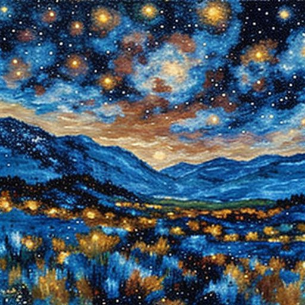<div class="play-overlay"><a href="cezar-baltag-sah-orb.html" class="play-btn-link" aria-label="Ascultă Șah orb"><button class="play-btn">▶️</button></a></div><div class="song-badges"><span class="badge featured-badge">noapte</span></div></div><div class="song-content"><div class="song-header"><h3 class="song-title"><a href="cezar-baltag-sah-orb.html">Șah orb</a></h3><div class="song-meta"><span class="artist">Cezar Baltag</span></div></div><div class="song-actions"><a href="cezar-baltag-sah-orb.html" class="btn btn-primary">▶️ Ascultă</a></div></div></div>
<div class="song-card" data-mood="caldura" role="article"><div class="song-image-container"><div class="play-overlay"><a href="cezar-bolliac-vara.html" class="play-btn-link" aria-label="Ascultă Vara"><button class="play-btn">▶️</button></a></div><div class="song-badges"><span class="badge featured-badge">caldura</span></div></div><div class="song-content"><div class="song-header"><h3 class="song-title"><a href="cezar-bolliac-vara.html">Vara</a></h3><div class="song-meta"><span class="artist">Cezar Bolliac</span></div></div><div class="song-actions"><a href="cezar-bolliac-vara.html" class="btn btn-primary">▶️ Ascultă</a></div></div></div>
<div class="song-card" data-mood="mare" role="article"><div class="song-image-container"><div class="play-overlay"><a href="cezar-ivanescu-jeu-d-amour-corabie.html" class="play-btn-link" aria-label="Ascultă Jeu d’Amour (Corabie)"><button class="play-btn">▶️</button></a></div><div class="song-badges"><span class="badge featured-badge">mare</span></div></div><div class="song-content"><div class="song-header"><h3 class="song-title"><a href="cezar-ivanescu-jeu-d-amour-corabie.html">Jeu d’Amour (Corabie)</a></h3><div class="song-meta"><span class="artist">Cezar Ivănescu</span></div></div><div class="song-actions"><a href="cezar-ivanescu-jeu-d-amour-corabie.html" class="btn btn-primary">▶️ Ascultă</a></div></div></div>
<div class="song-card" data-mood="frate" role="article"><div class="song-image-container"><div class="play-overlay"><a href="charles-baudelaire-doua-surori.html" class="play-btn-link" aria-label="Ascultă Două surori"><button class="play-btn">▶️</button></a></div><div class="song-badges"><span class="badge featured-badge">frate</span></div></div><div class="song-content"><div class="song-header"><h3 class="song-title"><a href="charles-baudelaire-doua-surori.html">Două surori</a></h3><div class="song-meta"><span class="artist">Charles Baudelaire</span></div></div><div class="song-actions"><a href="charles-baudelaire-doua-surori.html" class="btn btn-primary">▶️ Ascultă</a></div></div></div>
<div class="song-card" data-mood="cer" role="article"><div class="song-image-container"><div class="play-overlay"><a href="charles-baudelaire-smerit-te-ador-asemeni-cu-bolta-cea-nocturna.html" class="play-btn-link" aria-label="Ascultă Smerit te-ador asemeni cu bolta cea nocturnă"><button class="play-btn">▶️</button></a></div><div class="song-badges"><span class="badge featured-badge">cer</span></div></div><div class="song-content"><div class="song-header"><h3 class="song-title"><a href="charles-baudelaire-smerit-te-ador-asemeni-cu-bolta-cea-nocturna.html">Smerit te-ador asemeni cu bolta cea nocturnă</a></h3><div class="song-meta"><span class="artist">Charles Baudelaire</span></div></div><div class="song-actions"><a href="charles-baudelaire-smerit-te-ador-asemeni-cu-bolta-cea-nocturna.html" class="btn btn-primary">▶️ Ascultă</a></div></div></div>
<div class="song-card" data-mood="soare" role="article"><div class="song-image-container"><div class="play-overlay"><a href="charles-baudelaire-zori-spirituale.html" class="play-btn-link" aria-label="Ascultă Zori spirituale"><button class="play-btn">▶️</button></a></div><div class="song-badges"><span class="badge featured-badge">soare</span></div></div><div class="song-content"><div class="song-header"><h3 class="song-title"><a href="charles-baudelaire-zori-spirituale.html">Zori spirituale</a></h3><div class="song-meta"><span class="artist">Charles Baudelaire</span></div></div><div class="song-actions"><a href="charles-baudelaire-zori-spirituale.html" class="btn btn-primary">▶️ Ascultă</a></div></div></div>
<div class="song-card" data-mood="caldura" role="article"><div class="song-image-container"><div class="play-overlay"><a href="charles-simic-dimineata-de-vara-44997.html" class="play-btn-link" aria-label="Ascultă Dimineață de vară"><button class="play-btn">▶️</button></a></div><div class="song-badges"><span class="badge featured-badge">caldura</span></div></div><div class="song-content"><div class="song-header"><h3 class="song-title"><a href="charles-simic-dimineata-de-vara-44997.html">Dimineață de vară</a></h3><div class="song-meta"><span class="artist">Charles Simic</span></div></div><div class="song-actions"><a href="charles-simic-dimineata-de-vara-44997.html" class="btn btn-primary">▶️ Ascultă</a></div></div></div>
<div class="song-card" data-mood="cuvant" role="article"><div class="song-image-container"><div class="play-overlay"><a href="charles-simic-poem-fara-titlu-vol-poeme-timpurii.html" class="play-btn-link" aria-label="Ascultă Poem fără titlu (vol. Poeme timpurii)"><button class="play-btn">▶️</button></a></div><div class="song-badges"><span class="badge featured-badge">cuvant</span></div></div><div class="song-content"><div class="song-header"><h3 class="song-title"><a href="charles-simic-poem-fara-titlu-vol-poeme-timpurii.html">Poem fără titlu (vol. Poeme timpurii)</a></h3><div class="song-meta"><span class="artist">Charles Simic</span></div></div><div class="song-actions"><a href="charles-simic-poem-fara-titlu-vol-poeme-timpurii.html" class="btn btn-primary">▶️ Ascultă</a></div></div></div>
<div class="song-card" data-mood="mare" role="article"><div class="song-image-container"><div class="play-overlay"><a href="christian-w-schenk-cand-valurile.html" class="play-btn-link" aria-label="Ascultă Când valurile..."><button class="play-btn">▶️</button></a></div><div class="song-badges"><span class="badge featured-badge">mare</span></div></div><div class="song-content"><div class="song-header"><h3 class="song-title"><a href="christian-w-schenk-cand-valurile.html">Când valurile...</a></h3><div class="song-meta"><span class="artist">Christian W. Schenk</span></div></div><div class="song-actions"><a href="christian-w-schenk-cand-valurile.html" class="btn btn-primary">▶️ Ascultă</a></div></div></div>
<div class="song-card" data-mood="frate" role="article"><div class="song-image-container"><div class="play-overlay"><a href="christian-w-schenk-hai-fratioare.html" class="play-btn-link" aria-label="Ascultă Hai frățioare..."><button class="play-btn">▶️</button></a></div><div class="song-badges"><span class="badge featured-badge">frate</span></div></div><div class="song-content"><div class="song-header"><h3 class="song-title"><a href="christian-w-schenk-hai-fratioare.html">Hai frățioare...</a></h3><div class="song-meta"><span class="artist">Christian W. Schenk</span></div></div><div class="song-actions"><a href="christian-w-schenk-hai-fratioare.html" class="btn btn-primary">▶️ Ascultă</a></div></div></div>
<div class="song-card" data-mood="luna_stele noapte" role="article"><div class="song-image-container"><div class="play-overlay"><a href="christian-w-schenk-omului-din-luna-din-luna.html" class="play-btn-link" aria-label="Ascultă Omului din lună din lună"><button class="play-btn">▶️</button></a></div><div class="song-badges"><span class="badge featured-badge">luna_stele</span></div></div><div class="song-content"><div class="song-header"><h3 class="song-title"><a href="christian-w-schenk-omului-din-luna-din-luna.html">Omului din lună din lună</a></h3><div class="song-meta"><span class="artist">Christian W. Schenk</span></div></div><div class="song-actions"><a href="christian-w-schenk-omului-din-luna-din-luna.html" class="btn btn-primary">▶️ Ascultă</a></div></div></div>
<div class="song-card" data-mood="flori" role="article"><div class="song-image-container"><div class="play-overlay"><a href="cincinat-pavelescu-floarea-mistica.html" class="play-btn-link" aria-label="Ascultă Floarea mistică"><button class="play-btn">▶️</button></a></div><div class="song-badges"><span class="badge featured-badge">flori</span></div></div><div class="song-content"><div class="song-header"><h3 class="song-title"><a href="cincinat-pavelescu-floarea-mistica.html">Floarea mistică</a></h3><div class="song-meta"><span class="artist">Cincinat Pavelescu</span></div></div><div class="song-actions"><a href="cincinat-pavelescu-floarea-mistica.html" class="btn btn-primary">▶️ Ascultă</a></div></div></div>
<div class="song-card" data-mood="ploaie" role="article"><div class="song-image-container"><div class="play-overlay"><a href="cincinat-pavelescu-simfonia-ploii.html" class="play-btn-link" aria-label="Ascultă Simfonia ploii"><button class="play-btn">▶️</button></a></div><div class="song-badges"><span class="badge featured-badge">ploaie</span></div></div><div class="song-content"><div class="song-header"><h3 class="song-title"><a href="cincinat-pavelescu-simfonia-ploii.html">Simfonia ploii</a></h3><div class="song-meta"><span class="artist">Cincinat Pavelescu</span></div></div><div class="song-actions"><a href="cincinat-pavelescu-simfonia-ploii.html" class="btn btn-primary">▶️ Ascultă</a></div></div></div>
<div class="song-card" data-mood="flori" role="article"><div class="song-image-container"><div class="play-overlay"><a href="claudia-millian-minulescu-vazele-de-flori.html" class="play-btn-link" aria-label="Ascultă Vazele de flori"><button class="play-btn">▶️</button></a></div><div class="song-badges"><span class="badge featured-badge">flori</span></div></div><div class="song-content"><div class="song-header"><h3 class="song-title"><a href="claudia-millian-minulescu-vazele-de-flori.html">Vazele de flori</a></h3><div class="song-meta"><span class="artist">Claudia Millian Minulescu</span></div></div><div class="song-actions"><a href="claudia-millian-minulescu-vazele-de-flori.html" class="btn btn-primary">▶️ Ascultă</a></div></div></div>
<div class="song-card" data-mood="drum" role="article"><div class="song-image-container"><div class="play-overlay"><a href="concha-urquiza-drumuri.html" class="play-btn-link" aria-label="Ascultă Drumuri"><button class="play-btn">▶️</button></a></div><div class="song-badges"><span class="badge featured-badge">drum</span></div></div><div class="song-content"><div class="song-header"><h3 class="song-title"><a href="concha-urquiza-drumuri.html">Drumuri</a></h3><div class="song-meta"><span class="artist">Concha Urquiza</span></div></div><div class="song-actions"><a href="concha-urquiza-drumuri.html" class="btn btn-primary">▶️ Ascultă</a></div></div></div>
<div class="song-card" data-mood="flori" role="article"><div class="song-image-container"><div class="play-overlay"><a href="constananta-buzea-crinocaii.html" class="play-btn-link" aria-label="Ascultă Crinocaii"><button class="play-btn">▶️</button></a></div><div class="song-badges"><span class="badge featured-badge">flori</span></div></div><div class="song-content"><div class="song-header"><h3 class="song-title"><a href="constananta-buzea-crinocaii.html">Crinocaii</a></h3><div class="song-meta"><span class="artist">Constanţa Buzea</span></div></div><div class="song-actions"><a href="constananta-buzea-crinocaii.html" class="btn btn-primary">▶️ Ascultă</a></div></div></div>
<div class="song-card" data-mood="ploaie" role="article"><div class="song-image-container"><div class="play-overlay"><a href="constananta-buzea-dor-de-ploaie.html" class="play-btn-link" aria-label="Ascultă Dor de ploaie"><button class="play-btn">▶️</button></a></div><div class="song-badges"><span class="badge featured-badge">ploaie</span></div></div><div class="song-content"><div class="song-header"><h3 class="song-title"><a href="constananta-buzea-dor-de-ploaie.html">Dor de ploaie</a></h3><div class="song-meta"><span class="artist">Constanţa Buzea</span></div></div><div class="song-actions"><a href="constananta-buzea-dor-de-ploaie.html" class="btn btn-primary">▶️ Ascultă</a></div></div></div>
<div class="song-card" data-mood="lumina soare" role="article"><div class="song-image-container"><div class="play-overlay"><a href="constananta-buzea-lumina-lumii-in-lumina-lunii.html" class="play-btn-link" aria-label="Ascultă Lumina lumii în lumina lunii"><button class="play-btn">▶️</button></a></div><div class="song-badges"><span class="badge featured-badge">lumina</span></div></div><div class="song-content"><div class="song-header"><h3 class="song-title"><a href="constananta-buzea-lumina-lumii-in-lumina-lunii.html">Lumina lumii în lumina lunii</a></h3><div class="song-meta"><span class="artist">Constanţa Buzea</span></div></div><div class="song-actions"><a href="constananta-buzea-lumina-lumii-in-lumina-lunii.html" class="btn btn-primary">▶️ Ascultă</a></div></div></div>
<div class="song-card" data-mood="vant" role="article"><div class="song-image-container"><div class="play-overlay"><a href="constananta-buzea-vantul-are-par-taiat.html" class="play-btn-link" aria-label="Ascultă Vântul are păr tăiat"><button class="play-btn">▶️</button></a></div><div class="song-badges"><span class="badge featured-badge">vant</span></div></div><div class="song-content"><div class="song-header"><h3 class="song-title"><a href="constananta-buzea-vantul-are-par-taiat.html">Vântul are păr tăiat</a></h3><div class="song-meta"><span class="artist">Constanţa Buzea</span></div></div><div class="song-actions"><a href="constananta-buzea-vantul-are-par-taiat.html" class="btn btn-primary">▶️ Ascultă</a></div></div></div>
<div class="song-card" data-mood="frate" role="article"><div class="song-image-container"><div class="play-overlay"><a href="corneliu-coposu-surori.html" class="play-btn-link" aria-label="Ascultă Surori"><button class="play-btn">▶️</button></a></div><div class="song-badges"><span class="badge featured-badge">frate</span></div></div><div class="song-content"><div class="song-header"><h3 class="song-title"><a href="corneliu-coposu-surori.html">Surori</a></h3><div class="song-meta"><span class="artist">Corneliu Coposu</span></div></div><div class="song-actions"><a href="corneliu-coposu-surori.html" class="btn btn-primary">▶️ Ascultă</a></div></div></div>
<div class="song-card" data-mood="frate" role="article"><div class="song-image-container"><div class="play-overlay"><a href="corneliu-vadim-tudor-adio-fratele-meu-geaman.html" class="play-btn-link" aria-label="Ascultă Adio, fratele meu geamăn"><button class="play-btn">▶️</button></a></div><div class="song-badges"><span class="badge featured-badge">frate</span></div></div><div class="song-content"><div class="song-header"><h3 class="song-title"><a href="corneliu-vadim-tudor-adio-fratele-meu-geaman.html">Adio, fratele meu geamăn</a></h3><div class="song-meta"><span class="artist">Corneliu Vadim Tudor</span></div></div><div class="song-actions"><a href="corneliu-vadim-tudor-adio-fratele-meu-geaman.html" class="btn btn-primary">▶️ Ascultă</a></div></div></div>
<div class="song-card" data-mood="tara" role="article"><div class="song-image-container"><div class="play-overlay"><a href="corneliu-vadim-tudor-epistola-unui-martir-de-la-marasesti-catre-tradatorii-de-tara.html" class="play-btn-link" aria-label="Ascultă Epistola unui martir de la Mărăşeşti către trădătorii de țară"><button class="play-btn">▶️</button></a></div><div class="song-badges"><span class="badge featured-badge">tara</span></div></div><div class="song-content"><div class="song-header"><h3 class="song-title"><a href="corneliu-vadim-tudor-epistola-unui-martir-de-la-marasesti-catre-tradatorii-de-tara.html">Epistola unui martir de la Mărăşeşti către trădătorii de țară</a></h3><div class="song-meta"><span class="artist">Corneliu Vadim Tudor</span></div></div><div class="song-actions"><a href="corneliu-vadim-tudor-epistola-unui-martir-de-la-marasesti-catre-tradatorii-de-tara.html" class="btn btn-primary">▶️ Ascultă</a></div></div></div>
<div class="song-card" data-mood="durere" role="article"><div class="song-image-container"><div class="play-overlay"><a href="costache-conachi-ma-sfarsesc-amar-ma-doare.html" class="play-btn-link" aria-label="Ascultă Mă sfârșesc, amar mă doare"><button class="play-btn">▶️</button></a></div><div class="song-badges"><span class="badge featured-badge">durere</span></div></div><div class="song-content"><div class="song-header"><h3 class="song-title"><a href="costache-conachi-ma-sfarsesc-amar-ma-doare.html">Mă sfârșesc, amar mă doare</a></h3><div class="song-meta"><span class="artist">Costache Conachi</span></div></div><div class="song-actions"><a href="costache-conachi-ma-sfarsesc-amar-ma-doare.html" class="btn btn-primary">▶️ Ascultă</a></div></div></div>
<div class="song-card" data-mood="flori" role="article"><div class="song-image-container"><div class="play-overlay"><a href="costache-ioanid-am-gasit-o-floare-rupta.html" class="play-btn-link" aria-label="Ascultă Am găsit o floare ruptă"><button class="play-btn">▶️</button></a></div><div class="song-badges"><span class="badge featured-badge">flori</span></div></div><div class="song-content"><div class="song-header"><h3 class="song-title"><a href="costache-ioanid-am-gasit-o-floare-rupta.html">Am găsit o floare ruptă</a></h3><div class="song-meta"><span class="artist">Costache Ioanid</span></div></div><div class="song-actions"><a href="costache-ioanid-am-gasit-o-floare-rupta.html" class="btn btn-primary">▶️ Ascultă</a></div></div></div>
<div class="song-card" data-mood="drum viata" role="article"><div class="song-image-container"><div class="play-overlay"><a href="costache-ioanid-calea-adevarul-viata.html" class="play-btn-link" aria-label="Ascultă Calea, Adevărul, Viaţa"><button class="play-btn">▶️</button></a></div><div class="song-badges"><span class="badge featured-badge">drum</span></div></div><div class="song-content"><div class="song-header"><h3 class="song-title"><a href="costache-ioanid-calea-adevarul-viata.html">Calea, Adevărul, Viaţa</a></h3><div class="song-meta"><span class="artist">Costache Ioanid</span></div></div><div class="song-actions"><a href="costache-ioanid-calea-adevarul-viata.html" class="btn btn-primary">▶️ Ascultă</a></div></div></div>
<div class="song-card" data-mood="noapte" role="article"><div class="song-image-container"><div class="play-overlay"><a href="costache-ioanid-ce-noapte-grea.html" class="play-btn-link" aria-label="Ascultă Ce noapte grea!"><button class="play-btn">▶️</button></a></div><div class="song-badges"><span class="badge featured-badge">noapte</span></div></div><div class="song-content"><div class="song-header"><h3 class="song-title"><a href="costache-ioanid-ce-noapte-grea.html">Ce noapte grea!</a></h3><div class="song-meta"><span class="artist">Costache Ioanid</span></div></div><div class="song-actions"><a href="costache-ioanid-ce-noapte-grea.html" class="btn btn-primary">▶️ Ascultă</a></div></div></div>
<div class="song-card" data-mood="iubire" role="article"><div class="song-image-container"><div class="play-overlay"><a href="costache-ioanid-de-dragul-tau.html" class="play-btn-link" aria-label="Ascultă De dragul Tău"><button class="play-btn">▶️</button></a></div><div class="song-badges"><span class="badge featured-badge">iubire</span></div></div><div class="song-content"><div class="song-header"><h3 class="song-title"><a href="costache-ioanid-de-dragul-tau.html">De dragul Tău</a></h3><div class="song-meta"><span class="artist">Costache Ioanid</span></div></div><div class="song-actions"><a href="costache-ioanid-de-dragul-tau.html" class="btn btn-primary">▶️ Ascultă</a></div></div></div>
<div class="song-card" data-mood="frate" role="article"><div class="song-image-container"><div class="play-overlay"><a href="costache-ioanid-douazeci-de-ani.html" class="play-btn-link" aria-label="Ascultă Douăzeci de ani"><button class="play-btn">▶️</button></a></div><div class="song-badges"><span class="badge featured-badge">frate</span></div></div><div class="song-content"><div class="song-header"><h3 class="song-title"><a href="costache-ioanid-douazeci-de-ani.html">Douăzeci de ani</a></h3><div class="song-meta"><span class="artist">Costache Ioanid</span></div></div><div class="song-actions"><a href="costache-ioanid-douazeci-de-ani.html" class="btn btn-primary">▶️ Ascultă</a></div></div></div>
<div class="song-card" data-mood="flori primavara" role="article"><div class="song-image-container"><div class="play-overlay"><a href="costache-ioanid-e-primavara.html" class="play-btn-link" aria-label="Ascultă E primăvară..."><button class="play-btn">▶️</button></a></div><div class="song-badges"><span class="badge featured-badge">flori</span></div></div><div class="song-content"><div class="song-header"><h3 class="song-title"><a href="costache-ioanid-e-primavara.html">E primăvară...</a></h3><div class="song-meta"><span class="artist">Costache Ioanid</span></div></div><div class="song-actions"><a href="costache-ioanid-e-primavara.html" class="btn btn-primary">▶️ Ascultă</a></div></div></div>
<div class="song-card" data-mood="flori" role="article"><div class="song-image-container"><div class="play-overlay"><a href="costache-ioanid-floarea-de-mireasa.html" class="play-btn-link" aria-label="Ascultă Floarea de mireasă"><button class="play-btn">▶️</button></a></div><div class="song-badges"><span class="badge featured-badge">flori</span></div></div><div class="song-content"><div class="song-header"><h3 class="song-title"><a href="costache-ioanid-floarea-de-mireasa.html">Floarea de mireasă</a></h3><div class="song-meta"><span class="artist">Costache Ioanid</span></div></div><div class="song-actions"><a href="costache-ioanid-floarea-de-mireasa.html" class="btn btn-primary">▶️ Ascultă</a></div></div></div>
<div class="song-card" data-mood="dumnezeu" role="article"><div class="song-image-container"><div class="play-overlay"><a href="costache-ioanid-icoanele-mele.html" class="play-btn-link" aria-label="Ascultă Icoanele mele..."><button class="play-btn">▶️</button></a></div><div class="song-badges"><span class="badge featured-badge">dumnezeu</span></div></div><div class="song-content"><div class="song-header"><h3 class="song-title"><a href="costache-ioanid-icoanele-mele.html">Icoanele mele...</a></h3><div class="song-meta"><span class="artist">Costache Ioanid</span></div></div><div class="song-actions"><a href="costache-ioanid-icoanele-mele.html" class="btn btn-primary">▶️ Ascultă</a></div></div></div>
<div class="song-card" data-mood="libertate" role="article"><div class="song-image-container"><div class="play-overlay"><a href="costache-ioanid-inelul.html" class="play-btn-link" aria-label="Ascultă Inelul"><button class="play-btn">▶️</button></a></div><div class="song-badges"><span class="badge featured-badge">libertate</span></div></div><div class="song-content"><div class="song-header"><h3 class="song-title"><a href="costache-ioanid-inelul.html">Inelul</a></h3><div class="song-meta"><span class="artist">Costache Ioanid</span></div></div><div class="song-actions"><a href="costache-ioanid-inelul.html" class="btn btn-primary">▶️ Ascultă</a></div></div></div>
<div class="song-card" data-mood="frate" role="article"><div class="song-image-container"><div class="play-overlay"><a href="costache-ioanid-la-revedere-sora-alice.html" class="play-btn-link" aria-label="Ascultă La revedere, soră Alice..."><button class="play-btn">▶️</button></a></div><div class="song-badges"><span class="badge featured-badge">frate</span></div></div><div class="song-content"><div class="song-header"><h3 class="song-title"><a href="costache-ioanid-la-revedere-sora-alice.html">La revedere, soră Alice...</a></h3><div class="song-meta"><span class="artist">Costache Ioanid</span></div></div><div class="song-actions"><a href="costache-ioanid-la-revedere-sora-alice.html" class="btn btn-primary">▶️ Ascultă</a></div></div></div>
<div class="song-card" data-mood="tata" role="article"><div class="song-image-container"><div class="play-overlay"><a href="costache-ioanid-o-tata-bun-si-sfant.html" class="play-btn-link" aria-label="Ascultă O, Tată bun şi sfânt"><button class="play-btn">▶️</button></a></div><div class="song-badges"><span class="badge featured-badge">tata</span></div></div><div class="song-content"><div class="song-header"><h3 class="song-title"><a href="costache-ioanid-o-tata-bun-si-sfant.html">O, Tată bun şi sfânt</a></h3><div class="song-meta"><span class="artist">Costache Ioanid</span></div></div><div class="song-actions"><a href="costache-ioanid-o-tata-bun-si-sfant.html" class="btn btn-primary">▶️ Ascultă</a></div></div></div>
<div class="song-card" data-mood="frate" role="article"><div class="song-image-container"><div class="play-overlay"><a href="costache-ioanid-vreau-sa-iubesc-pe-fratii-mei.html" class="play-btn-link" aria-label="Ascultă Vreau să iubesc pe fratii mei"><button class="play-btn">▶️</button></a></div><div class="song-badges"><span class="badge featured-badge">frate</span></div></div><div class="song-content"><div class="song-header"><h3 class="song-title"><a href="costache-ioanid-vreau-sa-iubesc-pe-fratii-mei.html">Vreau să iubesc pe fratii mei</a></h3><div class="song-meta"><span class="artist">Costache Ioanid</span></div></div><div class="song-actions"><a href="costache-ioanid-vreau-sa-iubesc-pe-fratii-mei.html" class="btn btn-primary">▶️ Ascultă</a></div></div></div>
<div class="song-card" data-mood="mama" role="article"><div class="song-image-container"><div class="play-overlay"><a href="costache-ioanid-ti-aduci-aminte-mama.html" class="play-btn-link" aria-label="Ascultă Ți-aduci aminte, mamă"><button class="play-btn">▶️</button></a></div><div class="song-badges"><span class="badge featured-badge">mama</span></div></div><div class="song-content"><div class="song-header"><h3 class="song-title"><a href="costache-ioanid-ti-aduci-aminte-mama.html">Ți-aduci aminte, mamă</a></h3><div class="song-meta"><span class="artist">Costache Ioanid</span></div></div><div class="song-actions"><a href="costache-ioanid-ti-aduci-aminte-mama.html" class="btn btn-primary">▶️ Ascultă</a></div></div></div>
<div class="song-card" data-mood="lacrimi" role="article"><div class="song-image-container"><div class="play-overlay"><a href="dante-alighieri-plangeti-amanti-cand-zeul-chiar-a-plans.html" class="play-btn-link" aria-label="Ascultă Plângeti amanti, când Zeul chiar a plâns"><button class="play-btn">▶️</button></a></div><div class="song-badges"><span class="badge featured-badge">lacrimi</span></div></div><div class="song-content"><div class="song-header"><h3 class="song-title"><a href="dante-alighieri-plangeti-amanti-cand-zeul-chiar-a-plans.html">Plângeti amanti, când Zeul chiar a plâns</a></h3><div class="song-meta"><span class="artist">Dante Alighieri</span></div></div><div class="song-actions"><a href="dante-alighieri-plangeti-amanti-cand-zeul-chiar-a-plans.html" class="btn btn-primary">▶️ Ascultă</a></div></div></div>
<div class="song-card" data-mood="soare" role="article"><div class="song-image-container"><div class="play-overlay"><a href="demostene-botez-floarea-soarelui.html" class="play-btn-link" aria-label="Ascultă Floarea soarelui"><button class="play-btn">▶️</button></a></div><div class="song-badges"><span class="badge featured-badge">soare</span></div></div><div class="song-content"><div class="song-header"><h3 class="song-title"><a href="demostene-botez-floarea-soarelui.html">Floarea soarelui</a></h3><div class="song-meta"><span class="artist">Demostene Botez</span></div></div><div class="song-actions"><a href="demostene-botez-floarea-soarelui.html" class="btn btn-primary">▶️ Ascultă</a></div></div></div>
<div class="song-card" data-mood="drum" role="article"><div class="song-image-container"><div class="play-overlay"><a href="dimitrie-anghel-calatorii.html" class="play-btn-link" aria-label="Ascultă Călătorii"><button class="play-btn">▶️</button></a></div><div class="song-badges"><span class="badge featured-badge">drum</span></div></div><div class="song-content"><div class="song-header"><h3 class="song-title"><a href="dimitrie-anghel-calatorii.html">Călătorii</a></h3><div class="song-meta"><span class="artist">Dimitrie Anghel</span></div></div><div class="song-actions"><a href="dimitrie-anghel-calatorii.html" class="btn btn-primary">▶️ Ascultă</a></div></div></div>
<div class="song-card" data-mood="soare" role="article"><div class="song-image-container"><div class="play-overlay"><a href="dimitrie-anghel-floarea-soarelui.html" class="play-btn-link" aria-label="Ascultă Floarea – Soarelui"><button class="play-btn">▶️</button></a></div><div class="song-badges"><span class="badge featured-badge">soare</span></div></div><div class="song-content"><div class="song-header"><h3 class="song-title"><a href="dimitrie-anghel-floarea-soarelui.html">Floarea – Soarelui</a></h3><div class="song-meta"><span class="artist">Dimitrie Anghel</span></div></div><div class="song-actions"><a href="dimitrie-anghel-floarea-soarelui.html" class="btn btn-primary">▶️ Ascultă</a></div></div></div>
<div class="song-card" data-mood="lacrimi" role="article"><div class="song-image-container"><div class="play-overlay"><a href="dimitrie-bolintineanu-plangerile-poetului-roman.html" class="play-btn-link" aria-label="Ascultă Plângerile poetului român"><button class="play-btn">▶️</button></a></div><div class="song-badges"><span class="badge featured-badge">lacrimi</span></div></div><div class="song-content"><div class="song-header"><h3 class="song-title"><a href="dimitrie-bolintineanu-plangerile-poetului-roman.html">Plângerile poetului român</a></h3><div class="song-meta"><span class="artist">Dimitrie Bolintineanu</span></div></div><div class="song-actions"><a href="dimitrie-bolintineanu-plangerile-poetului-roman.html" class="btn btn-primary">▶️ Ascultă</a></div></div></div>
<div class="song-card" data-mood="timp" role="article"><div class="song-image-container"><div class="play-overlay"><a href="dimitrie-bolintineanu-timpul.html" class="play-btn-link" aria-label="Ascultă Timpul"><button class="play-btn">▶️</button></a></div><div class="song-badges"><span class="badge featured-badge">timp</span></div></div><div class="song-content"><div class="song-header"><h3 class="song-title"><a href="dimitrie-bolintineanu-timpul.html">Timpul</a></h3><div class="song-meta"><span class="artist">Dimitrie Bolintineanu</span></div></div><div class="song-actions"><a href="dimitrie-bolintineanu-timpul.html" class="btn btn-primary">▶️ Ascultă</a></div></div></div>
<div class="song-card" data-mood="tara" role="article"><div class="song-image-container"><div class="play-overlay"><a href="dimitrie-bolintineanu-ziua-buna-la-tara.html" class="play-btn-link" aria-label="Ascultă Ziua bună la ţară"><button class="play-btn">▶️</button></a></div><div class="song-badges"><span class="badge featured-badge">tara</span></div></div><div class="song-content"><div class="song-header"><h3 class="song-title"><a href="dimitrie-bolintineanu-ziua-buna-la-tara.html">Ziua bună la ţară</a></h3><div class="song-meta"><span class="artist">Dimitrie Bolintineanu</span></div></div><div class="song-actions"><a href="dimitrie-bolintineanu-ziua-buna-la-tara.html" class="btn btn-primary">▶️ Ascultă</a></div></div></div>
<div class="song-card" data-mood="soare" role="article"><div class="song-image-container"><div class="play-overlay"><a href="dimitrie-ciurezu-cununa-soarelui-fragmente.html" class="play-btn-link" aria-label="Ascultă Cununa soarelui (fragmente)"><button class="play-btn">▶️</button></a></div><div class="song-badges"><span class="badge featured-badge">soare</span></div></div><div class="song-content"><div class="song-header"><h3 class="song-title"><a href="dimitrie-ciurezu-cununa-soarelui-fragmente.html">Cununa soarelui (fragmente)</a></h3><div class="song-meta"><span class="artist">Dimitrie Ciurezu</span></div></div><div class="song-actions"><a href="dimitrie-ciurezu-cununa-soarelui-fragmente.html" class="btn btn-primary">▶️ Ascultă</a></div></div></div>
<div class="song-card" data-mood="ploaie" role="article"><div class="song-image-container"><div class="play-overlay"><a href="dimitrie-ciurezu-ploaie-si-soare.html" class="play-btn-link" aria-label="Ascultă Ploaie si soare"><button class="play-btn">▶️</button></a></div><div class="song-badges"><span class="badge featured-badge">ploaie</span></div></div><div class="song-content"><div class="song-header"><h3 class="song-title"><a href="dimitrie-ciurezu-ploaie-si-soare.html">Ploaie si soare</a></h3><div class="song-meta"><span class="artist">Dimitrie Ciurezu</span></div></div><div class="song-actions"><a href="dimitrie-ciurezu-ploaie-si-soare.html" class="btn btn-primary">▶️ Ascultă</a></div></div></div>
<div class="song-card" data-mood="cuvant" role="article"><div class="song-image-container"><div class="play-overlay"><a href="dsida-jeno-vers-simplu-despre-har-egyszer-vers-a-kegyelemr-l.html" class="play-btn-link" aria-label="Ascultă Vers simplu despre har - (Egyszerű vers a kegyelemről)"><button class="play-btn">▶️</button></a></div><div class="song-badges"><span class="badge featured-badge">cuvant</span></div></div><div class="song-content"><div class="song-header"><h3 class="song-title"><a href="dsida-jeno-vers-simplu-despre-har-egyszer-vers-a-kegyelemr-l.html">Vers simplu despre har - (Egyszerű vers a kegyelemről)</a></h3><div class="song-meta"><span class="artist">Dsida Jenő</span></div></div><div class="song-actions"><a href="dsida-jeno-vers-simplu-despre-har-egyszer-vers-a-kegyelemr-l.html" class="btn btn-primary">▶️ Ascultă</a></div></div></div>
<div class="song-card" data-mood="noapte" role="article"><div class="song-image-container"><div class="play-overlay"><a href="du-fu-noapte-cu-luna.html" class="play-btn-link" aria-label="Ascultă Noapte cu lună"><button class="play-btn">▶️</button></a></div><div class="song-badges"><span class="badge featured-badge">noapte</span></div></div><div class="song-content"><div class="song-header"><h3 class="song-title"><a href="du-fu-noapte-cu-luna.html">Noapte cu lună</a></h3><div class="song-meta"><span class="artist">Du Fu</span></div></div><div class="song-actions"><a href="du-fu-noapte-cu-luna.html" class="btn btn-primary">▶️ Ascultă</a></div></div></div>
<div class="song-card" data-mood="flori" role="article"><div class="song-image-container"><div class="play-overlay"><a href="duiliu-zamfirescu-flori-de-paste.html" class="play-btn-link" aria-label="Ascultă Flori de paşte"><button class="play-btn">▶️</button></a></div><div class="song-badges"><span class="badge featured-badge">flori</span></div></div><div class="song-content"><div class="song-header"><h3 class="song-title"><a href="duiliu-zamfirescu-flori-de-paste.html">Flori de paşte</a></h3><div class="song-meta"><span class="artist">Duiliu Zamfirescu</span></div></div><div class="song-actions"><a href="duiliu-zamfirescu-flori-de-paste.html" class="btn btn-primary">▶️ Ascultă</a></div></div></div>
<div class="song-card" data-mood="lacrimi" role="article"><div class="song-image-container"><div class="play-overlay"><a href="duiliu-zamfirescu-harpista.html" class="play-btn-link" aria-label="Ascultă Harpista"><button class="play-btn">▶️</button></a></div><div class="song-badges"><span class="badge featured-badge">lacrimi</span></div></div><div class="song-content"><div class="song-header"><h3 class="song-title"><a href="duiliu-zamfirescu-harpista.html">Harpista</a></h3><div class="song-meta"><span class="artist">Duiliu Zamfirescu</span></div></div><div class="song-actions"><a href="duiliu-zamfirescu-harpista.html" class="btn btn-primary">▶️ Ascultă</a></div></div></div>
<div class="song-card" data-mood="caldura" role="article"><div class="song-image-container"><div class="play-overlay"><a href="duiliu-zamfirescu-vara.html" class="play-btn-link" aria-label="Ascultă Vara"><button class="play-btn">▶️</button></a></div><div class="song-badges"><span class="badge featured-badge">caldura</span></div></div><div class="song-content"><div class="song-header"><h3 class="song-title"><a href="duiliu-zamfirescu-vara.html">Vara</a></h3><div class="song-meta"><span class="artist">Duiliu Zamfirescu</span></div></div><div class="song-actions"><a href="duiliu-zamfirescu-vara.html" class="btn btn-primary">▶️ Ascultă</a></div></div></div>
<div class="song-card" data-mood="mare" role="article"><div class="song-image-container"><div class="play-overlay"><a href="dumitru-corbea-marea.html" class="play-btn-link" aria-label="Ascultă Marea"><button class="play-btn">▶️</button></a></div><div class="song-badges"><span class="badge featured-badge">mare</span></div></div><div class="song-content"><div class="song-header"><h3 class="song-title"><a href="dumitru-corbea-marea.html">Marea</a></h3><div class="song-meta"><span class="artist">Dumitru Corbea</span></div></div><div class="song-actions"><a href="dumitru-corbea-marea.html" class="btn btn-primary">▶️ Ascultă</a></div></div></div>
<div class="song-card" data-mood="tata" role="article"><div class="song-image-container"><div class="play-overlay"><a href="dumitru-matcovschi-are-tata-doua-fete.html" class="play-btn-link" aria-label="Ascultă Are tata două fete"><button class="play-btn">▶️</button></a></div><div class="song-badges"><span class="badge featured-badge">tata</span></div></div><div class="song-content"><div class="song-header"><h3 class="song-title"><a href="dumitru-matcovschi-are-tata-doua-fete.html">Are tata două fete</a></h3><div class="song-meta"><span class="artist">Dumitru Matcovschi</span></div></div><div class="song-actions"><a href="dumitru-matcovschi-are-tata-doua-fete.html" class="btn btn-primary">▶️ Ascultă</a></div></div></div>
<div class="song-card" data-mood="caldura" role="article"><div class="song-image-container"><div class="play-overlay"><a href="dumitru-matcovschi-asta-vara-la-soroca.html" class="play-btn-link" aria-label="Ascultă Astă vară la Soroca"><button class="play-btn">▶️</button></a></div><div class="song-badges"><span class="badge featured-badge">caldura</span></div></div><div class="song-content"><div class="song-header"><h3 class="song-title"><a href="dumitru-matcovschi-asta-vara-la-soroca.html">Astă vară la Soroca</a></h3><div class="song-meta"><span class="artist">Dumitru Matcovschi</span></div></div><div class="song-actions"><a href="dumitru-matcovschi-asta-vara-la-soroca.html" class="btn btn-primary">▶️ Ascultă</a></div></div></div>
<div class="song-card" data-mood="fericire" role="article"><div class="song-image-container"><div class="play-overlay"><a href="dumitru-matcovschi-bucurati-va.html" class="play-btn-link" aria-label="Ascultă Bucurați-vă"><button class="play-btn">▶️</button></a></div><div class="song-badges"><span class="badge featured-badge">fericire</span></div></div><div class="song-content"><div class="song-header"><h3 class="song-title"><a href="dumitru-matcovschi-bucurati-va.html">Bucurați-vă</a></h3><div class="song-meta"><span class="artist">Dumitru Matcovschi</span></div></div><div class="song-actions"><a href="dumitru-matcovschi-bucurati-va.html" class="btn btn-primary">▶️ Ascultă</a></div></div></div>
<div class="song-card" data-mood="cer" role="article"><div class="song-image-container"><div class="play-overlay"><a href="dumitru-matcovschi-cerul-tau-moldova.html" class="play-btn-link" aria-label="Ascultă Cerul tău, Moldovă"><button class="play-btn">▶️</button></a></div><div class="song-badges"><span class="badge featured-badge">cer</span></div></div><div class="song-content"><div class="song-header"><h3 class="song-title"><a href="dumitru-matcovschi-cerul-tau-moldova.html">Cerul tău, Moldovă</a></h3><div class="song-meta"><span class="artist">Dumitru Matcovschi</span></div></div><div class="song-actions"><a href="dumitru-matcovschi-cerul-tau-moldova.html" class="btn btn-primary">▶️ Ascultă</a></div></div></div>
<div class="song-card" data-mood="dumnezeu" role="article"><div class="song-image-container"><div class="play-overlay"><a href="dumitru-matcovschi-daruieste-doamne-sfinte.html" class="play-btn-link" aria-label="Ascultă Dăruiește, Doamne Sfinte"><button class="play-btn">▶️</button></a></div><div class="song-badges"><span class="badge featured-badge">dumnezeu</span></div></div><div class="song-content"><div class="song-header"><h3 class="song-title"><a href="dumitru-matcovschi-daruieste-doamne-sfinte.html">Dăruiește, Doamne Sfinte</a></h3><div class="song-meta"><span class="artist">Dumitru Matcovschi</span></div></div><div class="song-actions"><a href="dumitru-matcovschi-daruieste-doamne-sfinte.html" class="btn btn-primary">▶️ Ascultă</a></div></div></div>
<div class="song-card" data-mood="mama" role="article"><div class="song-image-container"><div class="play-overlay"><a href="edgar-allan-poe-mamei-mele.html" class="play-btn-link" aria-label="Ascultă Mamei mele"><button class="play-btn">▶️</button></a></div><div class="song-badges"><span class="badge featured-badge">mama</span></div></div><div class="song-content"><div class="song-header"><h3 class="song-title"><a href="edgar-allan-poe-mamei-mele.html">Mamei mele</a></h3><div class="song-meta"><span class="artist">Edgar Allan Poe</span></div></div><div class="song-actions"><a href="edgar-allan-poe-mamei-mele.html" class="btn btn-primary">▶️ Ascultă</a></div></div></div>
<div class="song-card" data-mood="tara" role="article"><div class="song-image-container"><div class="play-overlay"><a href="edith-sodergran-tara-care-nu-e.html" class="play-btn-link" aria-label="Ascultă Ţara care nu e"><button class="play-btn">▶️</button></a></div><div class="song-badges"><span class="badge featured-badge">tara</span></div></div><div class="song-content"><div class="song-header"><h3 class="song-title"><a href="edith-sodergran-tara-care-nu-e.html">Ţara care nu e</a></h3><div class="song-meta"><span class="artist">Edith Sodergran</span></div></div><div class="song-actions"><a href="edith-sodergran-tara-care-nu-e.html" class="btn btn-primary">▶️ Ascultă</a></div></div></div>
<div class="song-card" data-mood="cer" role="article"><div class="song-image-container"><div class="play-overlay"><a href="edward-hirsch-cerul-in-crestere.html" class="play-btn-link" aria-label="Ascultă Cerul în creștere"><button class="play-btn">▶️</button></a></div><div class="song-badges"><span class="badge featured-badge">cer</span></div></div><div class="song-content"><div class="song-header"><h3 class="song-title"><a href="edward-hirsch-cerul-in-crestere.html">Cerul în creștere</a></h3><div class="song-meta"><span class="artist">Edward Hirsch</span></div></div><div class="song-actions"><a href="edward-hirsch-cerul-in-crestere.html" class="btn btn-primary">▶️ Ascultă</a></div></div></div>
<div class="song-card" data-mood="caldura" role="article"><div class="song-image-container"><div class="play-overlay"><a href="edward-hirsch-vara-americana.html" class="play-btn-link" aria-label="Ascultă Vară americană"><button class="play-btn">▶️</button></a></div><div class="song-badges"><span class="badge featured-badge">caldura</span></div></div><div class="song-content"><div class="song-header"><h3 class="song-title"><a href="edward-hirsch-vara-americana.html">Vară americană</a></h3><div class="song-meta"><span class="artist">Edward Hirsch</span></div></div><div class="song-actions"><a href="edward-hirsch-vara-americana.html" class="btn btn-primary">▶️ Ascultă</a></div></div></div>
<div class="song-card" data-mood="cer" role="article"><div class="song-image-container"><div class="play-overlay"><a href="elena-armenescu-ravnind-mereu-cerul.html" class="play-btn-link" aria-label="Ascultă Râvnind mereu cerul"><button class="play-btn">▶️</button></a></div><div class="song-badges"><span class="badge featured-badge">cer</span></div></div><div class="song-content"><div class="song-header"><h3 class="song-title"><a href="elena-armenescu-ravnind-mereu-cerul.html">Râvnind mereu cerul</a></h3><div class="song-meta"><span class="artist">Elena Armenescu</span></div></div><div class="song-actions"><a href="elena-armenescu-ravnind-mereu-cerul.html" class="btn btn-primary">▶️ Ascultă</a></div></div></div>
<div class="song-card" data-mood="lumina" role="article"><div class="song-image-container"><div class="play-overlay"><a href="elena-farago-lumini-de-amurg.html" class="play-btn-link" aria-label="Ascultă Lumini de amurg"><button class="play-btn">▶️</button></a></div><div class="song-badges"><span class="badge featured-badge">lumina</span></div></div><div class="song-content"><div class="song-header"><h3 class="song-title"><a href="elena-farago-lumini-de-amurg.html">Lumini de amurg</a></h3><div class="song-meta"><span class="artist">Elena Farago</span></div></div><div class="song-actions"><a href="elena-farago-lumini-de-amurg.html" class="btn btn-primary">▶️ Ascultă</a></div></div></div>
<div class="song-card" data-mood="moarte suflet" role="article"><div class="song-image-container"><div class="play-overlay"><a href="elena-farago-sufletul-meu-astazi-isi-dezgroapa-mortii.html" class="play-btn-link" aria-label="Ascultă Sufletul meu astăzi îşi dezgroapă morţii"><button class="play-btn">▶️</button></a></div><div class="song-badges"><span class="badge featured-badge">moarte</span></div></div><div class="song-content"><div class="song-header"><h3 class="song-title"><a href="elena-farago-sufletul-meu-astazi-isi-dezgroapa-mortii.html">Sufletul meu astăzi îşi dezgroapă morţii</a></h3><div class="song-meta"><span class="artist">Elena Farago</span></div></div><div class="song-actions"><a href="elena-farago-sufletul-meu-astazi-isi-dezgroapa-mortii.html" class="btn btn-primary">▶️ Ascultă</a></div></div></div>
<div class="song-card" data-mood="drum" role="article"><div class="song-image-container"><div class="play-overlay"><a href="elena-farago-trecea-un-om-pe-drum.html" class="play-btn-link" aria-label="Ascultă Trecea un om pe drum..."><button class="play-btn">▶️</button></a></div><div class="song-badges"><span class="badge featured-badge">drum</span></div></div><div class="song-content"><div class="song-header"><h3 class="song-title"><a href="elena-farago-trecea-un-om-pe-drum.html">Trecea un om pe drum...</a></h3><div class="song-meta"><span class="artist">Elena Farago</span></div></div><div class="song-actions"><a href="elena-farago-trecea-un-om-pe-drum.html" class="btn btn-primary">▶️ Ascultă</a></div></div></div>
<div class="song-card" data-mood="singuratate" role="article"><div class="song-image-container"><div class="play-overlay"><a href="elena-liliana-popescu-un-singur-cant.html" class="play-btn-link" aria-label="Ascultă Un singur cânt"><button class="play-btn">▶️</button></a></div><div class="song-badges"><span class="badge featured-badge">singuratate</span></div></div><div class="song-content"><div class="song-header"><h3 class="song-title"><a href="elena-liliana-popescu-un-singur-cant.html">Un singur cânt</a></h3><div class="song-meta"><span class="artist">Elena Liliana Popescu</span></div></div><div class="song-actions"><a href="elena-liliana-popescu-un-singur-cant.html" class="btn btn-primary">▶️ Ascultă</a></div></div></div>
<div class="song-card" data-mood="cantec" role="article"><div class="song-image-container"><div class="play-overlay"><a href="elizabeth-bishop-cantece-pentru-un-cantaret-colorat.html" class="play-btn-link" aria-label="Ascultă Cântece pentru un cântăreț colorat"><button class="play-btn">▶️</button></a></div><div class="song-badges"><span class="badge featured-badge">cantec</span></div></div><div class="song-content"><div class="song-header"><h3 class="song-title"><a href="elizabeth-bishop-cantece-pentru-un-cantaret-colorat.html">Cântece pentru un cântăreț colorat</a></h3><div class="song-meta"><span class="artist">Elizabeth Bishop</span></div></div><div class="song-actions"><a href="elizabeth-bishop-cantece-pentru-un-cantaret-colorat.html" class="btn btn-primary">▶️ Ascultă</a></div></div></div>
<div class="song-card" data-mood="ploaie" role="article"><div class="song-image-container"><div class="play-overlay"><a href="elizabeth-bishop-cantecul-pentru-sezonul-ploios.html" class="play-btn-link" aria-label="Ascultă Cântecul pentru sezonul ploios"><button class="play-btn">▶️</button></a></div><div class="song-badges"><span class="badge featured-badge">ploaie</span></div></div><div class="song-content"><div class="song-header"><h3 class="song-title"><a href="elizabeth-bishop-cantecul-pentru-sezonul-ploios.html">Cântecul pentru sezonul ploios</a></h3><div class="song-meta"><span class="artist">Elizabeth Bishop</span></div></div><div class="song-actions"><a href="elizabeth-bishop-cantecul-pentru-sezonul-ploios.html" class="btn btn-primary">▶️ Ascultă</a></div></div></div>
<div class="song-card" data-mood="dor" role="article"><div class="song-image-container"><div class="play-overlay"><a href="emil-botta-un-dor-fara-satiu.html" class="play-btn-link" aria-label="Ascultă Un dor fără saţiu"><button class="play-btn">▶️</button></a></div><div class="song-badges"><span class="badge featured-badge">dor</span></div></div><div class="song-content"><div class="song-header"><h3 class="song-title"><a href="emil-botta-un-dor-fara-satiu.html">Un dor fără saţiu</a></h3><div class="song-meta"><span class="artist">Emil Botta</span></div></div><div class="song-actions"><a href="emil-botta-un-dor-fara-satiu.html" class="btn btn-primary">▶️ Ascultă</a></div></div></div>
<div class="song-card" data-mood="drum" role="article"><div class="song-image-container"><div class="play-overlay"><a href="emil-brumaru-drum-gresit.html" class="play-btn-link" aria-label="Ascultă Drum greşit"><button class="play-btn">▶️</button></a></div><div class="song-badges"><span class="badge featured-badge">drum</span></div></div><div class="song-content"><div class="song-header"><h3 class="song-title"><a href="emil-brumaru-drum-gresit.html">Drum greşit</a></h3><div class="song-meta"><span class="artist">Emil Brumaru</span></div></div><div class="song-actions"><a href="emil-brumaru-drum-gresit.html" class="btn btn-primary">▶️ Ascultă</a></div></div></div>
<div class="song-card" data-mood="vant" role="article"><div class="song-image-container"><div class="play-overlay"><a href="emile-verhaeren-vantul.html" class="play-btn-link" aria-label="Ascultă Vântul"><button class="play-btn">▶️</button></a></div><div class="song-badges"><span class="badge featured-badge">vant</span></div></div><div class="song-content"><div class="song-header"><h3 class="song-title"><a href="emile-verhaeren-vantul.html">Vântul</a></h3><div class="song-meta"><span class="artist">Emile Verhaeren</span></div></div><div class="song-actions"><a href="emile-verhaeren-vantul.html" class="btn btn-primary">▶️ Ascultă</a></div></div></div>
<div class="song-card" data-mood="caldura" role="article"><div class="song-image-container"><div class="play-overlay"><a href="emily-dickinson-doriti-vara-gustati-o-pe-a-noastra.html" class="play-btn-link" aria-label="Ascultă Doriţi Vară? Gustaţi-o pe a noastră"><button class="play-btn">▶️</button></a></div><div class="song-badges"><span class="badge featured-badge">caldura</span></div></div><div class="song-content"><div class="song-header"><h3 class="song-title"><a href="emily-dickinson-doriti-vara-gustati-o-pe-a-noastra.html">Doriţi Vară? Gustaţi-o pe a noastră</a></h3><div class="song-meta"><span class="artist">Emily Dickinson</span></div></div><div class="song-actions"><a href="emily-dickinson-doriti-vara-gustati-o-pe-a-noastra.html" class="btn btn-primary">▶️ Ascultă</a></div></div></div>
<div class="song-card" data-mood="frate" role="article"><div class="song-image-container"><div class="play-overlay"><a href="emily-dickinson-o-sora-am-acasa.html" class="play-btn-link" aria-label="Ascultă O Soră am acasă"><button class="play-btn">▶️</button></a></div><div class="song-badges"><span class="badge featured-badge">frate</span></div></div><div class="song-content"><div class="song-header"><h3 class="song-title"><a href="emily-dickinson-o-sora-am-acasa.html">O Soră am acasă</a></h3><div class="song-meta"><span class="artist">Emily Dickinson</span></div></div><div class="song-actions"><a href="emily-dickinson-o-sora-am-acasa.html" class="btn btn-primary">▶️ Ascultă</a></div></div></div>
<div class="song-card" data-mood="cer" role="article"><div class="song-image-container"><div class="play-overlay"><a href="emily-dickinson-sa-privesti-cerul-de-vara.html" class="play-btn-link" aria-label="Ascultă Să priveşti Cerul de Vară"><button class="play-btn">▶️</button></a></div><div class="song-badges"><span class="badge featured-badge">cer</span></div></div><div class="song-content"><div class="song-header"><h3 class="song-title"><a href="emily-dickinson-sa-privesti-cerul-de-vara.html">Să priveşti Cerul de Vară</a></h3><div class="song-meta"><span class="artist">Emily Dickinson</span></div></div><div class="song-actions"><a href="emily-dickinson-sa-privesti-cerul-de-vara.html" class="btn btn-primary">▶️ Ascultă</a></div></div></div>
<div class="song-card" data-mood="noapte" role="article"><div class="song-image-container"><div class="play-overlay"><a href="emily-dickinson-salbatice-nopti-salbatice-nopti.html" class="play-btn-link" aria-label="Ascultă Sălbatice nopţi - Sălbatice nopţi!"><button class="play-btn">▶️</button></a></div><div class="song-badges"><span class="badge featured-badge">noapte</span></div></div><div class="song-content"><div class="song-header"><h3 class="song-title"><a href="emily-dickinson-salbatice-nopti-salbatice-nopti.html">Sălbatice nopţi - Sălbatice nopţi!</a></h3><div class="song-meta"><span class="artist">Emily Dickinson</span></div></div><div class="song-actions"><a href="emily-dickinson-salbatice-nopti-salbatice-nopti.html" class="btn btn-primary">▶️ Ascultă</a></div></div></div>
<div class="song-card" data-mood="caldura" role="article"><div class="song-image-container"><div class="play-overlay"><a href="emily-dickinson-un-ceva-ntr-o-varateca-zi.html" class="play-btn-link" aria-label="Ascultă Un ceva-ntr-o văratecă Zi"><button class="play-btn">▶️</button></a></div><div class="song-badges"><span class="badge featured-badge">caldura</span></div></div><div class="song-content"><div class="song-header"><h3 class="song-title"><a href="emily-dickinson-un-ceva-ntr-o-varateca-zi.html">Un ceva-ntr-o văratecă Zi</a></h3><div class="song-meta"><span class="artist">Emily Dickinson</span></div></div><div class="song-actions"><a href="emily-dickinson-un-ceva-ntr-o-varateca-zi.html" class="btn btn-primary">▶️ Ascultă</a></div></div></div>
<div class="song-card" data-mood="ploaie" role="article"><div class="song-image-container"><div class="play-overlay"><a href="eugen-jebeleanu-visul-negustorului.html" class="play-btn-link" aria-label="Ascultă Visul negustorului"><button class="play-btn">▶️</button></a></div><div class="song-badges"><span class="badge featured-badge">ploaie</span></div></div><div class="song-content"><div class="song-header"><h3 class="song-title"><a href="eugen-jebeleanu-visul-negustorului.html">Visul negustorului</a></h3><div class="song-meta"><span class="artist">Eugen Jebeleanu</span></div></div><div class="song-actions"><a href="eugen-jebeleanu-visul-negustorului.html" class="btn btn-primary">▶️ Ascultă</a></div></div></div>
<div class="song-card" data-mood="soare" role="article"><div class="song-image-container"><div class="play-overlay"><a href="eugen-jebeleanu-zorile.html" class="play-btn-link" aria-label="Ascultă Zorile"><button class="play-btn">▶️</button></a></div><div class="song-badges"><span class="badge featured-badge">soare</span></div></div><div class="song-content"><div class="song-header"><h3 class="song-title"><a href="eugen-jebeleanu-zorile.html">Zorile</a></h3><div class="song-meta"><span class="artist">Eugen Jebeleanu</span></div></div><div class="song-actions"><a href="eugen-jebeleanu-zorile.html" class="btn btn-primary">▶️ Ascultă</a></div></div></div>
<div class="song-card" data-mood="tata" role="article"><div class="song-image-container"><div class="play-overlay"><a href="eusebiu-camilar-tata.html" class="play-btn-link" aria-label="Ascultă Tata"><button class="play-btn">▶️</button></a></div><div class="song-badges"><span class="badge featured-badge">tata</span></div></div><div class="song-content"><div class="song-header"><h3 class="song-title"><a href="eusebiu-camilar-tata.html">Tata</a></h3><div class="song-meta"><span class="artist">Eusebiu Camilar</span></div></div><div class="song-actions"><a href="eusebiu-camilar-tata.html" class="btn btn-primary">▶️ Ascultă</a></div></div></div>
<div class="song-card" data-mood="dor" role="article"><div class="song-image-container"><div class="play-overlay"><a href="evgheni-evtusenko-dormi-iubito.html" class="play-btn-link" aria-label="Ascultă Dormi, iubito!"><button class="play-btn">▶️</button></a></div><div class="song-badges"><span class="badge featured-badge">dor</span></div></div><div class="song-content"><div class="song-header"><h3 class="song-title"><a href="evgheni-evtusenko-dormi-iubito.html">Dormi, iubito!</a></h3><div class="song-meta"><span class="artist">Evgheni Evtuşenko</span></div></div><div class="song-actions"><a href="evgheni-evtusenko-dormi-iubito.html" class="btn btn-primary">▶️ Ascultă</a></div></div></div>
<div class="song-card" data-mood="mama" role="article"><div class="song-image-container"><div class="play-overlay"><a href="evgheni-evtusenko-mama.html" class="play-btn-link" aria-label="Ascultă Mama"><button class="play-btn">▶️</button></a></div><div class="song-badges"><span class="badge featured-badge">mama</span></div></div><div class="song-content"><div class="song-header"><h3 class="song-title"><a href="evgheni-evtusenko-mama.html">Mama</a></h3><div class="song-meta"><span class="artist">Evgheni Evtuşenko</span></div></div><div class="song-actions"><a href="evgheni-evtusenko-mama.html" class="btn btn-primary">▶️ Ascultă</a></div></div></div>
<div class="song-card" data-mood="timp" role="article"><div class="song-image-container"><div class="play-overlay"><a href="federico-garcia-lorca-astfel-incat-sa-treaca-cinci-ani-legenda-timpului-teatru-fragment-liric.html" class="play-btn-link" aria-label="Ascultă Astfel încât să treacă cinci ani: Legenda timpului - teatru (fragment liric)"><button class="play-btn">▶️</button></a></div><div class="song-badges"><span class="badge featured-badge">timp</span></div></div><div class="song-content"><div class="song-header"><h3 class="song-title"><a href="federico-garcia-lorca-astfel-incat-sa-treaca-cinci-ani-legenda-timpului-teatru-fragment-liric.html">Astfel încât să treacă cinci ani: Legenda timpului - teatru (fragment liric)</a></h3><div class="song-meta"><span class="artist">Federico Garcia Lorca</span></div></div><div class="song-actions"><a href="federico-garcia-lorca-astfel-incat-sa-treaca-cinci-ani-legenda-timpului-teatru-fragment-liric.html" class="btn btn-primary">▶️ Ascultă</a></div></div></div>
<div class="song-card" data-mood="durere" role="article"><div class="song-image-container"><div class="play-overlay"><a href="federico-garcia-lorca-balada-durerii-negre.html" class="play-btn-link" aria-label="Ascultă Balada durerii negre"><button class="play-btn">▶️</button></a></div><div class="song-badges"><span class="badge featured-badge">durere</span></div></div><div class="song-content"><div class="song-header"><h3 class="song-title"><a href="federico-garcia-lorca-balada-durerii-negre.html">Balada durerii negre</a></h3><div class="song-meta"><span class="artist">Federico Garcia Lorca</span></div></div><div class="song-actions"><a href="federico-garcia-lorca-balada-durerii-negre.html" class="btn btn-primary">▶️ Ascultă</a></div></div></div>
<div class="song-card" data-mood="lacrimi" role="article"><div class="song-image-container"><div class="play-overlay"><a href="federico-garcia-lorca-casida-plansului.html" class="play-btn-link" aria-label="Ascultă Casida plânsului"><button class="play-btn">▶️</button></a></div><div class="song-badges"><span class="badge featured-badge">lacrimi</span></div></div><div class="song-content"><div class="song-header"><h3 class="song-title"><a href="federico-garcia-lorca-casida-plansului.html">Casida plânsului</a></h3><div class="song-meta"><span class="artist">Federico Garcia Lorca</span></div></div><div class="song-actions"><a href="federico-garcia-lorca-casida-plansului.html" class="btn btn-primary">▶️ Ascultă</a></div></div></div>
<div class="song-card" data-mood="copilarie" role="article"><div class="song-image-container"><div class="play-overlay"><a href="federico-garcia-lorca-copil-mut.html" class="play-btn-link" aria-label="Ascultă Copil mut"><button class="play-btn">▶️</button></a></div><div class="song-badges"><span class="badge featured-badge">copilarie</span></div></div><div class="song-content"><div class="song-header"><h3 class="song-title"><a href="federico-garcia-lorca-copil-mut.html">Copil mut</a></h3><div class="song-meta"><span class="artist">Federico Garcia Lorca</span></div></div><div class="song-actions"><a href="federico-garcia-lorca-copil-mut.html" class="btn btn-primary">▶️ Ascultă</a></div></div></div>
<div class="song-card" data-mood="cantec" role="article"><div class="song-image-container"><div class="play-overlay"><a href="federico-garcia-lorca-cantece-noi.html" class="play-btn-link" aria-label="Ascultă Cântece noi"><button class="play-btn">▶️</button></a></div><div class="song-badges"><span class="badge featured-badge">cantec</span></div></div><div class="song-content"><div class="song-header"><h3 class="song-title"><a href="federico-garcia-lorca-cantece-noi.html">Cântece noi</a></h3><div class="song-meta"><span class="artist">Federico Garcia Lorca</span></div></div><div class="song-actions"><a href="federico-garcia-lorca-cantece-noi.html" class="btn btn-primary">▶️ Ascultă</a></div></div></div>
<div class="song-card" data-mood="lacrimi" role="article"><div class="song-image-container"><div class="play-overlay"><a href="federico-garcia-lorca-don-soparla-plange.html" class="play-btn-link" aria-label="Ascultă Don șopârlă plânge"><button class="play-btn">▶️</button></a></div><div class="song-badges"><span class="badge featured-badge">lacrimi</span></div></div><div class="song-content"><div class="song-header"><h3 class="song-title"><a href="federico-garcia-lorca-don-soparla-plange.html">Don șopârlă plânge</a></h3><div class="song-meta"><span class="artist">Federico Garcia Lorca</span></div></div><div class="song-actions"><a href="federico-garcia-lorca-don-soparla-plange.html" class="btn btn-primary">▶️ Ascultă</a></div></div></div>
<div class="song-card" data-mood="vant" role="article"><div class="song-image-container"><div class="play-overlay"><a href="federico-garcia-lorca-preciosa-si-vantul.html" class="play-btn-link" aria-label="Ascultă Preciosa şi vântul"><button class="play-btn">▶️</button></a></div><div class="song-badges"><span class="badge featured-badge">vant</span></div></div><div class="song-content"><div class="song-header"><h3 class="song-title"><a href="federico-garcia-lorca-preciosa-si-vantul.html">Preciosa şi vântul</a></h3><div class="song-meta"><span class="artist">Federico Garcia Lorca</span></div></div><div class="song-actions"><a href="federico-garcia-lorca-preciosa-si-vantul.html" class="btn btn-primary">▶️ Ascultă</a></div></div></div>
<div class="song-card" data-mood="luna_stele" role="article"><div class="song-image-container"><div class="play-overlay"><a href="federico-garcia-lorca-romanta-lunatica.html" class="play-btn-link" aria-label="Ascultă Romanță lunatică"><button class="play-btn">▶️</button></a></div><div class="song-badges"><span class="badge featured-badge">luna_stele</span></div></div><div class="song-content"><div class="song-header"><h3 class="song-title"><a href="federico-garcia-lorca-romanta-lunatica.html">Romanță lunatică</a></h3><div class="song-meta"><span class="artist">Federico Garcia Lorca</span></div></div><div class="song-actions"><a href="federico-garcia-lorca-romanta-lunatica.html" class="btn btn-primary">▶️ Ascultă</a></div></div></div>
<div class="song-card" data-mood="dumnezeu" role="article"><div class="song-image-container"><div class="play-overlay"><a href="federico-garcia-lorca-sfantul-gabriel.html" class="play-btn-link" aria-label="Ascultă Sfântul Gabriel"><button class="play-btn">▶️</button></a></div><div class="song-badges"><span class="badge featured-badge">dumnezeu</span></div></div><div class="song-content"><div class="song-header"><h3 class="song-title"><a href="federico-garcia-lorca-sfantul-gabriel.html">Sfântul Gabriel</a></h3><div class="song-meta"><span class="artist">Federico Garcia Lorca</span></div></div><div class="song-actions"><a href="federico-garcia-lorca-sfantul-gabriel.html" class="btn btn-primary">▶️ Ascultă</a></div></div></div>
<div class="song-card" data-mood="tara" role="article"><div class="song-image-container"><div class="play-overlay"><a href="federico-garcia-lorca-tarara.html" class="play-btn-link" aria-label="Ascultă Tarara"><button class="play-btn">▶️</button></a></div><div class="song-badges"><span class="badge featured-badge">tara</span></div></div><div class="song-content"><div class="song-header"><h3 class="song-title"><a href="federico-garcia-lorca-tarara.html">Tarara</a></h3><div class="song-meta"><span class="artist">Federico Garcia Lorca</span></div></div><div class="song-actions"><a href="federico-garcia-lorca-tarara.html" class="btn btn-primary">▶️ Ascultă</a></div></div></div>
<div class="song-card" data-mood="singuratate" role="article"><div class="song-image-container"><div class="play-overlay"><a href="federico-garcia-lorca-tacerea.html" class="play-btn-link" aria-label="Ascultă Tăcerea"><button class="play-btn">▶️</button></a></div><div class="song-badges"><span class="badge featured-badge">singuratate</span></div></div><div class="song-content"><div class="song-header"><h3 class="song-title"><a href="federico-garcia-lorca-tacerea.html">Tăcerea</a></h3><div class="song-meta"><span class="artist">Federico Garcia Lorca</span></div></div><div class="song-actions"><a href="federico-garcia-lorca-tacerea.html" class="btn btn-primary">▶️ Ascultă</a></div></div></div>
<div class="song-card" data-mood="cer" role="article"><div class="song-image-container"><div class="play-overlay"><a href="federico-garcia-lorca-vazduh.html" class="play-btn-link" aria-label="Ascultă Văzduh"><button class="play-btn">▶️</button></a></div><div class="song-badges"><span class="badge featured-badge">cer</span></div></div><div class="song-content"><div class="song-header"><h3 class="song-title"><a href="federico-garcia-lorca-vazduh.html">Văzduh</a></h3><div class="song-meta"><span class="artist">Federico Garcia Lorca</span></div></div><div class="song-actions"><a href="federico-garcia-lorca-vazduh.html" class="btn btn-primary">▶️ Ascultă</a></div></div></div>
<div class="song-card" data-mood="durere" role="article"><div class="song-image-container"><div class="play-overlay"><a href="fernando-pessoa-exista-dureri.html" class="play-btn-link" aria-label="Ascultă Există dureri"><button class="play-btn">▶️</button></a></div><div class="song-badges"><span class="badge featured-badge">durere</span></div></div><div class="song-content"><div class="song-header"><h3 class="song-title"><a href="fernando-pessoa-exista-dureri.html">Există dureri</a></h3><div class="song-meta"><span class="artist">Fernando Pessoa</span></div></div><div class="song-actions"><a href="fernando-pessoa-exista-dureri.html" class="btn btn-primary">▶️ Ascultă</a></div></div></div>
<div class="song-card" data-mood="fericire" role="article"><div class="song-image-container"><div class="play-overlay"><a href="fiodor-tiutcev-trimite-i-doamne-bucurie.html" class="play-btn-link" aria-label="Ascultă Trimite-i, Doamne, bucurie"><button class="play-btn">▶️</button></a></div><div class="song-badges"><span class="badge featured-badge">fericire</span></div></div><div class="song-content"><div class="song-header"><h3 class="song-title"><a href="fiodor-tiutcev-trimite-i-doamne-bucurie.html">Trimite-i, Doamne, bucurie</a></h3><div class="song-meta"><span class="artist">Fiodor Tiutcev</span></div></div><div class="song-actions"><a href="fiodor-tiutcev-trimite-i-doamne-bucurie.html" class="btn btn-primary">▶️ Ascultă</a></div></div></div>
<div class="song-card" data-mood="frate" role="article"><div class="song-image-container"><div class="play-overlay"><a href="firdousi-64-fereidun-iradj-purcese-catre-fratii-sai.html" class="play-btn-link" aria-label="Ascultă 6.4 Fereidun. Iradj purcese către frații săi"><button class="play-btn">▶️</button></a></div><div class="song-badges"><span class="badge featured-badge">frate</span></div></div><div class="song-content"><div class="song-header"><h3 class="song-title"><a href="firdousi-64-fereidun-iradj-purcese-catre-fratii-sai.html">6.4 Fereidun. Iradj purcese către frații săi</a></h3><div class="song-meta"><span class="artist">Firdousi</span></div></div><div class="song-actions"><a href="firdousi-64-fereidun-iradj-purcese-catre-fratii-sai.html" class="btn btn-primary">▶️ Ascultă</a></div></div></div>
<div class="song-card" data-mood="frate" role="article"><div class="song-image-container"><div class="play-overlay"><a href="firdousi-65-fereidun-iradj-este-ucis-de-fratii-sai.html" class="play-btn-link" aria-label="Ascultă 6.5 Fereidun. Iradj este ucis de frații săi"><button class="play-btn">▶️</button></a></div><div class="song-badges"><span class="badge featured-badge">frate</span></div></div><div class="song-content"><div class="song-header"><h3 class="song-title"><a href="firdousi-65-fereidun-iradj-este-ucis-de-fratii-sai.html">6.5 Fereidun. Iradj este ucis de frații săi</a></h3><div class="song-meta"><span class="artist">Firdousi</span></div></div><div class="song-actions"><a href="firdousi-65-fereidun-iradj-este-ucis-de-fratii-sai.html" class="btn btn-primary">▶️ Ascultă</a></div></div></div>
<div class="song-card" data-mood="durere" role="article"><div class="song-image-container"><div class="play-overlay"><a href="firdousi-99104-kei-kavus-jalea-lui-rostam-la-moartea-lui-sohab.html" class="play-btn-link" aria-label="Ascultă 9.9.(10.4) Kei Kavus. Jalea lui Rostam la moartea lui Sohab"><button class="play-btn">▶️</button></a></div><div class="song-badges"><span class="badge featured-badge">durere</span></div></div><div class="song-content"><div class="song-header"><h3 class="song-title"><a href="firdousi-99104-kei-kavus-jalea-lui-rostam-la-moartea-lui-sohab.html">9.9.(10.4) Kei Kavus. Jalea lui Rostam la moartea lui Sohab</a></h3><div class="song-meta"><span class="artist">Firdousi</span></div></div><div class="song-actions"><a href="firdousi-99104-kei-kavus-jalea-lui-rostam-la-moartea-lui-sohab.html" class="btn btn-primary">▶️ Ascultă</a></div></div></div>
<div class="song-card" data-mood="moarte" role="article"><div class="song-image-container"><div class="play-overlay"><a href="firdousi-xv94-gostasb-zal-afla-despre-moartea-lui-rostam-faramurz-aduse-cosciugul-lui-taica-sau-si-l-puse-intr-un-mormant.html" class="play-btn-link" aria-label="Ascultă XV9.4 Goștasb. Zal află despre moartea lui Rostam. Faramurz aduse coșciugul lui Taică-său și-l puse într-un mormânt"><button class="play-btn">▶️</button></a></div><div class="song-badges"><span class="badge featured-badge">moarte</span></div></div><div class="song-content"><div class="song-header"><h3 class="song-title"><a href="firdousi-xv94-gostasb-zal-afla-despre-moartea-lui-rostam-faramurz-aduse-cosciugul-lui-taica-sau-si-l-puse-intr-un-mormant.html">XV9.4 Goștasb. Zal află despre moartea lui Rostam. Faramurz aduse coșciugul lui Taică-său și-l puse într-un mormânt</a></h3><div class="song-meta"><span class="artist">Firdousi</span></div></div><div class="song-actions"><a href="firdousi-xv94-gostasb-zal-afla-despre-moartea-lui-rostam-faramurz-aduse-cosciugul-lui-taica-sau-si-l-puse-intr-un-mormant.html" class="btn btn-primary">▶️ Ascultă</a></div></div></div>
<div class="song-card" data-mood="casa" role="article"><div class="song-image-container"><div class="play-overlay"><a href="nichita-stanescu-acasa.html" class="play-btn-link" aria-label="Ascultă Acasă"><button class="play-btn">▶️</button></a></div><div class="song-badges"><span class="badge featured-badge">casa</span></div></div><div class="song-content"><div class="song-header"><h3 class="song-title"><a href="nichita-stanescu-acasa.html">Acasă</a></h3><div class="song-meta"><span class="artist">Nichita Stănescu</span></div></div><div class="song-actions"><a href="nichita-stanescu-acasa.html" class="btn btn-primary">▶️ Ascultă</a></div></div></div>
<div class="song-card" data-mood="casa" role="article"><div class="song-image-container"><div class="play-overlay"><a href="nichita-stanescu-acasa-nimanuia.html" class="play-btn-link" aria-label="Ascultă Acasă nimanuia"><button class="play-btn">▶️</button></a></div><div class="song-badges"><span class="badge featured-badge">casa</span></div></div><div class="song-content"><div class="song-header"><h3 class="song-title"><a href="nichita-stanescu-acasa-nimanuia.html">Acasă nimanuia</a></h3><div class="song-meta"><span class="artist">Nichita Stănescu</span></div></div><div class="song-actions"><a href="nichita-stanescu-acasa-nimanuia.html" class="btn btn-primary">▶️ Ascultă</a></div></div></div>
<div class="song-card" data-mood="toamna" role="article"><div class="song-image-container"><div class="play-overlay"><a href="nichita-stanescu-autoportret-pe-o-frunza-de-toamna.html" class="play-btn-link" aria-label="Ascultă Autoportret pe o frunză de toamnă"><button class="play-btn">▶️</button></a></div><div class="song-badges"><span class="badge featured-badge">toamna</span></div></div><div class="song-content"><div class="song-header"><h3 class="song-title"><a href="nichita-stanescu-autoportret-pe-o-frunza-de-toamna.html">Autoportret pe o frunză de toamnă</a></h3><div class="song-meta"><span class="artist">Nichita Stănescu</span></div></div><div class="song-actions"><a href="nichita-stanescu-autoportret-pe-o-frunza-de-toamna.html" class="btn btn-primary">▶️ Ascultă</a></div></div></div>
<div class="song-card" data-mood="dumnezeu" role="article"><div class="song-image-container"><div class="play-overlay"><a href="nichita-stanescu-cautarea-tonului.html" class="play-btn-link" aria-label="Ascultă Căutarea tonului"><button class="play-btn">▶️</button></a></div><div class="song-badges"><span class="badge featured-badge">dumnezeu</span></div></div><div class="song-content"><div class="song-header"><h3 class="song-title"><a href="nichita-stanescu-cautarea-tonului.html">Căutarea tonului</a></h3><div class="song-meta"><span class="artist">Nichita Stănescu</span></div></div><div class="song-actions"><a href="nichita-stanescu-cautarea-tonului.html" class="btn btn-primary">▶️ Ascultă</a></div></div></div>
<div class="song-card" data-mood="timp" role="article"><div class="song-image-container"><div class="play-overlay"><a href="nichita-stanescu-dreptul-la-timp-iii.html" class="play-btn-link" aria-label="Ascultă Dreptul la timp III"><button class="play-btn">▶️</button></a></div><div class="song-badges"><span class="badge featured-badge">timp</span></div></div><div class="song-content"><div class="song-header"><h3 class="song-title"><a href="nichita-stanescu-dreptul-la-timp-iii.html">Dreptul la timp III</a></h3><div class="song-meta"><span class="artist">Nichita Stănescu</span></div></div><div class="song-actions"><a href="nichita-stanescu-dreptul-la-timp-iii.html" class="btn btn-primary">▶️ Ascultă</a></div></div></div>
<div class="song-card" data-mood="ploaie" role="article"><div class="song-image-container"><div class="play-overlay"><a href="nichita-stanescu-da-doamne-o-ploaie-albastra.html" class="play-btn-link" aria-label="Ascultă Dă, Doamne, o ploaie albastră"><button class="play-btn">▶️</button></a></div><div class="song-badges"><span class="badge featured-badge">ploaie</span></div></div><div class="song-content"><div class="song-header"><h3 class="song-title"><a href="nichita-stanescu-da-doamne-o-ploaie-albastra.html">Dă, Doamne, o ploaie albastră</a></h3><div class="song-meta"><span class="artist">Nichita Stănescu</span></div></div><div class="song-actions"><a href="nichita-stanescu-da-doamne-o-ploaie-albastra.html" class="btn btn-primary">▶️ Ascultă</a></div></div></div>
<div class="song-card" data-mood="toamna" role="article"><div class="song-image-container"><div class="play-overlay"><a href="nichita-stanescu-frunza-verde-de-albastru.html" class="play-btn-link" aria-label="Ascultă Frunză Verde De Albastru"><button class="play-btn">▶️</button></a></div><div class="song-badges"><span class="badge featured-badge">toamna</span></div></div><div class="song-content"><div class="song-header"><h3 class="song-title"><a href="nichita-stanescu-frunza-verde-de-albastru.html">Frunză Verde De Albastru</a></h3><div class="song-meta"><span class="artist">Nichita Stănescu</span></div></div><div class="song-actions"><a href="nichita-stanescu-frunza-verde-de-albastru.html" class="btn btn-primary">▶️ Ascultă</a></div></div></div>
<div class="song-card" data-mood="ploaie" role="article"><div class="song-image-container"><div class="play-overlay"><a href="nichita-stanescu-moartea-pasarilor.html" class="play-btn-link" aria-label="Ascultă Moartea păsărilor"><button class="play-btn">▶️</button></a></div><div class="song-badges"><span class="badge featured-badge">ploaie</span></div></div><div class="song-content"><div class="song-header"><h3 class="song-title"><a href="nichita-stanescu-moartea-pasarilor.html">Moartea păsărilor</a></h3><div class="song-meta"><span class="artist">Nichita Stănescu</span></div></div><div class="song-actions"><a href="nichita-stanescu-moartea-pasarilor.html" class="btn btn-primary">▶️ Ascultă</a></div></div></div>
<div class="song-card" data-mood="iarna ochi" role="article"><div class="song-image-container"><div class="play-overlay"><a href="nichita-stanescu-ninge-cu-ochi.html" class="play-btn-link" aria-label="Ascultă Ninge cu ochi"><button class="play-btn">▶️</button></a></div><div class="song-badges"><span class="badge featured-badge">iarna</span></div></div><div class="song-content"><div class="song-header"><h3 class="song-title"><a href="nichita-stanescu-ninge-cu-ochi.html">Ninge cu ochi</a></h3><div class="song-meta"><span class="artist">Nichita Stănescu</span></div></div><div class="song-actions"><a href="nichita-stanescu-ninge-cu-ochi.html" class="btn btn-primary">▶️ Ascultă</a></div></div></div>
<div class="song-card" data-mood="timp" role="article"><div class="song-image-container"><div class="play-overlay"><a href="nichita-stanescu-numai-o-clipa.html" class="play-btn-link" aria-label="Ascultă Numai o clipă"><button class="play-btn">▶️</button></a></div><div class="song-badges"><span class="badge featured-badge">timp</span></div></div><div class="song-content"><div class="song-header"><h3 class="song-title"><a href="nichita-stanescu-numai-o-clipa.html">Numai o clipă</a></h3><div class="song-meta"><span class="artist">Nichita Stănescu</span></div></div><div class="song-actions"><a href="nichita-stanescu-numai-o-clipa.html" class="btn btn-primary">▶️ Ascultă</a></div></div></div>
<div class="song-card" data-mood="lacrimi" role="article"><div class="song-image-container"><div class="play-overlay"><a href="nichita-stanescu-prin-simpla-luare.html" class="play-btn-link" aria-label="Ascultă Prin simpla luare"><button class="play-btn">▶️</button></a></div><div class="song-badges"><span class="badge featured-badge">lacrimi</span></div></div><div class="song-content"><div class="song-header"><h3 class="song-title"><a href="nichita-stanescu-prin-simpla-luare.html">Prin simpla luare</a></h3><div class="song-meta"><span class="artist">Nichita Stănescu</span></div></div><div class="song-actions"><a href="nichita-stanescu-prin-simpla-luare.html" class="btn btn-primary">▶️ Ascultă</a></div></div></div>
<div class="song-card" data-mood="lacrimi" role="article"><div class="song-image-container"><div class="play-overlay"><a href="nichita-stanescu-rasu-plansu.html" class="play-btn-link" aria-label="Ascultă Râsu&#x27; plânsu&#x27;"><button class="play-btn">▶️</button></a></div><div class="song-badges"><span class="badge featured-badge">lacrimi</span></div></div><div class="song-content"><div class="song-header"><h3 class="song-title"><a href="nichita-stanescu-rasu-plansu.html">Râsu&#x27; plânsu&#x27;</a></h3><div class="song-meta"><span class="artist">Nichita Stănescu</span></div></div><div class="song-actions"><a href="nichita-stanescu-rasu-plansu.html" class="btn btn-primary">▶️ Ascultă</a></div></div></div>
<div class="song-card" data-mood="lacrimi" role="article"><div class="song-image-container"><div class="play-overlay"><a href="nichita-stanescu-rasu-plansu.html" class="play-btn-link" aria-label="Ascultă Râsu` plânsu`"><button class="play-btn">▶️</button></a></div><div class="song-badges"><span class="badge featured-badge">lacrimi</span></div></div><div class="song-content"><div class="song-header"><h3 class="song-title"><a href="nichita-stanescu-rasu-plansu.html">Râsu` plânsu`</a></h3><div class="song-meta"><span class="artist">Nichita Stănescu</span></div></div><div class="song-actions"><a href="nichita-stanescu-rasu-plansu.html" class="btn btn-primary">▶️ Ascultă</a></div></div></div>
<div class="song-card" data-mood="durere" role="article"><div class="song-image-container"><div class="play-overlay"><a href="nichita-stanescu-sa-nu-ne-ferim-de-suferinta.html" class="play-btn-link" aria-label="Ascultă Sa nu ne ferim de suferință"><button class="play-btn">▶️</button></a></div><div class="song-badges"><span class="badge featured-badge">durere</span></div></div><div class="song-content"><div class="song-header"><h3 class="song-title"><a href="nichita-stanescu-sa-nu-ne-ferim-de-suferinta.html">Sa nu ne ferim de suferință</a></h3><div class="song-meta"><span class="artist">Nichita Stănescu</span></div></div><div class="song-actions"><a href="nichita-stanescu-sa-nu-ne-ferim-de-suferinta.html" class="btn btn-primary">▶️ Ascultă</a></div></div></div>
<div class="song-card" data-mood="dor" role="article"><div class="song-image-container"><div class="play-overlay"><a href="nichita-stanescu-spunem-dor-si-atat.html" class="play-btn-link" aria-label="Ascultă Spunem Dor și atât"><button class="play-btn">▶️</button></a></div><div class="song-badges"><span class="badge featured-badge">dor</span></div></div><div class="song-content"><div class="song-header"><h3 class="song-title"><a href="nichita-stanescu-spunem-dor-si-atat.html">Spunem Dor și atât</a></h3><div class="song-meta"><span class="artist">Nichita Stănescu</span></div></div><div class="song-actions"><a href="nichita-stanescu-spunem-dor-si-atat.html" class="btn btn-primary">▶️ Ascultă</a></div></div></div>
<div class="song-card" data-mood="cuvant" role="article"><div class="song-image-container"><div class="play-overlay"><a href="nichita-stanescu-trecerea-de-la-notiuni-la-poezie-impotrivire-la-aspectul-pietros-al-versurilor-de-pana-acum.html" class="play-btn-link" aria-label="Ascultă Trecerea de la noţiuni la poezie, împotrivire la aspectul pietros al versurilor de până acum"><button class="play-btn">▶️</button></a></div><div class="song-badges"><span class="badge featured-badge">cuvant</span></div></div><div class="song-content"><div class="song-header"><h3 class="song-title"><a href="nichita-stanescu-trecerea-de-la-notiuni-la-poezie-impotrivire-la-aspectul-pietros-al-versurilor-de-pana-acum.html">Trecerea de la noţiuni la poezie, împotrivire la aspectul pietros al versurilor de până acum</a></h3><div class="song-meta"><span class="artist">Nichita Stănescu</span></div></div><div class="song-actions"><a href="nichita-stanescu-trecerea-de-la-notiuni-la-poezie-impotrivire-la-aspectul-pietros-al-versurilor-de-pana-acum.html" class="btn btn-primary">▶️ Ascultă</a></div></div></div>
<div class="song-card" data-mood="iarna" role="article"><div class="song-image-container"><div class="play-overlay"><a href="nichita-stanescu-zapada-viscolita.html" class="play-btn-link" aria-label="Ascultă Zapada viscolita"><button class="play-btn">▶️</button></a></div><div class="song-badges"><span class="badge featured-badge">iarna</span></div></div><div class="song-content"><div class="song-header"><h3 class="song-title"><a href="nichita-stanescu-zapada-viscolita.html">Zapada viscolita</a></h3><div class="song-meta"><span class="artist">Nichita Stănescu</span></div></div><div class="song-actions"><a href="nichita-stanescu-zapada-viscolita.html" class="btn btn-primary">▶️ Ascultă</a></div></div></div>
<div class="song-card" data-mood="cuvant" role="article"><div class="song-image-container"><div class="play-overlay"><a href="nichita-stanescu-impotriva-cuvintelor.html" class="play-btn-link" aria-label="Ascultă Împotriva cuvintelor"><button class="play-btn">▶️</button></a></div><div class="song-badges"><span class="badge featured-badge">cuvant</span></div></div><div class="song-content"><div class="song-header"><h3 class="song-title"><a href="nichita-stanescu-impotriva-cuvintelor.html">Împotriva cuvintelor</a></h3><div class="song-meta"><span class="artist">Nichita Stănescu</span></div></div><div class="song-actions"><a href="nichita-stanescu-impotriva-cuvintelor.html" class="btn btn-primary">▶️ Ascultă</a></div></div></div>
:::

::: {.no-results .hidden}
<div class="no-results-content"><div class="no-results-icon">🔍</div><h3>Niciun poem găsit</h3><p>Încearcă alt termen sau altă temă.</p><button class="btn btn-primary" id="clearFilters">Șterge filtrele</button></div>
:::

```{=html}
<style>
:root{
  --bg-card:#242b3d; --text:#e8eaed; --muted:#9aa0a6; --border:#3c4043;
  --primary:#4f9cf9; --accent:#e879f9;
}
.songs-hero{
  background:linear-gradient(135deg,#0f1419 0%,#1e3a8a 30%,#7c3aed 70%,#ec4899 100%);
  padding:clamp(2rem,5vw,4rem) 1rem; text-align:center; border-radius:0 0 18px 18px;
}
.hero-title{font-size:clamp(2rem,5vw,3rem); color:#fff; margin:0; font-weight:700; border:none;}
.hero-subtitle{font-size:clamp(1rem,3vw,1.4rem); color:rgba(255,255,255,.92); margin-top:.75rem;}
.hero-mood-filter{margin-top:1.5rem;}
.mood-filter{display:flex; justify-content:center; gap:.5rem; flex-wrap:wrap;}
.mood-btn{padding:.5rem 1rem; border:1px solid rgba(255,255,255,.35); border-radius:25px;
  background:rgba(255,255,255,.08); color:#fff; font-size:.9rem; cursor:pointer; transition:all .25s ease;}
.mood-btn:hover,.mood-btn.active{background:linear-gradient(45deg,var(--primary),var(--accent));
  border-color:var(--primary); transform:translateY(-2px);}
.search-stats-bar{display:flex; align-items:center; gap:2rem; padding:1rem 1.5rem;
  max-width:1200px; margin:0 auto; border-bottom:1px solid var(--border);}
.stats-container{display:flex; align-items:center; gap:2rem;}
.stat-item{text-align:center;}
.stat-number{display:block; font-size:1.5rem; font-weight:700;
  background:linear-gradient(45deg,var(--primary),var(--accent));
  -webkit-background-clip:text; -webkit-text-fill-color:transparent; background-clip:text;}
.stat-label{font-size:.9rem; color:var(--muted);}
.search-container{margin-left:auto; width:100%; max-width:420px;}
#songSearch{width:100%; padding:.8rem 1.5rem; border:2px solid var(--border); border-radius:50px;
  background:var(--bg-card); color:var(--text); font-size:1rem;}
#songSearch:focus{outline:none; border-color:var(--primary); box-shadow:0 0 0 3px rgba(79,156,249,.2);}
.songs-grid{display:grid; grid-template-columns:repeat(auto-fill,minmax(300px,1fr));
  gap:2rem; padding:2rem 1rem; max-width:1200px; margin:0 auto;}
.song-card{background:var(--bg-card); border-radius:15px; overflow:hidden;
  border:1px solid var(--border); transition:all .3s ease;}
.song-card:hover{transform:translateY(-5px); box-shadow:0 15px 35px rgba(79,156,249,.2); border-color:var(--primary);}
.song-image-container{position:relative; height:160px; overflow:hidden;}
.poem-cover{display:flex; align-items:center; justify-content:center;}
.song-image{width:100%; height:100%; object-fit:cover; transition:transform .3s ease;}
.song-card:hover .song-image{transform:scale(1.05);}
.play-overlay{position:absolute; inset:0; background:rgba(0,0,0,.55);
  display:flex; align-items:center; justify-content:center; opacity:0; transition:opacity .3s ease;}
.song-card:hover .play-overlay{opacity:1;}
.play-btn{background:linear-gradient(45deg,var(--primary),var(--accent)); border:none; border-radius:50%;
  width:60px; height:60px; font-size:1.5rem; color:#fff; cursor:pointer; transition:transform .3s ease;}
.play-btn:hover{transform:scale(1.1);}
.song-badges{position:absolute; top:1rem; right:1rem; display:flex; flex-direction:column; gap:.5rem;}
.badge{padding:.25rem .75rem; border-radius:15px; font-size:.8rem; font-weight:600; backdrop-filter:blur(10px);}
.featured-badge{background:rgba(79,156,249,.9); color:#fff; text-transform:capitalize;}
.song-content{padding:1.5rem;}
.song-header{margin-bottom:1rem;}
.song-title{margin:0 0 .5rem; font-size:1.25rem; font-weight:600;}
.song-title a{color:#fff; text-decoration:none;}
.song-title a:hover{background:linear-gradient(45deg,var(--primary),var(--accent));
  -webkit-background-clip:text; -webkit-text-fill-color:transparent; background-clip:text;}
.song-meta{font-size:.95rem; color:var(--muted); font-style:italic;}
.song-actions{display:flex; gap:.75rem; align-items:center; flex-wrap:wrap;}
.btn{padding:.5rem 1rem; border-radius:8px; text-decoration:none; font-size:.9rem; font-weight:500;
  cursor:pointer; border:none; display:inline-block;}
.btn-primary{background:linear-gradient(45deg,var(--primary),var(--accent)); color:#fff;}
.btn-primary:hover{transform:translateY(-2px); box-shadow:0 5px 15px rgba(79,156,249,.3);}
.no-results{grid-column:1/-1; text-align:center; padding:3rem; color:var(--muted);}
.no-results-icon{font-size:4rem; margin-bottom:1rem;}
.hidden{display:none;}
@media (max-width:768px){
  .songs-grid{grid-template-columns:1fr; padding:1rem; gap:1.5rem;}
  .search-stats-bar{flex-direction:column; gap:1.25rem;}
  .search-container{margin-left:0; max-width:none;}
}
</style>
```
